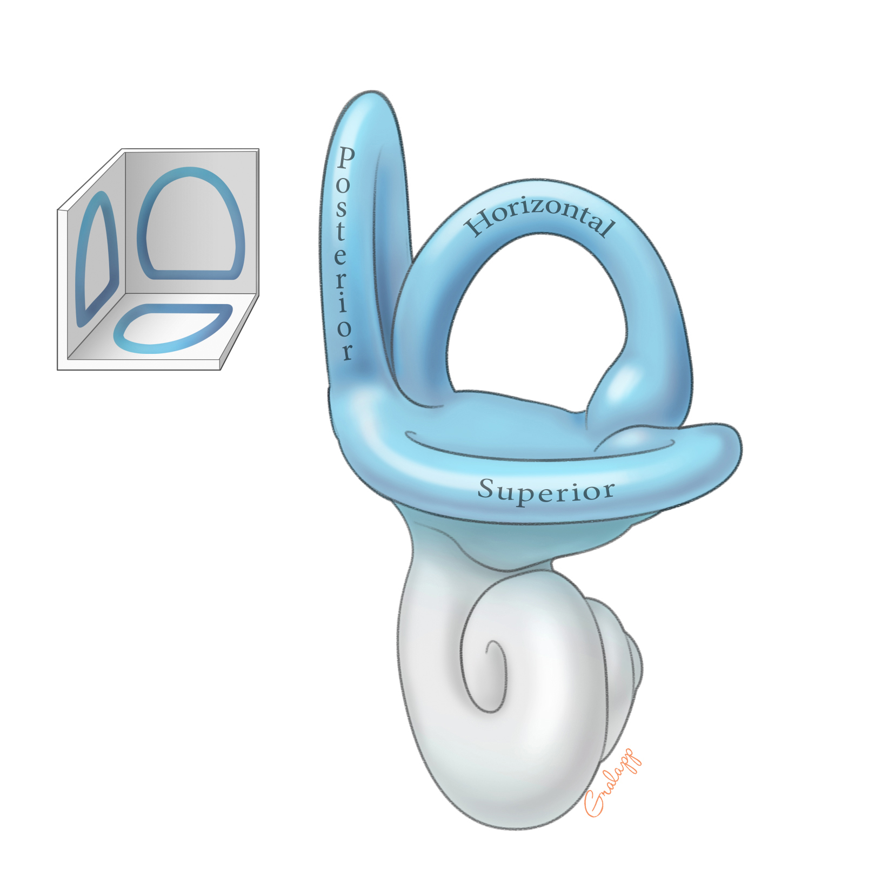
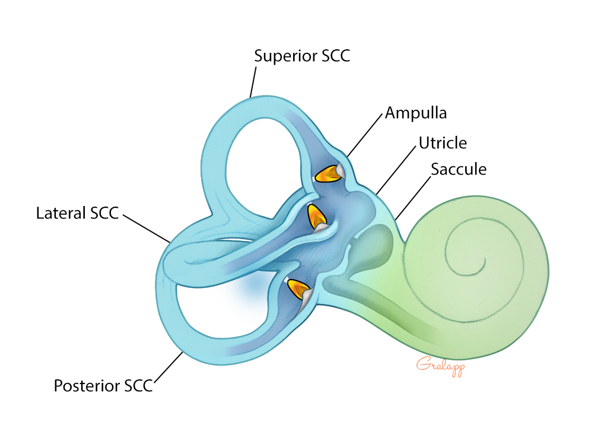
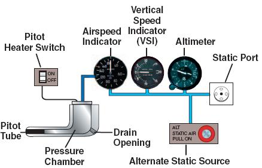
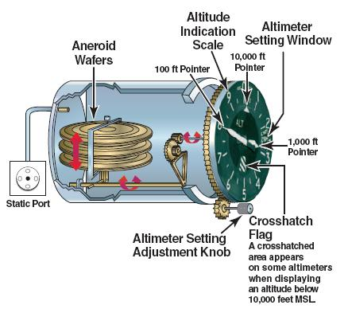
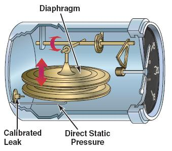
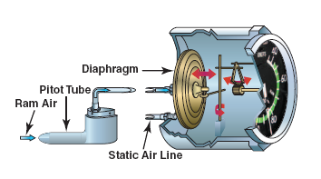
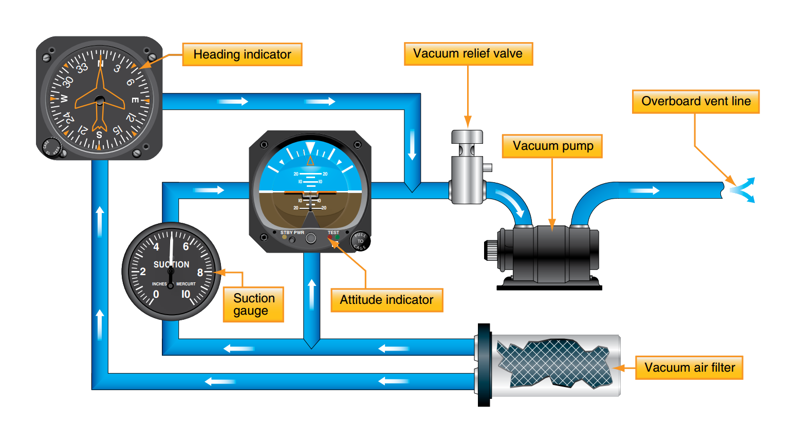
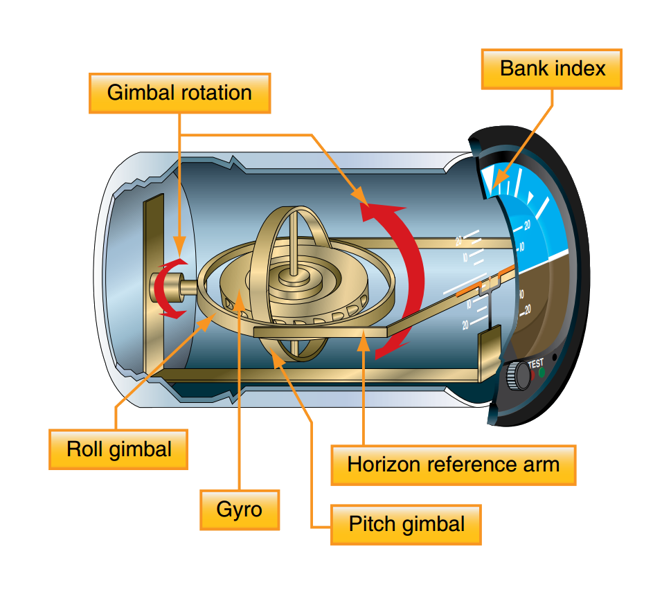
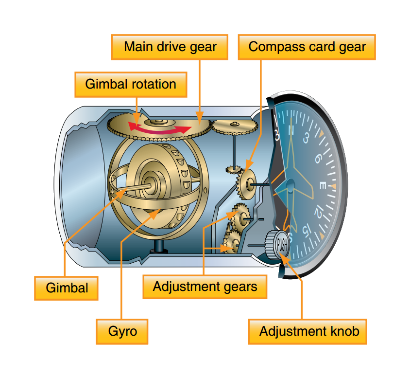
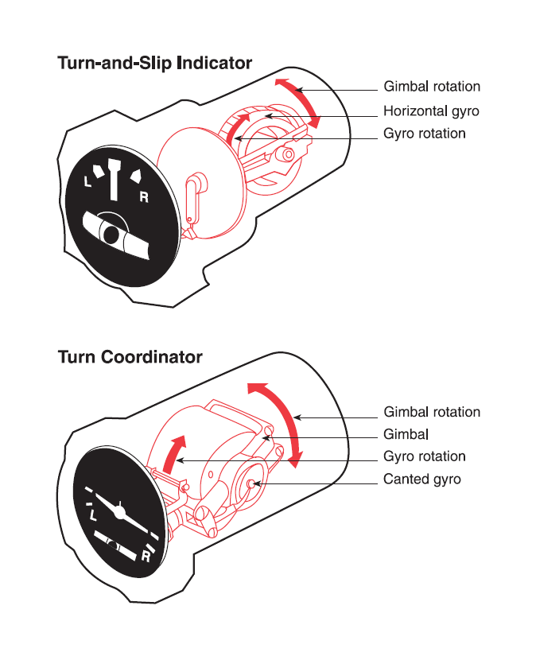

## Aim

*   To learn how to fly by sole reference to the instruments and perform a 180° turn in-case of accidental flight into IMC

---

## Motivation

*   Inadvertent flight into IMC is one of of biggest causes of fatal aviation accidents around the world
*   A 1954 study from the University of Illinois found that a 180° turn curriculum materially increases the chance of surviving unexpected IMC
*   **This is not an instrument rating, and is not sufficient training for intentional flight into cloud**

---

## Objectives

By the end of this brief you should be able to:

*   List the three major inputs to our sense of balance
*   Describe two common illusions in IMC
*   Describe techniques to avoid or deal with disorientation
*   List the instruments which rely on the pitot-static system, and state their limitations and common errors
*   List the gyroscopic instruments, and state their limitations and common errors

---

## Lesson overview

Duration: approx 45 mins

*   Sensory illusions & disorientation
*   Instruments
*   Application
*   Threat and error management
*   Review questions

---

## Revision

*   What instruments will you find in the "six pack"?
    <!-- ASI, AH, Altimeter, turn coordinator, DI, VSI -->
*   What is our procedure for entering a climb?
    <!-- PAST -->
*   What is our primary reference for the plane's attitude?
    <!-- The horizon -->

---

## Physiolological inputs

*   Inner ear (vestibular system)
*   Proprioception (sensors in your muscles, tendons, and joints)
    <!-- Proprioception is your sense of body position and movement. It relies on sensors in your muscles, tendons, and joints that tell your brain where your limbs are and how they're moving without even looking. It helps you do things like touch your nose with your eyes closed or walk without watching your feet. -->
*   Sight (most important)

---

## Sight

*   Provides overriding sense—settles ambiguities from other senses
*   In visual flight the horizon is our indication of attitude
*   Without visual cues, the brain is more likely to draw incorrect conclusions from the information provided by the vestibular system and proprioception
*   In instrument flight we use the artificial horizon as our indicator of attitude

---

<!--
_class:
_backgroundColor: #fff
-->

## Semicircular canals

*   Three semicircular canals perceive angular acceleration in:
    *   Yaw
    *   Roll
    *   Pitch
*   Associated illusion: the leans

<!--
There are three semi-circular canals which are each tilted on a different plane: one to perceive acceleration in yaw, one in roll, and one in pitch. The semi-circular cancals are filled with a fluid called endolymph, and when the head is rotated the endolymph moves through the canal that corresponds with the plane of movement. The movement of this fluid causes hair cells in the canal to move, which then sends information about the movement to the brain.

The leans can occur when the plane is banked very slowly in one direction, then returned to level flight. Because the vestibular system didn't detect the slow turn, the return to level flight actually feels like the plane has been put into a bank in the opposite direction. This can lead to a pilot feeling that the instruments are wrong, and reentering the original bank because it "feels" level. The solution is to trust the instruments.
-->

---

<!--
_class:
_backgroundColor: #fff
-->

## Otolith organs

*   Made up of the utricle and saccule
*   Perceives horizontal and vertical acceleration
*   Associated illusion: somatogravic illusion

<!--
The utricle detects horizontal movements, and the succule detects vertical movements. Tiny crystals sit on a gel-like layer above hair cells. When you move or tilt your head the crystals shift due to gravity or acceleration, bending the hair cells and sending information about the movement to the brain.

Rapid acceleration feels very similar to pitching up (use wine glass example). This can be quite a common illusion during night takeoffs where the pilot mistakes acceleration for a steep climb, and reacts by pushing the nose down. This causes further acceleration, which can be further mistaken for pitching up, and the pilot again reacts by pushing the nose down. Once again, the solution is to trust the instruments.
-->

---

## Preventing and dealing with illusions

*   Limit angular accelerations where possible
    *   Small attitude changes
    *   Reduce head movements
*   Trust the instruments
    <!-- There are other illusions, such as the "bright is up" illusion and the "false horizon" illusion. Ultimately the solution is to trust the instruments and not to rely on what your brain feels is correct. -->

---

<!--
_class: lead
-->

## How instruments work

<!-- Use the cockpit diagram -->

---

<!--
_class: lead
_backgroundColor: #fff
--->

## Pressure instruments

<!--
The pitot-static systeam uses the pitot tube to measure the total pressure from the flowing air, and the static port to measure the static air pressure. The airspeed indicator uses both air from the pitot tube and static port, while the altimeter and VSI use the static port only.
-->

---

<!--
_class: 
_backgroundColor: #fff
--->

## Altimeter

*   Measures height above a datum (QNH set on the subscale)
*   As pressure from the static port decreases the aneroid wafers expand, moving the altimeter hands
*   The reverse is true when static pressure increases

<!-- If the static port is blocked the instrument freezes—any change in altitude results in no change -->

<!-- If the QNH is incorrectly set, the altimeter won't read the correct altitude—either too high or too low depending on the QNH you've set -->

<!-- Ground checks: QNH or runway elevation set -->

---

<!--
_class: 
_backgroundColor: #fff
--->

## Vertical speed indicator

*   Diaphram linked to static port, the area surrounding the diaphram is linked to the static port with a "calibrated leak"
*   Measures how quickly the static pressure is changing
*   Lag!
    <!-- The calibrated leak is what creates the reading, but it also causes a lag after a change in vertical speed. It is therefore a bad idea to "chase" the readings on this instrument to establish level flight, or any particular descent rate. Set an attitude, and then wait a few seconds to see what stable reading you get. -->

<!-- If the static port is blocked the VSI will show zero -->

<!-- Ground checks: reading zero -->

---

<!--
_class: 
_backgroundColor: #fff
--->

## Airspeed indicator

*   Measures difference between total pressure from pitot tube, and static pressure from the static port
    <!-- The difference between total pressure and static pressure is called dynamic pressure -->
*   The greater the difference, the higher the airspeed
*   In the case of a blockage—PUDSUC

<!-- Ground checks: "airspeed alive"—if we're not getting an airspeed indication by halfway down the runway we abort the takeoff -->

---

## Gyroscopic instruments

*   Spinning mass
    <!-- Any spiinning mass takes on gyroscopic properties. The heavier the object and the fact it spins, the greater these effects. -->
*   Rigidity
    *   Tendency to maintain original alignment in space
*   Precession
    *   When a force is applied to a gyroscope, the force manifests 90° later in the direction of rotation
*   Vacuum driven or electrically driven
    <!-- Or in this case, string driven! -->

<!-- Rotor, mounted on gymbals, which allow multiple degrees of freedom of movement -->

---

<!--
_class: lead
_backgroundColor: #fff
-->

## Vacuum pump system

---

<!--
_class: lead
_backgroundColor: #fff
--->

## Artificial horizon

*   Shows pitch attitude and bank angle
*   Plane/instrument moves around the gyro
*   Vacuum driven
*   Ground checks:
    *   Align wings with horizon
    *   Suction gauge = green

<!-- The gyro rotates around the normal axis, therefore doesn't give yaw information. It relies on the principle of rigidity. -->

<!-- If the vacuum system fails the gyro will topple and the AH will not remain rigid -->

---

<!--
_class: lead
_backgroundColor: #fff
--->

## Directional indicator

*   Shows heading information
*   Needs to be aligned!
*   Vacuum driven
*   Ground checks
    *   Aligned with compass
        <!-- Needs to be aligned every 15 minutes or so in the air -->
        <!-- Also Earth-rate procession -->
    *   Suction gauge = green
    *   Left and right turns

<!-- The gyro rotates around the lateral axis and also relies on the principle of rigidity -->

<!-- If the vacuum system fails the gyro will not remain rigid and the DI will spin randomly -->

---

<!--
_class: lead
_backgroundColor: #fff
--->

## Turn coordinator

*   Indicates rate of yaw (turn coordinator vs turn-and-slip indicator)
    <!-- The marks indicate a rate 1 turn (3 degrees per second, or 2 minutes for 360 degrees) -->
*   Ball to indicate balance
*   Electrically driven
    <!-- Redundancy in-case of vacuum system failure -->
*   Ground checks
    *   No flags
    *   Left and right turns

<!-- The gyro rotates around the lateral axis, and relies on the principle of precession -->

<!-- If the electrical system fails a red flag will be displayed on the turn coordinator -->

---

## Application

---

## Threat and error management

Threat | Error | UAS | Countermeasure
-------|-------|-----|---------------
<small>IMC</small> | <small>"Rough" control inputs</small> | <small>Disorientation</small> |

---

## Threat and error management

Threat | Error | UAS | Countermeasure
-------|-------|-----|---------------
<small>IMC</small> | <small>"Rough" control inputs</small> | <small>Disorientation</small> | <small>Fly smooth, reduce head movements</small>

---

## Threat and error management

Threat | Error | UAS | Countermeasure
-------|-------|-----|---------------
<small>IMC</small> | <small>"Rough" control inputs</small> | <small>Disorientation</small> | <small>Fly smooth, reduce head movements</small>
<small>Disorientation</small> | <small>Believing bodily sensations</small> | <small>Unintended turn, climb, or descent</small> |

---

## Threat and error management

Threat | Error | UAS | Countermeasure
-------|-------|-----|---------------
<small>IMC</small> | <small>"Rough" control inputs</small> | <small>Disorientation</small> | <small>Fly smooth, reduce head movements</small>
<small>Disorientation</small> | <small>Believing bodily sensations</small> | <small>Unintended turn, climb, or descent</small> | <small>Trust instruments</small>

---

## Threat and error management

Threat | Error | UAS | Countermeasure
-------|-------|-----|---------------
<small>IMC</small> | <small>"Rough" control inputs</small> | <small>Disorientation</small> | <small>Fly smooth, reduce head movements</small>
<small>Disorientation</small> | <small>Believing bodily sensations</small> | <small>Unintended turn, climb, or descent</small> | <small>Trust instruments</small>
<small>Instrument failure</small> | <small>Assuming everything is working</small> | <small>In flight without instruments</small> |

---

## Threat and error management

Threat | Error | UAS | Countermeasure
-------|-------|-----|---------------
<small>IMC</small> | <small>"Rough" control inputs</small> | <small>Disorientation</small> | <small>Fly smooth, reduce head movements</small>
<small>Disorientation</small> | <small>Believing bodily sensations</small> | <small>Unintended turn, climb, or descent</small> | <small>Trust instruments</small>
<small>Instrument failure</small> | <small>Assuming everything is working</small> | <small>In flight without instruments</small> | <small>Perform ground checks</small>

---

## Review questions

*   Apart from your eyesight, what are the other major inputs to your sense of balance?
    <!-- The vestibular system (the inner ear), and proprioception (muscular and postural cues) -->
*   What is the somatogravic illusion? When is it likely to be experienced?
*   What are the leans?
*   What actions should you take if you feel disoriented in IMC?
    <!-- Rely on the instruments, ignore what you feel is up, down, or level -->

---

## Review questions

*   What instruments are driven by the pitot-static system?
*   What would the altimeter indicate in a climb if the static port was blocked?
*   What about the air speed indicator?
*   Why can't you rely on the VSI to level off from a climb?
*   Which instruments are driven by gyros?
*   Which instruments would be affected by a vacuum pump failure?
*   What is a major limitation of the directional indicator?

---

## Objectives

You should now be able to:

*   List the three major inputs to our sense of balance
*   Describe two common illusions in IMC
*   Describe techniques to avoid or deal with disorientation
*   List the instruments which rely on the pitot-static system, and state their limitations and common errors
*   List the gyroscopic instruments, and state their limitations and common errors