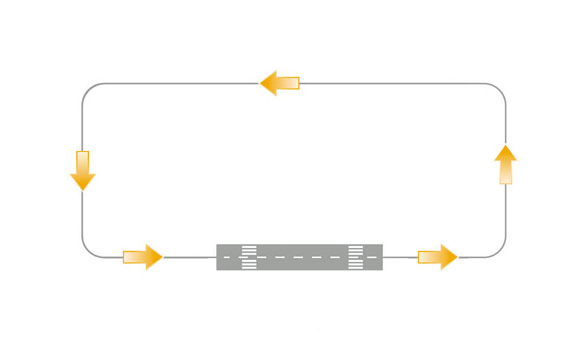
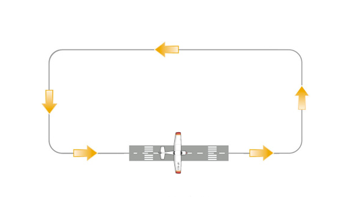
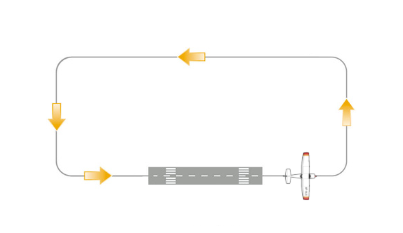
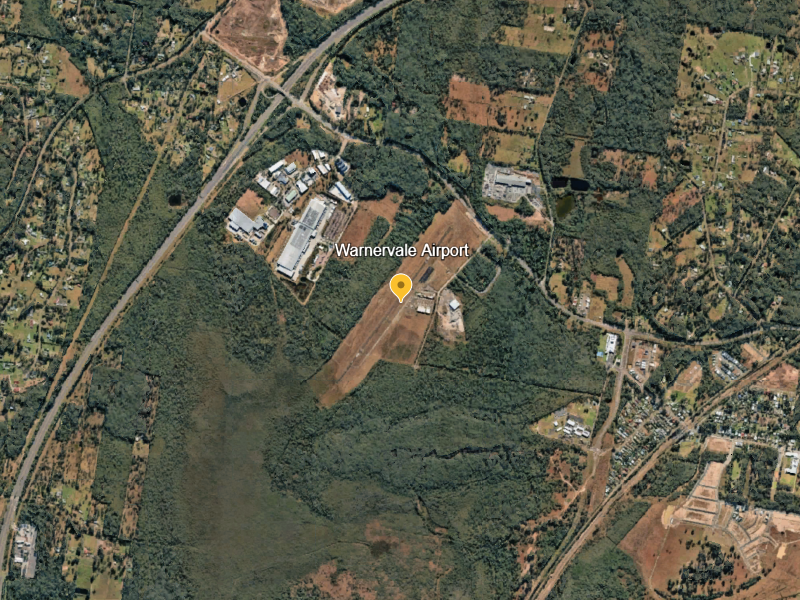
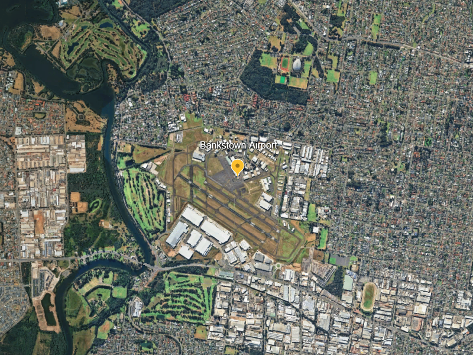
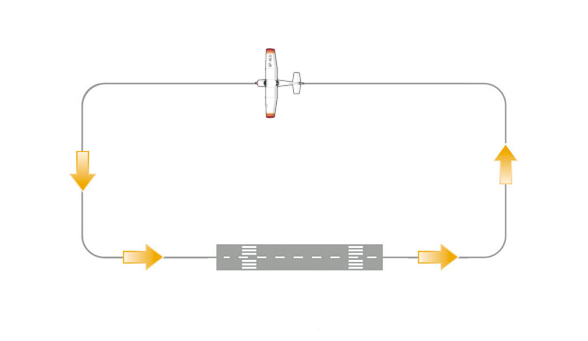
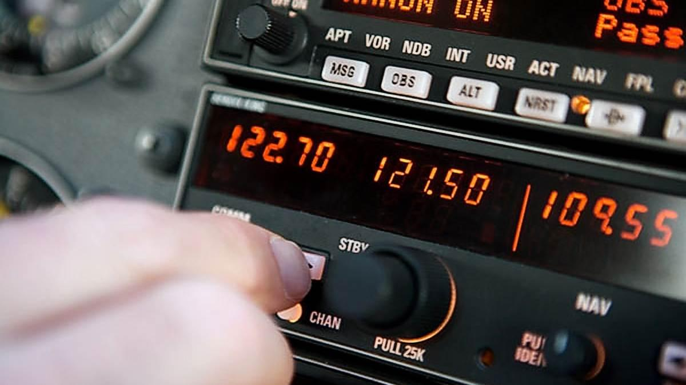
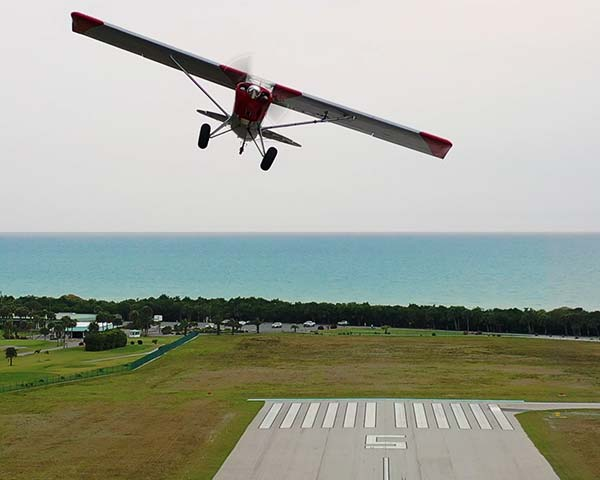

## Aim

*   To learn how to safely deal with emergencies at different points in the circuit

---

## Motivation

*   Knowing how to react in an emergency increases your safety and confidence
*   Learning to accurately fly a glide approach helps to improve your handling and energy management skills
*   This will also be the foundation for later lessons on forced landings outside of the circuit area

---

## Objectives

By the end of this brief you should be able to:

*   Describe how pre-flight inspection and correct in-flight management can prevent most engine failures
*   Describe the main priority in each of the three engine failure after takeoff scenarios
*   Briefly describe how you would select a field for a forced landing
*   State how the partial engine failure procedure differs from an engine failure
*   Perform a takeoff safety brief
*   State how you would prioritise activities during an emergency

---

## Lesson overview

Duration: approx 45 mins

*   Emergency causes
*   Aborted takeoff
*   Engine failure after takeoff
*   Partial engine failure
*   Takeoff safety brief
*   Application
*   Threat and error management
*   Review questions

---

## Revision

*   What are the 5 legs of the circuit?
*   Why do we use carby-heat below 2000 RPM?
*   What are some factors that affect glide range?
    <!-- Lift:drag ratio, wind, airspeed, flaps -->
*   What is our best glide speed?

---

<!--
_class:
-->

## Emergency causes

<!--
Two groups (without headings): Within our control, out of our control. Brainstorm causes with the student, add some more of your own. After brainstorming, ask: why have I made two different groups? While there are things that are not within our control, the vast majority of things that could cause an emergency can be prevented by proper pre-flight checks and in-flight management.

(Mostly) Within our control:

*   Air intake blockage
*   Carb icing
*   Fuel contamination
*   Fuel starvation/exhaustion (mixture too lean, poor fuel management, wrong tank selection, etc.)
*   Fouled spark plugs

(Mostly) Out of our control:

*   Engine failure due to mechanical failure
*   Partial power or severe vibration due to mechanical failure
*   Fire
*   Bird strike
-->

---

## Aborted takeoff

*   In the case of any abnormal symptoms during the takeoff roll:
    *   Low power/RPM
    *   Oil temperature and pressure—too high or low
    *   Airspeed not rising
    <!--
    *   Rough running (vibration or sound)
    *   Engine failure
    *   Puncture
    -->
*   Immediately abandon the takeoff:
    *   Power to idle
    *   Maintain directional control with rudder
    *   Braking as required

---

<!--
_class:
_backgroundColor: #fff
--->

## Engine failure after takeoff

*   With runway remaining
*   No runway remaining
*   After turning downwind

---

<!--
_class:
_backgroundColor: #fff
--->

## With runway remaining

*   Aim: land safely and come to a stop on the remaining runway
*   Lower the nose
*   Full flaps
*   Land on remaining runway
*   Maximum effective braking as required
    <!-- Once slowed to a safe speed we can taxi clear of the runway -->

---

<!--
_class:
_backgroundColor: #fff
--->

## No runway remaining

*   Aim: safe glide to an off-airport landing area
*   Establish best glide speed
    <!-- Lower the nose -->
*   Identify landing area straight ahead
    <!-- What's "straight ahead"? Some schools teach within your front wind screen, some teach 30 degrees either side of the nose. We explain it as "only gentle manevering to avoid obstacles. The point is that we want to avoid steep bank while close to the ground, and we absolutely do not consider turning back to the field at this point. This is called the "impossible turn", and it has earnt this name with sadly too many crashes over the years. -->
    <!-- We'll talk about landing considerations shortly -->
*   Only gentle maneuvering to avoid obstacles
*   Use flaps as required

<!--
This same procedure will be followed for an engine failure on crosswind, except as we get higher we have more options and can expand the area we consider for landing, but we still only want to perform gentle maneuvering
-->

---

<!--
_class:
_backgroundColor: #fff
--->

## Landing site considerations

<!-- Normally we talk about landing site considerations when we do practice-forced landings in the training area or during navigation exercises. But there's still some value in knowing what to look for during an engine failure after takeoff. -->

*   Wind
    <!-- As with any other landing, we want to land into the wind to reduce our ground roll and—particularly if we're landing on a not-so-nice surface—to reduce our kinetic energy. Luckily we're taking off into wind, so if we land straight ahead we don't really need to consider wind. -->
*   Size
*   Shape
*   Slope
*   Surface
    <!-- Size, shape, slope, surface are our biggest considerations in engine failure after takeoff. This isn't a list you'll go through consciously in your head, it's just to give you an idea of things to consider. Basically we want to aim for a big flat area without any obstacles. -->
*   Surrounds
*   Sun
    <!-- Surrounds is intended to mean "where can I get help", and sun is about avoiding early-morning or late-afternoon sun in your eyes. With an engine failure under 1000ft there's not really much you can do about this. -->

<!-- Ideally when you are operating out of an airport you should spend some time beforehand to identify your options. Particularly if the aerodrome is surrounded by obstacles, like trees or buildings. Google Earth is a great resource for this. -->

---

<!--
_class: lead invert
-->

## Landing site considerations

<!-- RWY 20 has some larger trees straight ahead, past that is thick vegetation which isn't going to be the nicest landing but it's not too bad. From RWY 02 there's some open areas, probably not enough for a nice landing but at least enough to bleed off some energy before ending up in the bushes -->

---

<!--
_class: lead invert
-->

## Landing site considerations

<!-- RWY 29 has some options e.g. there's a golf course, but RWY 11 has almost nothing—maybe the racetrack or netball courts but even they aren't pretty -->

---

<!--
_class:
_backgroundColor: #fff
--->

## After turning downwind

*   Aim: glide safely back to the runway
*   Establish best glide speed
*   Immediate actions (FMCOST)
*   Adjust flight path to reach aim point (⅓ down the runway)
*   Mayday call
    <!-- Format: MAYDAY MAYDAY MAYDAY, Warnervale traffic, Cessna VVQ, engine failure, making a glide approach RWY 20, clear the runway, Warnervale -->
*   Passenger brief
    <!-- What's happening, what they need to do, reduce stress (distract them) -->
*   Add drag once landing is assured
    <!-- Once landing is assured, add drag to bring the aiming point closer towards you to increase available landing distance -->
*   Secure airplane (FMMM)
    <!-- Reduce likelyhood of fire by turning off the electrical system and shutting down the engine and fuel flow -->
    <!-- Aviate – Navigate – Communicate -->

---

## Partial engine failure

*   Aim: assess performance and fly back to the runway if possible
*   Set best glide speed
    <!-- Attitude for performance. Climb if possible—even a slow rate of climb is better than none. -->
*   Immediate actions (FMCOST)
*   Assume total engine failure will occur
*   Plan approach—keep it tight, consider a glide approach
*   Mayday call
*   Passenger brief
*   Secure airplane (FMMM)

---

## Takeoff safety briefing

*   A sample pre-takeoff brief can be found in the checklist
    <!-- It includes emergency considerations, and you should always brief these before takeoff so that you have a plan and do not need to spend brain cycles on that when an actual emergency occurs. You simply need to execute what you already said you would do when you were on the ground. Read the sample. -->
*   This briefing is a sample, tailor it to the particular airport and departure you have planned
    *   If you are departing downwind or staying in the circuit you would mention that once you've turned downwind you will turn back to RWY 02 or 20 as appropriate
    *   If you have a particular landing area picked out in-case of a failure on upwind or crosswind you would include that in your brief
        <!-- e.g. we're taking off on RWY 20, if we have an engine failure on upwind we will get the nose down, set best glide speed of 60kts, make a gentle turn to the right to avoid the trees, taking flaps as required -->

---

## Application

---

## Threat and error management

*   High workload, high stress
    *   Aviate, navigate, communicate
    *   Learn your immediate action items (FMCOST) and engine shutdown procedures (FMMM)

---

## Threat and error management

*   Unusual maneuvering
    *   Keep a good lookout
    *   Maintain situational awareness of other traffic in the circuit
    *   State intentions on the radio

---

## Threat and error management

*   Glide approach is just a simulation
    *   If at any time we're too low and not going to make the runway add power to adjust descent path or go around

---

## Review questions

*   Why is important to do a thorough pre-flight inspection and proper runups every time you fly?
*   What is an example cause of an engine problem that could be detected during a pre-flight check?
*   If you have an engine failure after takeoff, in which scenario(s) can you conduct a landing back on the runway?
*   You lose power at 300ft AGL on upwind, what should you do? <!-- What about at 600ft on crosswind? -->
*   What are the key factors to consider when selecting a landing site?

---

## Review questions

*   Why do we not need to commit to a forced landing after a partial engine failure?
*   Give an example takeoff safety brief for today's conditions and runway
*   What does "aviate, navigate, communicate" mean in an emergency?

---

## Objectives

You should now be able to:

*   Describe how pre-flight inspection and correct in-flight management can prevent most engine failures
*   Describe the main priority in each of the three engine failure after takeoff scenarios
*   Briefly describe how you would select a field for a forced landing
*   State how the partial engine failure procedure differs from an engine failure
*   Perform a takeoff safety brief
*   State how you would prioritise activities during an emergency