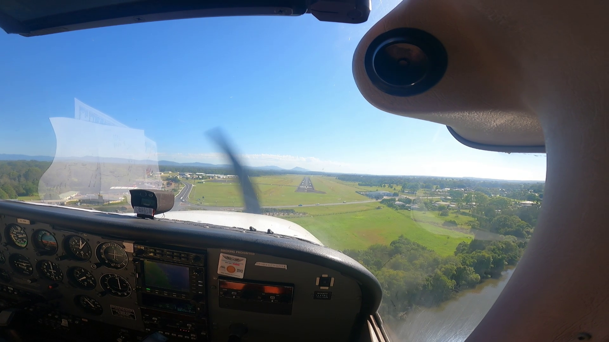
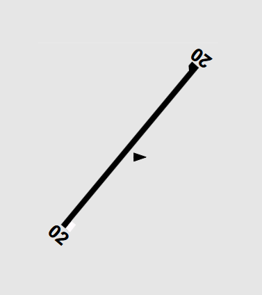
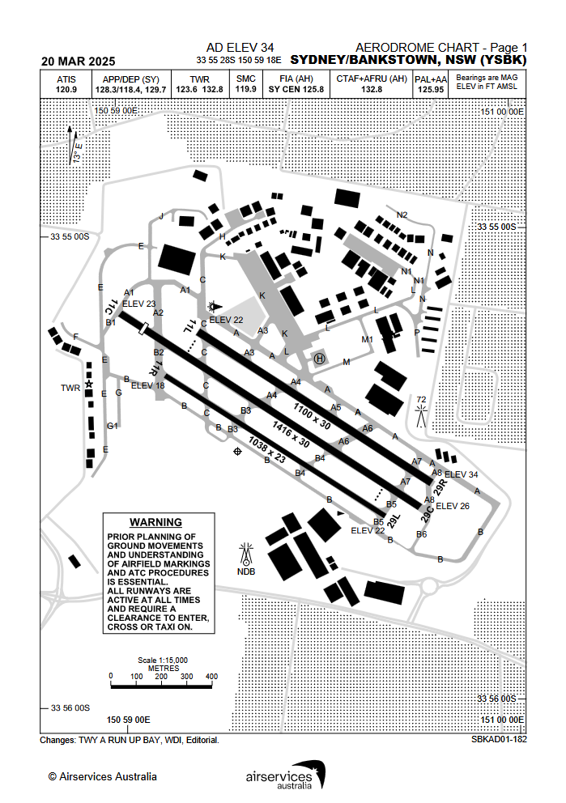
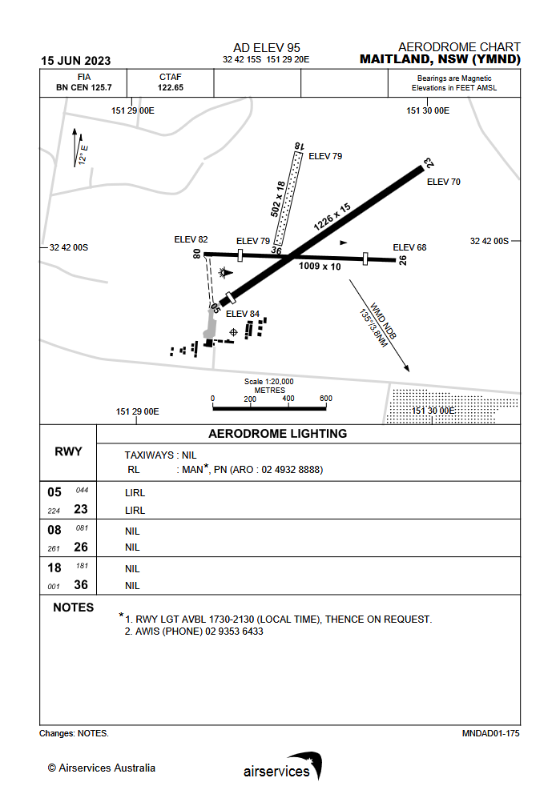
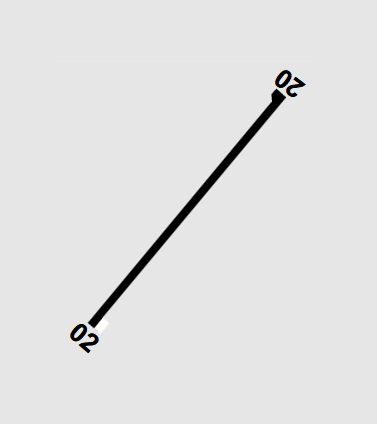
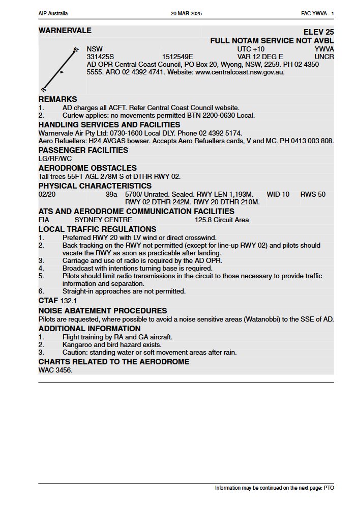
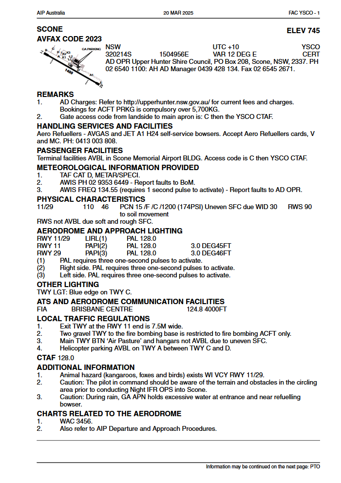
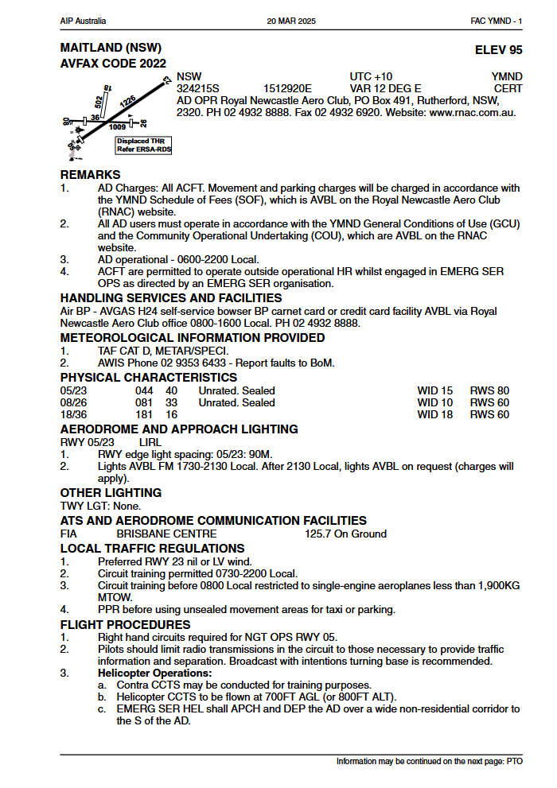
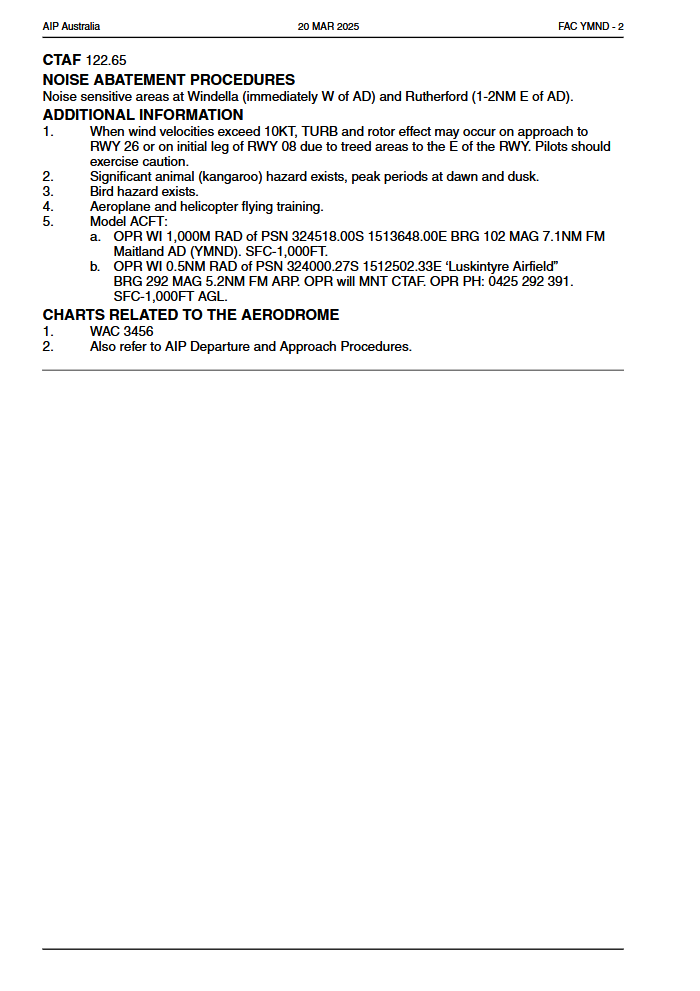

## Aim

*   Learn to takeoff, fly a correct and accurate circuit, and land safely

---

## Motivation

*   Provides an orderly producedure for departures and arrivals
    <!-- Reducing the risk of collision -->
*   Gives you the foundational skills needed to fly into other aerodromes
    <!-- Procedures are consistent throughout the country -->
*   Learning to land is fun!

---

## Objectives

By the end of this brief you should be able to:

*   Explain how runways are identified
*   Explain why we takeoff and land into wind
*   Determine the best runway to use given a wind sock indication
*   Name the 5 legs of the circuit
*   Draw the circuit procedure for Warnervale including altitudes

---

## Lesson overview

Duration: approx 30 mins

*   Runway identification
*   Choosing a runway
*   The circuit procedure
*   Aerodrome specific procedures
*   Threat and error management
*   Review questions

---

## Revision

*   How does wind affect angle of climb?
*   What is the best rate of climb speed?
*   What angle of bank do we limit ourselves to in a climbing turn?
*   What is our configuration for an approach descent?

---

<!--
_class:
_backgroundColor: #e6e6e6
-->

## Runway numbers

*   Runways can be used in two opposite directions
*   Each runway direction is named with a two-digit number based on the direction they face <!-- in 10s of degrees magnetic -->
*   e.g. A runway facing east/west is named runway 09/27 <!-- as east is 090 degrees and west is 270 degrees -->

<!-- Looking at Warnervale, we have runway 02/20. If we draw a compass rose around the runway diagram (090, 180, 270, 360) we can see that runway 02 faces about 020 degrees and 20 faces about 200 degrees. -->

---

## Runway numbers

*   Airports that have parallel runways add L (left), C (centre), and R (right) after the runway number
*   e.g. runway 11L/29R

---

## Runway numbers

*   Some airports have multiple runways facing in different directions
*   This gives pilots more options to select the most suitable runway for the conditions

---

## Choosing a runway

*   Usually we choose the runway to use based off of wind direction and velocity
*   We prefer to takeoff and land into wind
    <!--
    *   Ground speed = airspeed + wind speed
    *   Taking off into a headwind means our airspeed is higher than our ground speed, allowing us to take-off earlier
    *   A headwind also steepens our climb angle, allowing us to clear obstacles more easily
    *   Landing into a headwind means our ground speed is slower than our airspeed, meaning that it takes less distance to stop once we land
    -->
*   We might also consider:
    *   Runway length, slope, and surface
    *   Other traffic <!-- It may be better to slot in with other traffic in the circuit rather than create a potential conflict to avoid a small crosswind -->
    *   The position of the sun <!-- Landing into a setting sun can make visibility quite difficult -->
    *   "Preferred" runways e.g. YWVA RWY 20 <!-- We'll talk more about this shortly -->

---

## Determining wind direction

*   The large end of a windsock points to where the wind is coming from, the small end where it is going to
*   Fully extended = 30kts, half extended = 15kts

<!-- We can also determine wind direction from meteorological reports broadcast by the aerodrome, but we'll touch on that more when we start looking at flying cross-country -->

---

<!--
_class: lead
_backgroundColor: #e6e6e6
-->

## Choosing a runway

<!--
Examples using wind sock; wind from:
*   020 (RWY 02)
*   180 (RWY 20)
*   070 (RWY 02)
*   110 (RWY 20, preferred runway in direct crosswind)

Draw compass rose if required
-->

---

<!--
_class:
-->

## The circuit

<!--
*   The circuit is a standard pattern, which provides an orderly procedure for planes to depart and arrive at an aerodrome
*   Circuits are generally flown with left hand turns as that gives better visibility from the pilot's seat, however right hand circuits are used at some aerodromes in some circumstances. Check the ERSA! We'll go through some examples shortly.
*   The circuit 5 legs, upwind, crosswind, downwind, base, and final
    *   Upwind: climb straight ahead to 500ft AGL, then turn onto crosswind
    *   Crosswind: Continue climbing to 1000ft AGL, turn onto downwind at approx. 45 degrees to the upwind threshold. Depending on the performance of the plane you may need to level out before, during, or after the downwind turn.
    *   Downwind: flown parallel to the runway at 1000ft AGL. Spacing is judged to ensure we are an appropriate distance from the runway. Used as time to complete pre-landing checks. Approaching a point with the runway threshold 45 degrees behind you, configure for descent and then make the turn onto base
    *   Base: Continue descent, adding flaps to slow down. Turn final so that you're aligned with the runway.
    *   Final: Continue descent and adding flaps to reach landing configuration. Pre-landing checks, and land.
-->

---

<!--
_class: lead
-->

## Aerodrome specific procedures

<!--
En Route Supplement Australia (ERSA) is an important flight planning document, providing information on aerodromes, navigation aids, flight planning requirements, and more.

Whenever we fly to an aerodrome it's important that we check the ERSA for aerodrome specific procedures. There's an entry here for most strips in Australia, and it should be your first port of call for aerodrome information. Even if it's an airport you're familiar with, these procedures do change and it's important to revise them before getting in the plane.
-->

---

## Warnervale

<!--
En Route Supplement Australia (ERSA) is an important flight planning document, providing information on aerodromes, navigation aids, flight planning requirements, and more.

Whenever we fly to an aerodrome it's important that we check the ERSA for aerodrome specific procedures. There's an entry here for most strips in Australia, and it should be your first port of call for aerodrome information. Even if it's an airport you're familiar with, these procedures do change and it's important to revise them before getting in the plane.

Run through the ERSA entry for YWVA:
*   Elevation is 25ft, so we use 1000ft as our circuit altitude
*   RWY 20 is preferred
*   Multiple aerodromes use our CTAF: Warnervale, Lake Macquarie, Somersby, Mangrove Mountain, plus traffic transiting
    *   That's why we limit transmissions to those necessary
    *   And why we begin and end all transmissions with the name of the aerodrome
*   If we're taking off on RWY 20 we will need to turn crosswind a little earlier than we would normally do so—about 300ft AGL instead of 500ft AGL
-->

---

## Scone

<!--
*   Elevation is 745ft, so at Scone 1,700ft is used as the circuit altitude
-->

---

## Maitland

 

<!--
*   Elevation is 95ft, so at Maitland circuit altitude is 1,100ft
*   Preferred runway is 23
*   Right hand circuits for night operations on RWY 05 (because there's terrain to the north which is easy to avoid during the day but is difficult or impossible to see at night)
*   On windy days turbulence can be an issue around the trees around RWY 08/26
-->

---

## Application

---

## Threat & error management

Threat | Error | UAS | Countermeasure
-|-|-|-
Circuit is busy | Poor lookout | Conflict with other aircraft | 

---

## Threat & error management

Threat | Error | UAS | Countermeasure
-|-|-|-
Circuit is busy | Poor lookout | Conflict with other aircraft | <small>Lookout, radio calls, situational awareness</small>

---

## Threat & error management

Threat | Error | UAS | Countermeasure
-|-|-|-
Circuit is busy | Poor lookout | Conflict with other aircraft | <small>Lookout, radio calls, situational awareness</small>
High workload | <small>Forget carb heat, flaps, etc.</small> | Misconfigured aircraft | 

---

## Threat & error management

Threat | Error | UAS | Countermeasure
-|-|-|-
Circuit is busy | Poor lookout | Conflict with other aircraft | <small>Lookout, radio calls, situational awareness</small>
High workload | <small>Forget carb heat, flaps, etc.</small> | Misconfigured aircraft | Use standard checks and callouts

---

## Threat & error management

Threat | Error | UAS | Countermeasure
-|-|-|-
Circuit is busy | Poor lookout | Conflict with other aircraft | <small>Lookout, radio calls, situational awareness</small>
High workload | <small>Forget carb heat, flaps, etc.</small> | Misconfigured aircraft | Use standard checks and callouts
Pressure to land | <small>Continuing with unstable approach</small> | Unsafe landing | 

---

## Threat & error management

Threat | Error | UAS | Countermeasure
-|-|-|-
Circuit is busy | Poor lookout | Conflict with other aircraft | <small>Lookout, radio calls, situational awareness</small>
High workload | <small>Forget carb heat, flaps, etc.</small> | Misconfigured aircraft | Use standard checks and callouts
Pressure to land | <small>Continuing with unstable approach</small> | Unsafe landing | Go around

<!-- We will go over the go around procedure next lesson, for now I'll take over if we need to go around -->

---

<!--
_class: 
_backgroundColor: #e6e6e6
-->

## Review questions

*   What do the numbers at the end of a runway indicate? <!-- Direction in 10s of degrees magnetic -->
*   Given the wind-sock indication, which runway is the best to use?
*   Why do we takeoff and land into wind?
*   Draw the circuit procedure for RWY 02 <!-- What are the names of the legs? What altitude do we turn crosswind? What altitude do we maintain on downwind? What would be different if we were using RWY 20? -->

---

## Objectives

You should now be able to:

*   Explain how runways are identified
*   Explain why we takeoff and land into wind
*   Determine the best runway to use given a wind sock indication
*   Name the 5 legs of the circuit
*   Draw the circuit procedure for Warnervale including altitudes