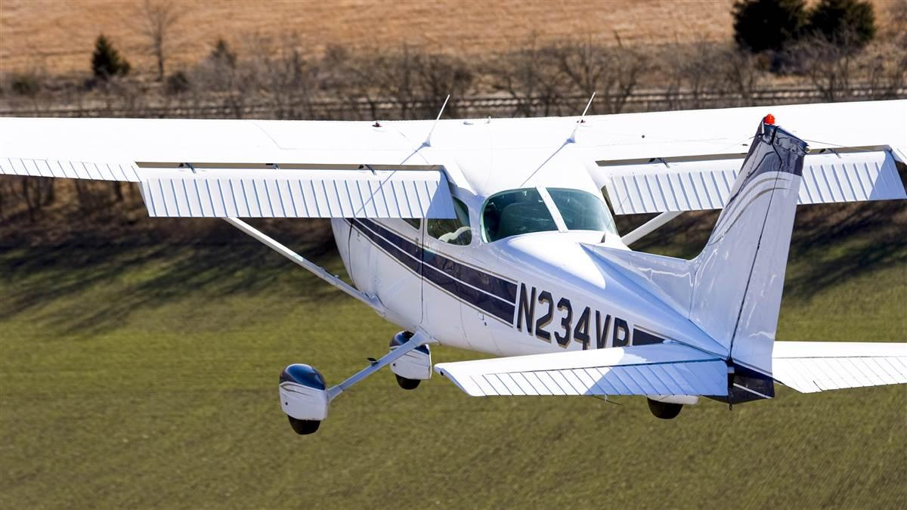

## Aim

*   To learn the different types of climb, how to achieve set performance, and to learn the aerodynamics behind a climb

---

## Motivation

*   Every flight has at least one climb—immediately after take-off
*   It's another fundamental skill that our future maneuvres will build upon, as well as an opportunity to further develop your aeroplane handling skills

<!--
Attitude flying, smooth control inputs, balanced/coordinated flight
-->

---

## Objectives

By the end of this brief you should be able to:

*   State the three types of climb and describe when you would use each
*   Explain the aerodynamic forces acting on the aeroplane during a climb
*   List the factors affecting climb performance and describe their effect

---

## Lesson overview

Duration: approx 50 mins

*   Definitions
*   Types of climb
*   Forces in a climb
*   Climb performance
*   Application
*   Threat and error management
*   Review questions

---

## Revision

*   What are the four forces which act on an aeroplane in straight and level flight?
*   What is meant by equilibrium?
*   Why does the total drag curve form a "U" shape?
*   How does the plane respond when you increase power?

<!--
### Four forces

*   Weight
*   Lift
*   Drag
*   Thrust

### Equilibrium

Net force acting on an object is zero—no changes to an object's motion

### Drag

Induced drag at low speed, parasite drag at high speed

### Power

Plane pitches up (thrust/drag couple) and yaws to the left (slipstream)
-->

---

## Definitions

*   **Angle of climb**
    *   Angle between the Earth's surface and the flight path during a climb
*   **Rate of climb**
    *   The aircraft's vertical speed, measured in feet per minute

<!--
Include power and ground speed?
-->

---

<!--
_class: lead
-->

## Types of climb

<!--
TODO: Consider moving this after forces in a climb
-->

<!--
### Best angle of climb

*   Climb in the least horizontal distance
*   Essential for clearing obstacless quickly and safely

---

### Best rate of climb

*   Climb in the minimum time
*   Used for example when climbing above bad weather or turbulence

---

### Cruise climb

*   Better engine cooling
*   Better forward visibility
*   Reduces en-route time

Why does best rate get higher quicker? Think of riding a bicycle up the steepest hill you could possibly ride up—how fast are you going? You're going up a really steep slope, but it's not very efficient because you're going so slowly. Now imagine a less steep hill that you can go up a bit more quickly. Even though the hill isn't as steep, you can actually get up the hill more quickly because your speed is faster.
-->

---

<!--
_class: lead
-->

## Forces in a climb

<!--
Starting from straight and level, we have the four forces (weight, lift, thrust, and drag), and they are in equilibrium with lift = weight and thrust = drag.
-->

---

<!--
_class: lead
-->

## Forces in a climb

<!-- In a climb, our flight path will be tilted upwards, and our forces will resolve differently. -->

---

<!--
_class: lead
-->

## Forces in a climb

<!-- Weight still acts downwards towards the centre of the earth -->

---

<!--
_class: lead
-->

## Forces in a climb

<!-- And drag, once again, acts backwards against the direction of motion. However this time, our direction of motion is slightly upwards to drag acts backwards and slightly down.

Now, let's forget about planes for a second and imagine a car parked on a hill. If you park your car on a hill like this, and you forget to put your parking brake on, what is going to happen to your car? It will roll backwards down the hill. This is due to weight, and the way we can think of this is that there's two components of weight: 1) a perpendicular component which holds the car down against the earth and 2) a rearward component of weight which is pulling the car backwards down the hill.
-->

---

<!--
_class: lead
-->

## Forces in a climb

<!--
We can do the same for the plane, and split weight into a perpendicular component and a rearwards component. The perpendicular component acts at right angles to the flight path, and the rearwards component acts opposite the flight path, just like drag.
-->

---

<!--
_class: lead
-->

## Forces in a climb

<!--
Lift acts perpendicular to the direction of motion, so compared to straight and level it is tilted back. And in a climb, lift is equal and opposite to the perpendicular component of weight.

You'll notice then, that means lift is less than weight in a climb. Many people find that surprising, because you would think that lift would be the most important force in a climb.

Now let's look at the rearward component of weight.
-->

---

<!--
_class: lead
-->

## Forces in a climb

<!--
Like we said the rearward component of weight acts in the same direction as drag, so we can move the force line and add it onto drag.
-->

---

<!--
_class: lead
-->

## Forces in a climb

<!--
Thrust then needs to overcome both drag and the rearward component of weight. So you can see that thrust is the most important force in a climb—the more thrust we have the steeper we can climb. We can see this by imagining a plane that could climb straight up. Lift is irrelevant at this climb angle, but we would need an engine powerful enough to create enough thrust to reach equilibrium with both weight and drag.

So we can see the plane is in equilibrium in a climb. Lift = perpendicular component of weight. Thrust = drag + rearward component of weight. And as we said, thrust dictates the angle we can climb at. Now let's look at climb performance so we can examine this idea in more detail.
-->

---

<!--
_class: lead
-->

## Climb performance

---

<!--
_class:
-->

## Best angle of climb

*   Occurs at maximum excess thrust
*   Speed = 56kts
*   Also known as: VX

<!--
Blue line represents thrust available. The faster you fly, the less effective the propeller is, so the less thrust is available. Think of it like paddling a kayak: if you're sitting still you can use the paddle to give yourself a big push and accelerate yourself and you feel a lot of resistance from the water, but if you're already going fast even if you paddle as hard as you can you don't feel as much resistant from the water and you don't really go much faster.

Red line represents thrust required. Now remember in level flight, thrust is used to overcome drag, so the thrust required line actually mirrors the total drag curve.

If we compare the curves, the area with the biggest gap between them represents our maximum excess thrust, and that's the speed where we will achieve our best angle of climb. Remembering from our four forces explanation, that it's thrust which is used to overcome drag and the rearward component of weight. So the biggest excess gives us the best climb angle.
-->

---

<!--
_class: lead invert
-->

## Power

$$
\begin{align}
Force &= Mass \times Acceleration\\
\\
\\
\end{align}
$$

<!--
Thrust is a _force_. F = MA, therefore the more thrust you apply the faster you can accelerate a plane.
-->

---

<!--
_class: lead invert
-->

## Power

$$
\begin{align}
Force &= Mass \times Acceleration\\
Work &= Force \times Distance\\
\\
\end{align}
$$

<!--
If you move an object, then you have done "work". The further you move something the more work you have done. W = FD.
-->

---

<!--
_class: lead invert
-->

## Power

$$
\begin{align}
Force &= Mass \times Acceleration\\
Work &= Force \times Distance\\
Power &= Work \div Time
\end{align}
$$

<!--
Power is how quickly work is done i.e. P = W/D. Think of it as the rate of work. In this case, the work is climbing, so power affects rate of climb.
-->

---

<!--
_class:
-->

## Best rate of climb

*   Occurs at maximum excess power
*   Speed = 68kts
*   Also known as: VY

<!--
We said P = W/D. Another way to phrase it is P = Thrust * Speed. We get this graph by taking the thrust available curves, and the thrust required curves, and multiplying them by speed.

What can you tell me about the power available curve? What about the power required curve? This shows that power available is relatively constant as speed increases, but power required increases sharply as speed increases.

Where will we find best rate of climb? Again, it's about excess power. We're looking for the point where we have maximum excess power.
-->

---

<!--
_class:
-->

## Normal (cruise) climb

*   Normally ~10kts faster than VY, depending on the plane
*   Speed = 70–80kts

<!--
Cruise climb is less engineer-y and more hand-wavy. We're looking for a comfortable rate of climb for our passengers, a faster air speed so we can keep the engine cool and get to our destination in a reasonable time, but we don't want to climb so slowly that we never reach our target altitude.

In other words, a bit faster than best rate, but still utilizing a decent amount of excess power so climb rate isn't too bad.
-->

---

<!--
_class:
-->

## Types of climb

<table width="100%">
    <thead>
        <tr>
            <th>Type of climb</th>
            <th>Speed</th>
        </tr>
    </thead>
    <tbody>
        <tr>
            <td>
                Best angle of climb
            </td>
            <td>56kts</td>
        </tr>
        <tr>
            <td>
                Best rate of climb
            </td>
            <td>68kts</td>
        </tr>
        <tr>
            <td>
                Normal (cruise) climb
            </td>
            <td>70–80kts</td>
        </tr>
</table>

---

## Factors affecting climb performance

*   Weight
*   Altitude
*   Flaps
*   Wind

---

<!--
_class:
-->

## Weight

As weight increases:

*   More thrust and power is required to fly level
    <!-- Consider a truck vs a car going up a hill, which is going to struggle more to climb up a hill? -->
*   Less excess thrust and power
*   Therefore, maximum angle and rate of climb is decreased

---

<!--
_class:
-->

## Altitude

As altitude increases:

*   Thrust and power available is reduced, due to decreased air density
    <!-- *   Additionally, more power is required to fly level at any given airspeed  -->
*   Maximum angle and rate of climb are reduced

---

## Flaps

*   The effect of flaps can depend on the specific aircraft and flaps configuration, so check the POH!
*   In a Cessna 150 any extension of flaps reduces maximum angle and rate of climb

---

## Wind

*   An aeroplane in a headwind will gain the same altitude in a minute as an aircraft in nil wind
*   However, during that minute the parcel of air the aeroplane is flying in will have moved, therefore the angle of climb is increased
*   In summary:
    *   Wind has no effect of **rate of climb**
    *   A **headwind** increases **angle of climb**
    *   A **tailwind** decreases **angle of climb**

<!--
Analogy: swimming against a current: does the current affect how many strokes you make in a minute? No, your "rate of stroke" remains the same, just the water you are swimming in is moving so you don't get as far in a minute.
-->

---

## Factors affecting climb performance

<table width="100%">
    <thead>
        <tr>
            <th>Factor</th>
            <th>Angle of climb</th>
            <th>Rate of climb</th>
        </tr>
    </thead>
    <tbody>
        <tr>
            <td>Weight</td>
            <td></td>
            <td></td>
        </tr>
        <tr>
            <td>Altitude</td>
            <td></td>
            <td></td>
        </tr>
        <tr>
            <td>Flaps</td>
            <td></td>
            <td></td>
        </tr>
        <tr>
            <td>Wind</td>
            <td></td>
            <td></td>
        </tr>
    </tbody>
</table>

<!--
Weight   | Decrease                 | Decrease
Altitude | Decrease                 | Decrease
Flap     | Decrease                 | Decrease
Wind     | Hw Increase, Tw Decrease | Nil
-->

---

## Application

---

## Threat and error management

*   Traffic
    *   Clear the nose
*   Temps and pressures
    *   Lower the nose
    *   Reduce power
    *   Enrich mixture

<!--
*   Traffic
    *   Look at the picture: what can you tell me about your view ahead? Not very good.
    *   Teaching aid: two model aeroplanes climbing into eachother
*   Temps and pressures
    *   Why would temps and pressures be particularly concerning during a climb? Full power + low airspeed
-->

---

## Threat and error management

*   Situational awareness
    *   Airspace
    *   Weather

<!--
*   Be aware of airspace above you and do not climb into controlled airspace without a clearance
*   We are flying under VFR and must stay clear of cloud
-->

---

## Review questions

*   What are the three types of climb?
*   If you are taking off from a runway with trees at the end, how would you avoid them during your climb out?
*   How does a plane overcome the drag force and the rearward component of weight during a climb?
*   How does the lift force change in a climb compared to straight and level flight?
*   Why does a headwind increase our angle of climb?
*   Apart from wind, what other factors affect climb performance?

---

## Objectives

You should now be able to:

*   State the three types of climb and describe when you would use each
*   Explain the aerodynamic forces acting on the aeroplane during a climb
*   List the factors affecting climb performance and describe their effect