## Aim

To learn the different types of climb, how to achieve set performance, and to learn the aerodynamics behind a climb

---

## Motivation

*   Every flight has at least one climb—immediately after take-off
*   It's another fundamental skill that our future maneuvers will build upon, as well as an opportunity to further develop your aeroplane handling skills

<!--
Attitude flying, smooth control inputs, balanced/coordinated flight
-->

---

## Objectives

By the end of this brief you should be able to:

*   State the three types of climb and describe when you would use each
*   Explain the aerodynamic forces acting on the aeroplane during a climb
*   List the factors affecting climb performance and describe their effect

---

## Lesson overview

Duration: approx 40 mins

*   Definitions
*   Types of climb
*   Forces in a climb
*   Climb performance
*   Threat and error management
*   Review questions

---

## Revision

*   List the four forces which act on an aeroplane in straight and level flight
*   Describe what is meant by equilibrium
*   Explain what happens to the total drag force as an aeroplane accelerates from slow flight to fast flight

<!--

### Four forces

*   Weight
*   Lift
*   Drag
*   Thrust

### Equilibrium

Net force acting on an object is zero—no changes to an object's motion

-->

---

## Definitions

*   **Angle of climb**
    *   Angle between the Earth's surface and the flight path during a climb
*   **Rate of climb**
    *   The aircraft's vertical speed, measured in feet per minute

<!--
Include power and ground speed?
-->

---

<!--
_class:
-->

## Types of climb

*   Best angle of climb
*   Best rate of climb
*   Normal (cruise) climb

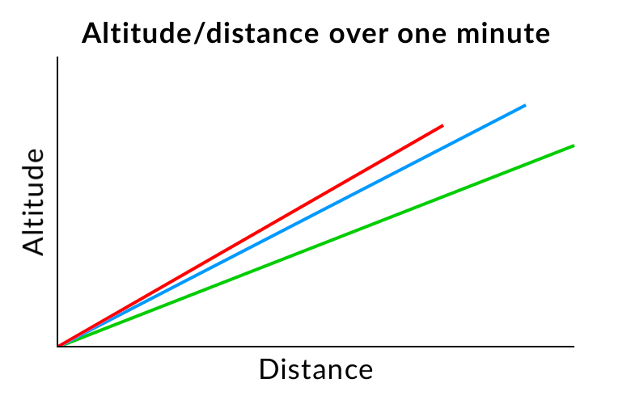

<!--
TODO: Consider moving this after forces in a climb
-->

<!--
### Best angle of climb

*   Climb in the least horizontal distance
*   Essential for clearing obstacless quickly and safely

---

### Best rate of climb

*   Climb in the minimum time
*   Used for example when climbing above bad weather or turbulence

---

### Cruise climb

*   Better engine cooling
*   Better forward visibility
*   Reduces en-route time
-->

---

<!--
_class: lead
-->

## Forces in a climb

---

<!--
_class: lead
-->

## Forces in a climb

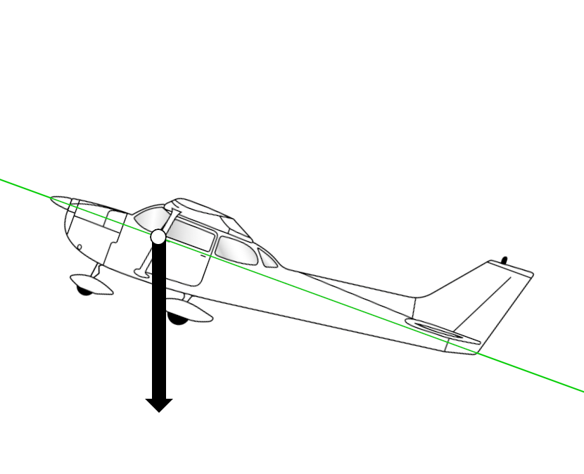

---

<!--
_class: lead
-->

## Forces in a climb

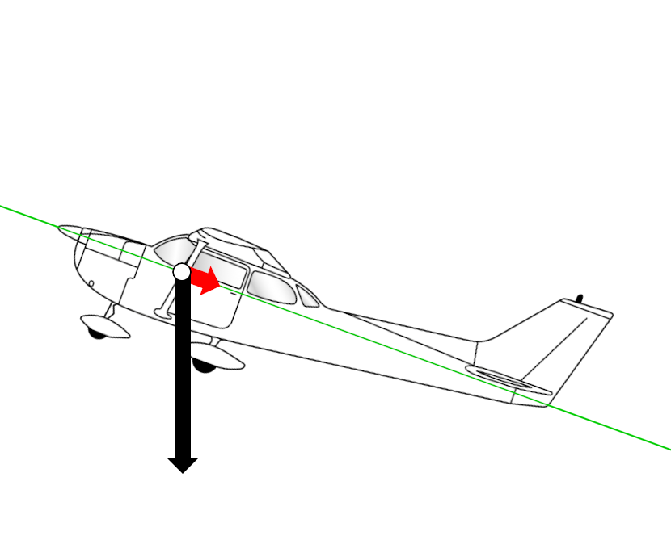

---

<!--
_class: lead
-->

## Forces in a climb

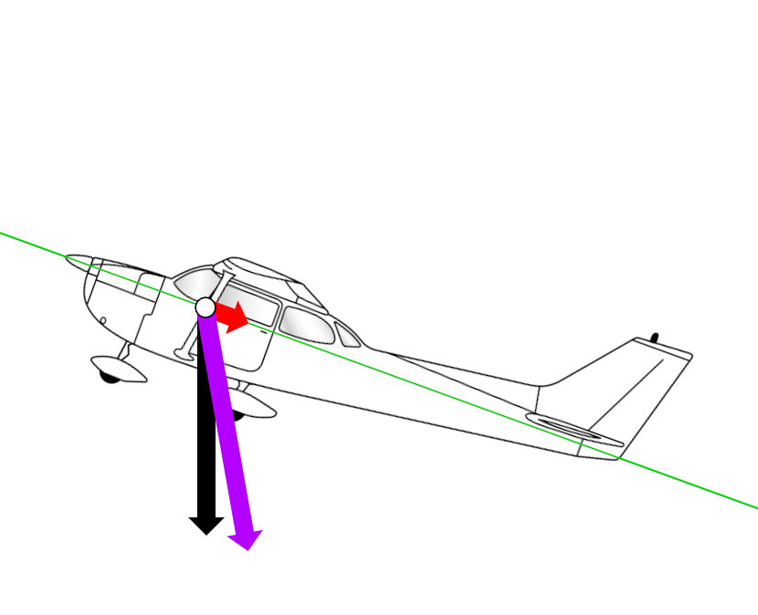

---

<!--
_class: lead
-->

## Forces in a climb

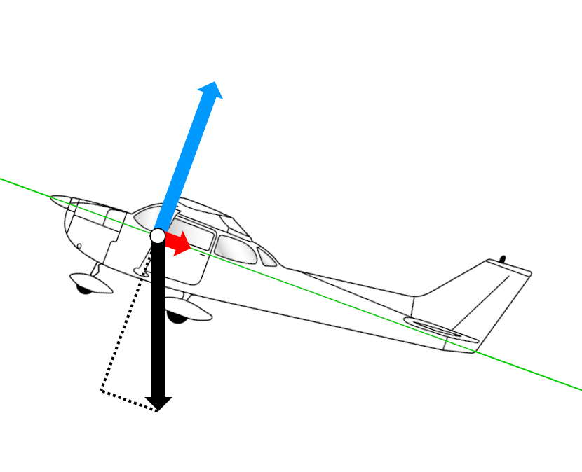

---

<!--
_class: lead
-->

## Forces in a climb

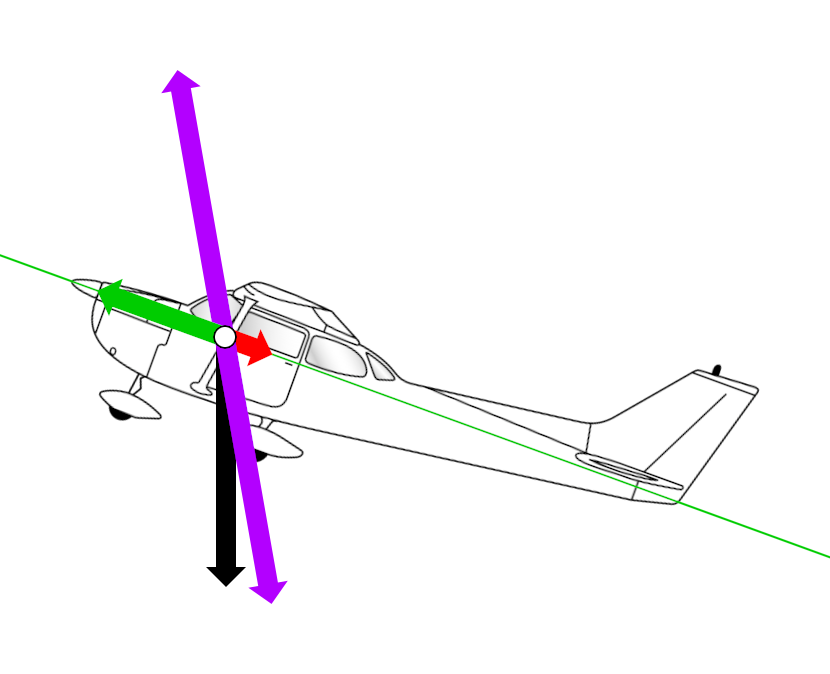

---

<!--
_class: lead
-->

## Forces in a climb

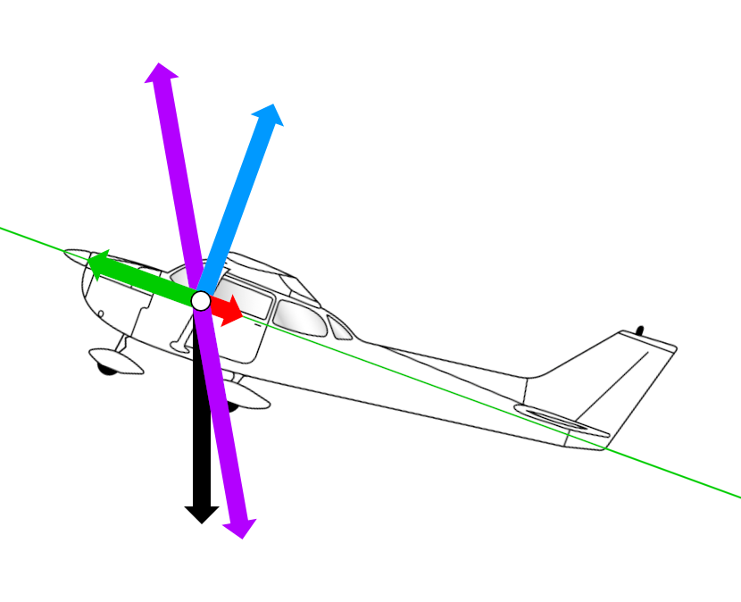

---

<!-- DELETE THIS TO ENABLE SLIDE
## Thrust

>   For every action, there is an equal and opposite reaction
—Newton's 3rd law of motion

*   Engine spins a propeller, which accelerates a mass of air backwards
*   The equal and opposite reaction is that the aeroplane is pushed forwards

---

<!--
_class: lead
_backgroundColor: #f6fafb
-->

<!-- DELETE THIS TO ENABLE SLIDE
## Propellers

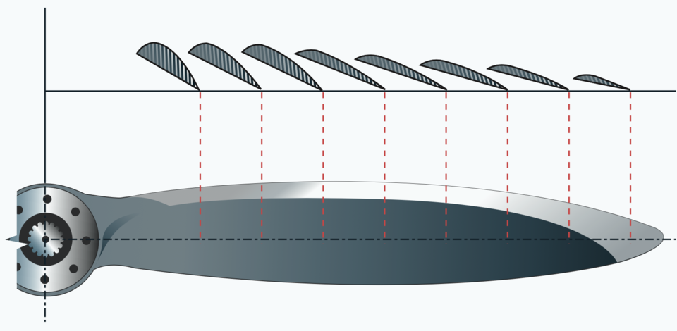

<!--

### About propellers

*   Propeller is a wing and thus produces lift, it's just angled so that it produces lift in a forwards direction
*   Fat in the middle, skinny on the outside—to provide structural integrity at the root and reduce weight at the tip
*   Blade is twisted so that the angle of attack, the angle the blade meets the air, is constant. The twist is required because the outer edge of the blade is covering more distance that the inner portion.

### Fixed-pitch propellers

*   The C150 and many trainer aeroplanes have "fixed pitch" propellers, which means that the blade's angle of incidence or "pitch" cannot be changed. More advanced aeroplanes have variable-pitch propellers, which mean that an optimal angle of attack can be used through any stage of flight. A fixed-pitch propeller is a simpler system, but means that the propeller is most efficient at one particular speed.
*   For the C150 the propeller is most efficient at climb speeds because we need all the help we can get in a climb, whereas more powerful aeroplanes might have a fixed-pitch propeller that is set to be more efficient at cruise.
-->

<!-- DELETE THIS TO ENABLE SLIDE
---

<!--
_class: lead
_backgroundColor: #f6fafb
-->

<!-- DELETE THIS TO ENABLE SLIDE
## Propellers

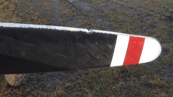

<!--
*   One particular threat regarding propellers is chips and cracks, caused by impacts with foreign objects like stones. These can propogate, eventually causing failure.
*   As part of our pre-flight inspection we must check the leading edge for chips, and check the front and rear faces for cracks.
-->

<!-- DELETE THIS TO ENABLE SLIDE
---
DELETE THIS TO ENABLE SLIDE -->

## Climb performance

---

<!--
_class:
-->

### Best angle of climb

*   VX
*   Occurs at maximum excess thrust
*   Speed = 56kts

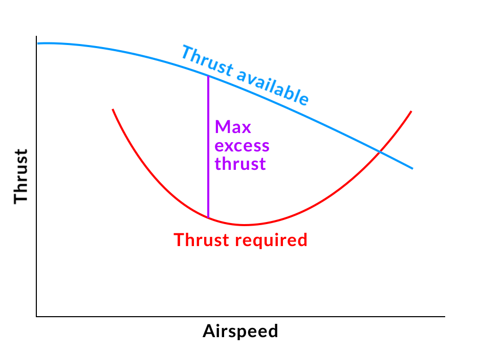

---

### Power

*   Work = Force × Distance
*   Power = Work ÷ Time
*   Therefore, power is the rate of doing work

<!--
In this case the work is climbing, so the greater the power the greater the height we can climb in a given time
-->

---

<!--
_class:
-->

### Best rate of climb

*   VY
*   Occurs at maximum excess power
*   Speed = 68kts

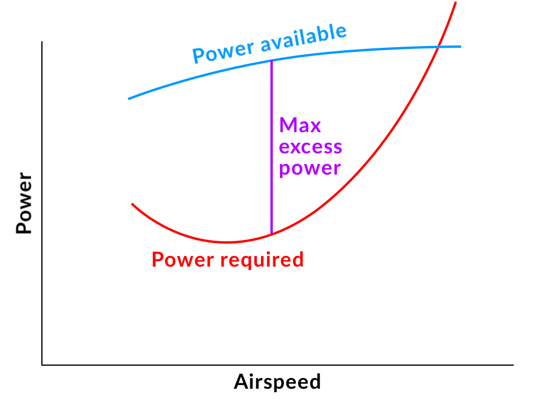

---

<!--
_class:
-->

### Normal (cruise) climb

*   Normally ~10kts faster than VY, depending on the plane
*   Speed = 70–80kts

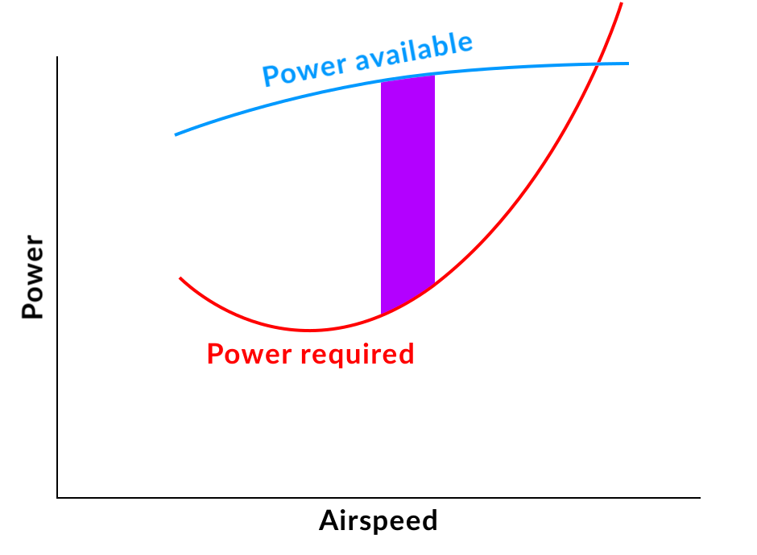

<!--
A bit faster than best rate, but still a decent amount of excess power so climb rate isn't too bad
-->

---

<!--
_class:
-->

## Types of climb

<table width="100%">
    <thead>
        <tr>
            <th>Type of climb</th>
            <th>Speed</th>
        </tr>
    </thead>
    <tbody>
        <tr>
            <td>
                Best angle of climb
            </td>
            <td>56kts</td>
        </tr>
        <tr>
            <td>
                Best rate of climb
            </td>
            <td>68kts</td>
        </tr>
        <tr>
            <td>
                Normal (cruise) climb
            </td>
            <td>70–80kts</td>
        </tr>
</table>

---

## Factors affecting climb performance

---

<!--
_class:
-->

### Weight

As weight increases:

*   More thrust and power is required to fly level
*   Less excess thrust and power
*   Therefore, maximum angle and rate of climb is decreased

---

### Altitude

As altitude increases:

*   Power is reduced, due to decreased air density
*   Additionally, more power is required to fly level at any given airspeed
*   Maximum angle and rate of climb are reduced

---

### Flaps

*   The effect of flaps can depend on the specific aircraft and flaps configuration, so check the POH!
*   In a Cessna 150 any extension of flaps reduces maximum angle and rate of climb

---

### Wind

*   An aeroplane in a headwind will gain the same altitude in a minute as an aircraft in nil wind
*   However, during that minute the parcel of air the aeroplane is flying in will have moved, therefore the angle of climb is increased
*   In summary:
    *   Wind has no effect of rate of climb
    *   A headwind increases angle of climb
    *   A tailwind decreases angle of climb

<!--
Analogy: swimming against a current: does the current affect how many strokes you make in a minute? No, your "rate of stroke" remains the same, just the water you are swimming in is moving so you don't get as far in a minute.
-->

---

## Factors affecting climb performance

<table width="100%">
    <thead>
        <tr>
            <th>Factor</th>
            <th>Angle of climb</th>
            <th>Rate of climb</th>
        </tr>
    </thead>
    <tbody>
        <tr>
            <td>Weight</td>
            <td></td>
            <td></td>
        </tr>
        <tr>
            <td>Altitude</td>
            <td></td>
            <td></td>
        </tr>
        <tr>
            <td>Flaps</td>
            <td></td>
            <td></td>
        </tr>
        <tr>
            <td>Wind</td>
            <td></td>
            <td></td>
        </tr>
    </tbody>
</table>

<!--
Weight   | Decrease                 | Decrease
Altitude | Decrease                 | Decrease
Flap     | Decrease                 | Decrease
Wind     | Hw Increase, Tw Decrease | Nil
-->

---

## Threat and error management

*   Traffic
    *   Clear the nose
*   Temps and pressures
    *   Lower the nose
    *   Reduce power
    *   Enrich mixture

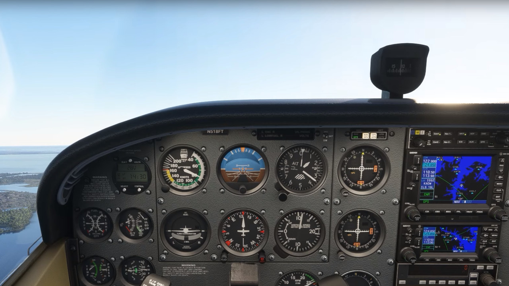

<!--
*   Traffic
    *   Look at the picture: what can you tell me about your view ahead? Not very good.
    *   Teaching aid: two model aeroplanes climbing into eachother
*   Temps and pressures
    *   Why would temps and pressures be particularly concerning during a climb? Full power + low airspeed
-->

---

## Threat and error management

*   Situational awareness
    *   Airspace
    *   Weather

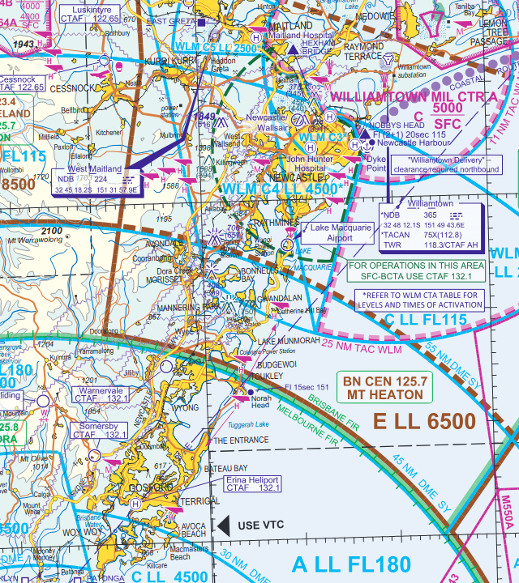

<!--
*   Be aware of airspace above you and do not climb into controlled airspace without a clearance
*   We are flying under VFR and must stay clear of cloud
-->

---

## Review questions

*   List the three types of climb
*   Give an example of when would you use each type of climb
*   Describe the lift force during a climb, compared to level flight
*   Explain the effect of wind on climb performance
*   State the flaps configuration that gives us best climb performance in the Cessna 150

---

## Objectives

You should now be able to:

*   State the three types of climb and describe when you would use each
*   Explain the aerodynamic forces acting on the aeroplane during a climb
*   List the factors affecting climb performance and describe their effect