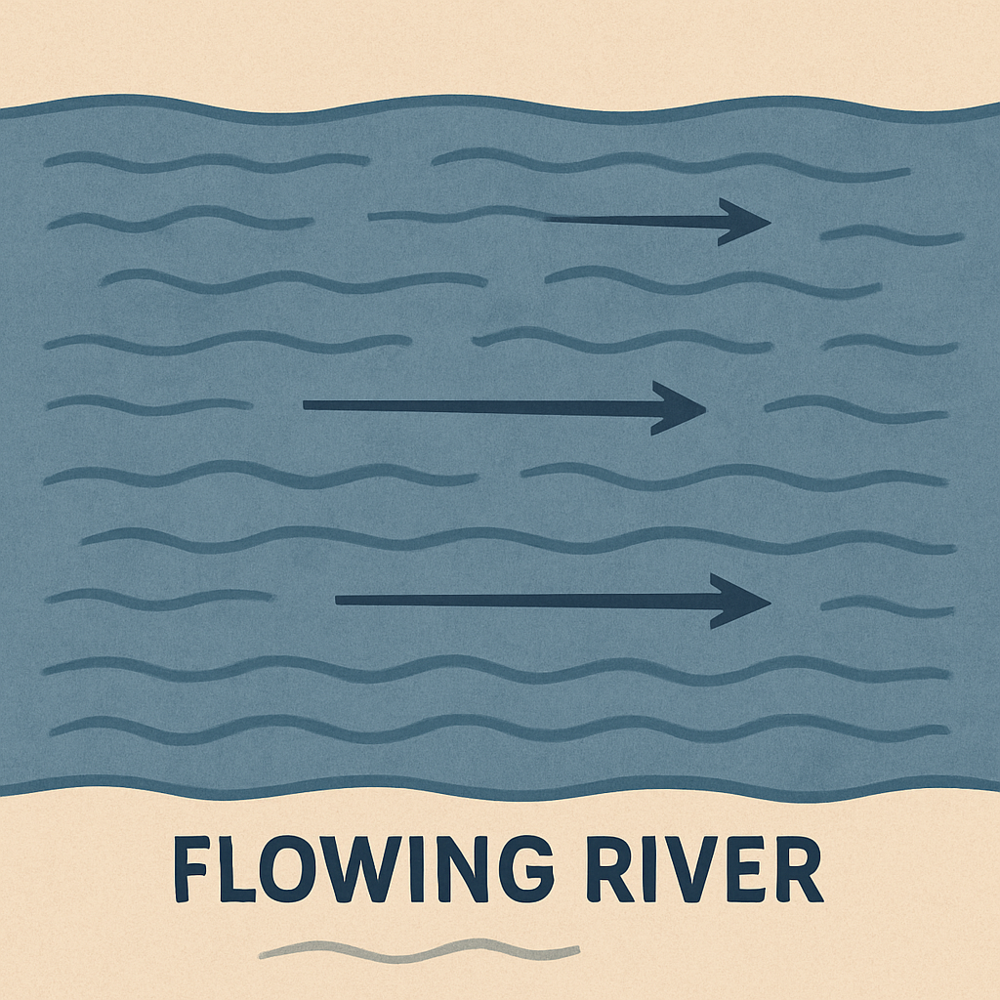
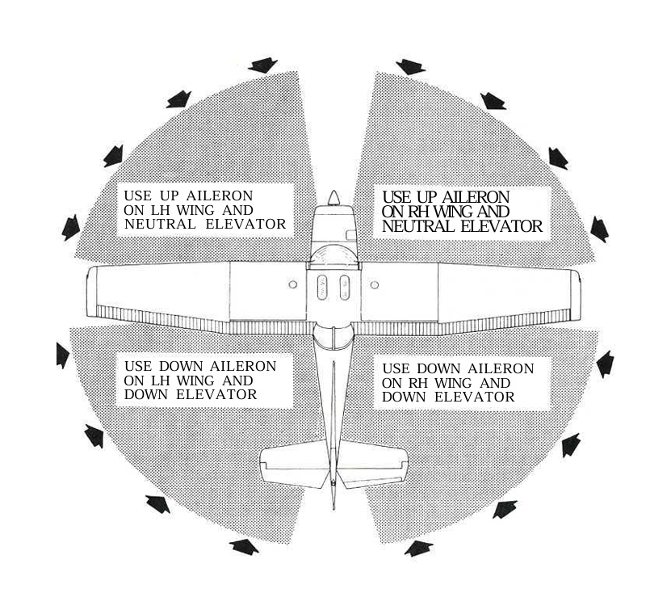
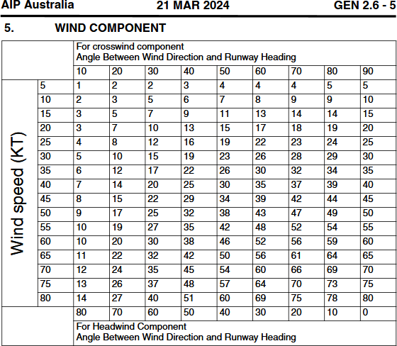
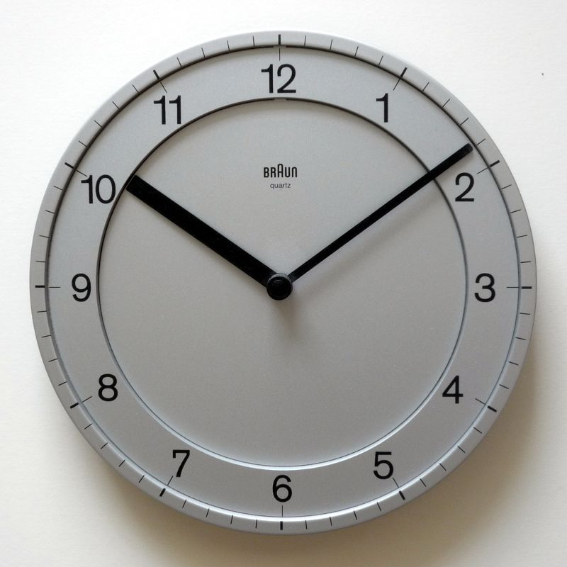

## Aim

*   To learn the correct technique for taxi, takeoff, and landing in crosswind conditions
*   To learn how to compensate for drift throughout the circuit

---

## Motivation

*   Expands your ability to fly in a wider range of conditions
*   Many aerodromes only have one runway orientation—you can't always land into wind
*   Increases safety and confidence when landing in real-world scenarios
*   Helps develop better handling and coordination skills

---

## Objectives

By the end of this brief you should be able to:

*   Define drift, and explain how we correct for it
*   State the correct control input for a given wind direction during taxi
*   Describe crosswind takeoff & landing technique
*   Determine the crosswind component of wind
*   Define maximum demonstrated crosswind, and state where we would find it

---

## Lesson overview

Duration: approx 45 mins

*   Drift compensation
*   Taxi, takeoff, and landing technique
*   Determining crosswind component
*   Crosswind limitations
*   Application
*   Threat and error management
*   Review questions

---

## Revision

*   How do we use a windsock to determine wind direction and speed?
*   What effect will a headwind have on our descent angle?
*   What would you do if an approach or landing felt unsafe?
*   What is the go around procedure?

---

<!--
_class:
_backgroundColor: #f3ddc0
-->

## Drift compensation

*   When flying in a crosswind, the plane will be "pushed" in the direction of the wind
*   Drift = difference in angle between the plane's heading and its ground track
*   Nose into wind to correct for drift angle
    <!-- When we get to navigation, we go through how to calculate exactly what the drift angle is and therefore how much of a correction we need to make. For now, it's a visual "guesstimate" -->

<!-- Analogy: swimming across a flowing river -->

---

## The effect of wind on climbing and descending

*   Headwind
    *   Steepens climb and descent angle
    *   Reduces ground speed, increasing the time spent on a given leg
*   Tailwind
    *   Shallows climb and descent angle
    *   Increases ground speed, reducing the time spent on a given leg

<!-- A headwind or tailwind is just another form of drift, and just like a crosswind we need to consider its effects and compensate for it throughout our circuit -->

---

<!--
_class:
_backgroundColor: #fff
-->

## Taxi control input

*   Deflect the into-wind control surfaces so that the wind cannot "pick it up"
    <!-- So if wind is coming from in-front, what elevator control do we need? What about when the wind is coming from behind? What if the wind is coming from the front left? What about the rear left? -->
    *   Wind from ahead: climb into wind
    *   Wind from behind: dive from wind
*   Be conscious of taxi speed in windy conditions
    <!-- It can be more difficult than you would think to maintain directional control on the ground -->

---

## Takeoff technique

*   Ailerons fully into wind, elevator neutral
*   As the plane accelerates, slowly bring the ailerons back to neutral so that they are fully neutral at the moment you rotate
*   Plane will weathercock into wind, make a balanced climb holding that drift angle, using visual reference to maintain runway track

---

## Approach & landing technique

*   Crab into wind for most of final
*   On short final, rudder to align with centreline, and into-wind wing down to maintain runway track
*   Into-wind wheel will touch down first

---

<!--
_class: lead invert
-->

<video src="./crosswind-landing.webm" controls="controls" width="326" height="580" loop></video>

<!--
*   Crab into wind for most of final
*   On short final, rudder to align with centreline, and into-wind wing down to maintain runway track
*   Into-wind wheel will touch down first
-->

---

<!--
_class:
_backgroundColor: #fff
-->

## Determining crosswind component

<!--
How much of a correction you need to make in these different phases depends on the strength of the crosswind

Within your AIP you can find this wind component table, which allows you to calculate the headwind and crosswind component of the wind.

Examples. Using Warnervale's runways (what are they?), let's determine the crosswind component for the following winds:
230/25 = RWY 20, 12kts crosswind
010/10 = RWY 02, 2kts crosswind
080/20 = RWY 02, 17kts crosswind
-->

---

## Determining crosswind component

*   Minutes = angle between wind direction and runway heading
*   30 mins = 50% crosswind
*   45 mins = 75% crosswind
*   60 mins = 100% crosswind

---

<!--
_class: lead
-->

## Crosswind limitations

---

## Maximum demonstrated crosswind

*   Published in the POH
*   Maximum crosswind where adequate control of the plane was demonstrated by the manufacturer during certification tests
*   Not considered a limit, just a reference for what was actually done during certification tests
*   Cessna 150 maximum demonstrated crosswind = 13kts
    <!-- Students should use the POH to find maximum demonstrated POH -->

---

## Personal minimums

*   Reflects your own experience, recent practice, and confidence
*   Can be more restrictive than POH values, especially while you are inexperienced
*   Gradually adjusted as skill and confidence increases

<!-- When I was doing some hour building for CPL my wife and I went on a trip to Townsville and back. On the way back we stopped at Longreach for the night. In the morning the wind was blowing 25–30kts, direct crosswind. So as a pilot with about 100 hours, and my wife on board, I preflighted the plane but decided to stay on the ground. We waited in the cafe at the QANTAS museum, staring at the windsock, until we finally saw it fall to about 15kts and then we decided to go. It delayed our departure and we had to adjust our plans a bit, but it was a conservative and safe choice, and that's totally ok. -->

---

## Application

---

## Threat and error management

Threat | Error | UAS | Countermeasure
-|-|-|-
Wind during taxi | Incorrect control inputs | Loss of control |

---

## Threat and error management

Threat | Error | UAS | Countermeasure
-|-|-|-
Wind during taxi | Incorrect control inputs | Loss of control | "Climb into, dive away"

---

## Threat and error management

Threat | Error | UAS | Countermeasure
-|-|-|-
Wind during taxi | Incorrect control inputs | Loss of control | "Climb into, dive away"
Gusty crosswind | Insufficient control inputs | Blown off centreline |

---

## Threat and error management

Threat | Error | UAS | Countermeasure
-|-|-|-
Wind during taxi | Incorrect control inputs | Loss of control | "Climb into, dive away"
Gusty crosswind | Insufficient control inputs | Blown off centreline | Correct technique, consider flaps

---

## Threat and error management

Threat | Error | UAS | Countermeasure
-|-|-|-
Wind during taxi | Incorrect control inputs | Loss of control | "Climb into, dive away"
Gusty crosswind | Insufficient control inputs | Blown off centreline | Correct technique, consider flaps
Narrow runway | Misjudge alignment | Touchdown off runway |

---

## Threat and error management

Threat | Error | UAS | Countermeasure
-|-|-|-
Wind during taxi | Incorrect control inputs | Loss of control | "Climb into, dive away"
Gusty crosswind | Insufficient control inputs | Blown off centreline | Correct technique, consider flaps
Narrow runway | Misjudge alignment | Touchdown off runway | Go around

---

## Threat and error management

Threat | Error | UAS | Countermeasure
-|-|-|-
Wind during taxi | Incorrect control inputs | Loss of control | "Climb into, dive away"
Gusty crosswind | Insufficient control inputs | Blown off centreline | Correct technique, consider flaps
Narrow runway | Misjudge alignment | Touchdown off runway | Go around
Wind beyond skill| Exceed personal mins | Any of the above |

---

## Threat and error management

Threat | Error | UAS | Countermeasure
-|-|-|-
Wind during taxi | Incorrect control inputs | Loss of control | "Climb into, dive away"
Gusty crosswind | Insufficient control inputs | Blown off centreline | Correct technique, consider flaps
Narrow runway | Misjudge alignment | Touchdown off runway | Go around
Wind beyond skill| Exceed personal mins | Any of the above | Stay on the ground

---

## Review questions

*   What is drift?
    <!-- How do we correct for it? -->
*   If the wind is from your front-left during taxi, which control inputs should you use?
*   Describe the crosswind takeoff technique
*   Describe the crosswind landing technique
*   Using the watch technique, determine the crosswind component of wind 065/20 for RWY 02
    <!-- (15kts). Try using the AIP, is the figure different? (14kts) -->
*   What is maximum demonstrated crosswind?
    <!-- Is maximum demonstrated crosswind a limit? Where do we find the value for our plane? What was the value for the C150? -->

---

## Objectives

You should now be able to:

*   Define drift, and explain how we correct for it
*   State the correct control input for a given wind direction during taxi
*   Describe crosswind takeoff & landing technique
*   Determine the crosswind component of wind
*   Define maximum demonstrated crosswind, and state where we would find it