## Aim

*   To learn the different types of descent, the aerodynamics behind a descent, and the factors affecting glide performance.

---

## Motivation

*   A good landing is preceded by a good stable descent
*   Practising descents helps you learn to manage airspeed and rate of descent, which will make your approaches into the circuit much smoother

---

## Objectives

By the end of this brief you should be able to:

*   State the three types of descent
*   Describe the arrangement of forces in a descent
*   Determine glide range given lift/drag ratio
*   List the factors affecting glide performance and state their effect

---

## Lesson overview

Duration: approx 50 mins

*   Types of descent
*   Forces in a descent
*   Glide range
*   Factors affecting glide performance
*   Application
*   Threat and error management
*   Review questions

---

## Revision

*   Compared to straight and level, how does the direction of the lift vector change in a climb?
    <!-- It tilts backwards. Lift acts 90 degrees to the direction of motion. -->
*   Why does the total drag curve form a "U" shape?
    <!-- At low speed induced drag dominates, and at high speed parasite drag dominates. Our minimum drag speed is somewhere in the middle. -->
*   What is the pilot's lift formula?
    <!-- Lift = Speed * AoA -->
*   How does carby heat mitigate carby icing?
    <!-- It redirects hot, unfiltered air from around the exhaust into the venturi which melts the ice. -->

---

## Types of descent

*   Cruise descent
    *   500fpm, approximately cruise speed
*   Approach descent
    *   Reduced speed, incorporates flaps
*   Glide descent
    *   Idle power, best glide speed

---

<!--
_class: lead
-->

## Forces in a descent

<!--
Remembering our four forces from straight and level, we said talked about the idea of "couples"—what is a couple? Because the forces are offset, the couples created a rotating force. Thurst-drag created a nose-up force, and weight-lift created a nose-down force.

Thinking about these couples, what would happen if we removed thrust? The nose-up force from the lift-drag couple would reduce, causing the nose to lower.
-->

---

<!--
_class: lead
-->

## Forces in a descent

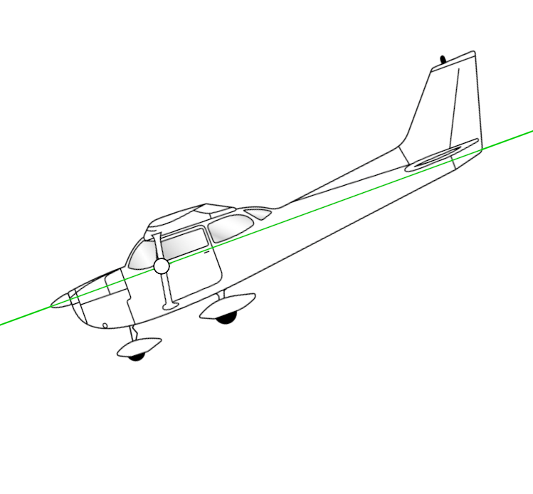

<!-- The plane is now angled downwards, following a glide path. So let's walk through the forces and see how they are in equilibrium. -->

---

<!--
_class: lead
-->

## Forces in a descent

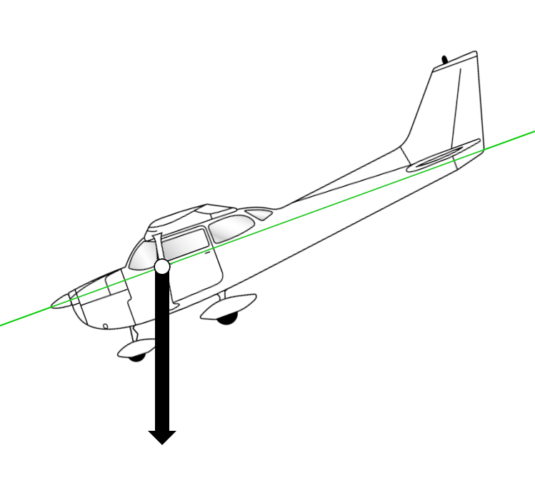

<!-- For a moment, let's forget about planes and instead imagine a car parked on a hill. Weight acts straight down, but if we release the parking brake which was in the car going to go? Forward, down the hill. So we can split weight into two components, one acting forward and one acting perpendicular. -->

<!-- Since the plane's flight path is tilted, we can do the same thing. -->

---

<!--
_class: lead
-->

## Forces in a descent

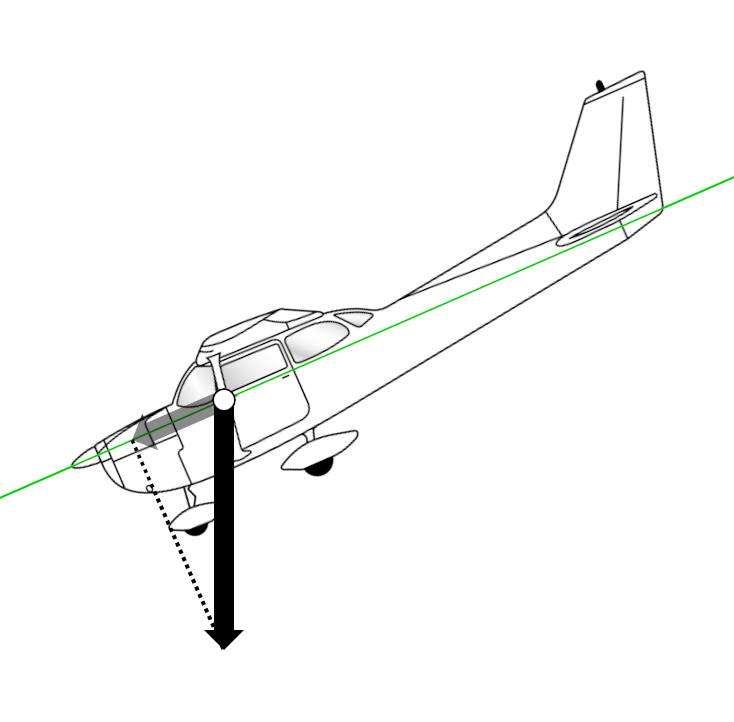

<!-- One which acts forwards along the flight path called the forward component of weight -->

---

<!--
_class: lead
-->

## Forces in a descent

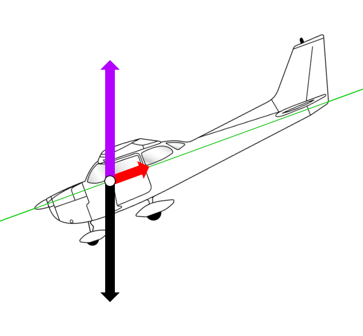

<!-- And one which acts perpendicular to the flight path -->

---

<!--
_class: lead
-->

## Forces in a descent

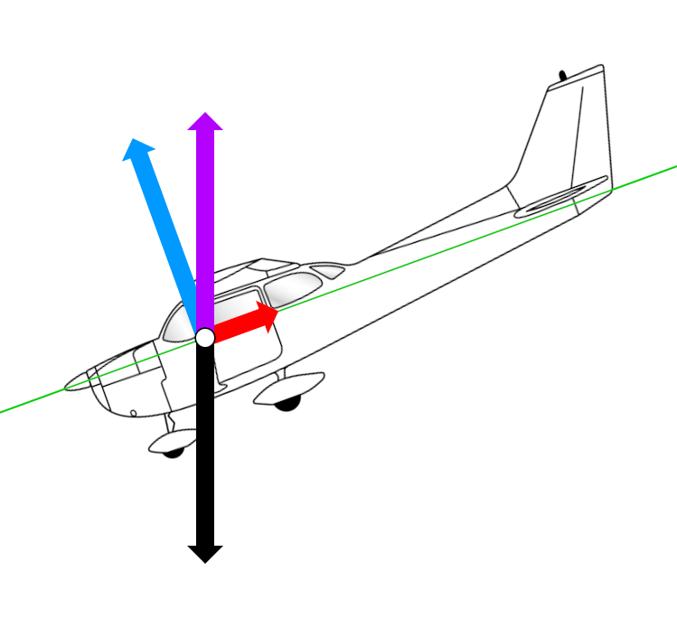

<!-- The forward component of weight acts forwards along the flight path, and is in equilibrium with drag. So in a glide we no longer have need for thrust, as gravity does the forward work. If we do a powered descent, thrust would in any-case be less than drag. -->

---

<!--
_class: lead
-->

## Forces in a descent

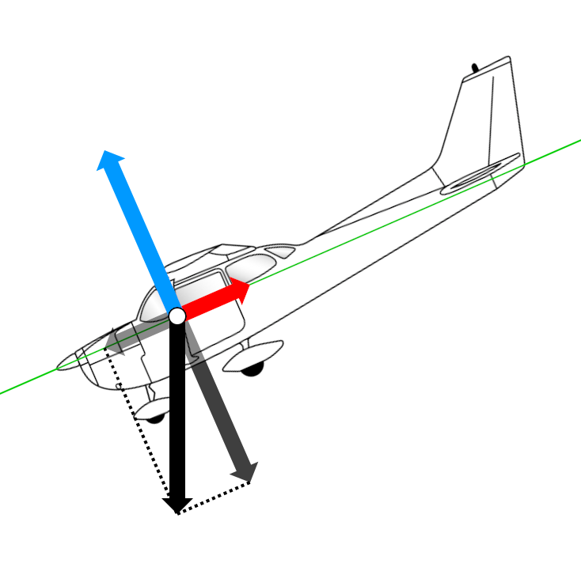

<!-- Meanwhile, the perpendicular component of weight acts at right angles to the flight path and is in equilibrium with lift. Note that because lift is equal to a component of weight, that means lift is less than the total weight force, -->

---

<!--
_class: lead
-->

## Forces in a descent

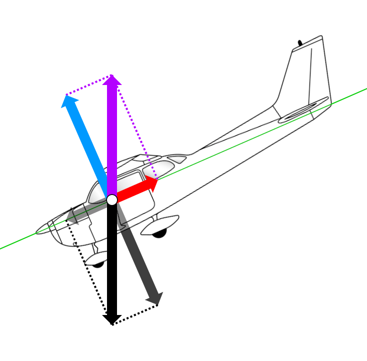

<!--
So you can see all of the forces are in equilibrium, with weight being balanced with lift and drag.

Adding a little thrust simply shallows the flight path, as a smaller forward component of weight is required to balance with drag.

Similarly, adding flaps requires a steeper descent angle because we need more forward component of weight to balance the increased drag.
-->

---

<!--
_class: lead
-->

## Glide range

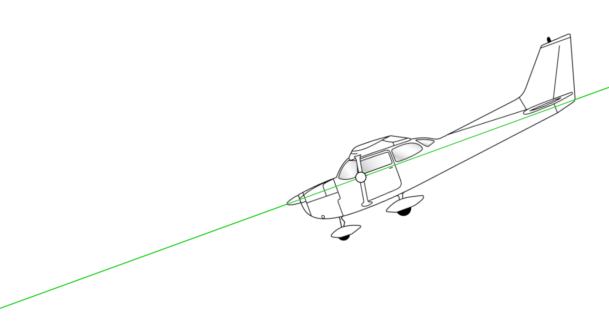

---

<!--
_class: lead
-->

## Glide range

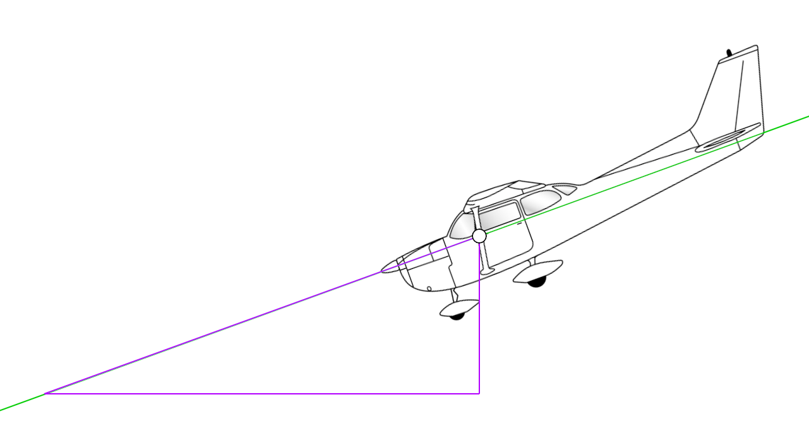

<!-- Hypotenuse is the flight path, vertical side is the plane's height above the ground, and the horizontal side is the glide distance -->

---

<!--
_class: lead
-->

## Glide range

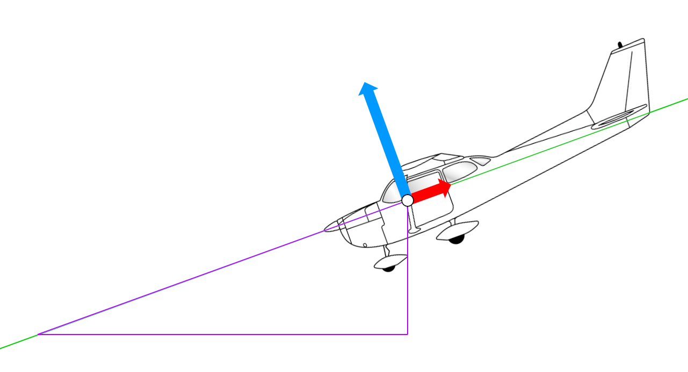

<!-- Add our lift and drag vectors -->

---

<!--
_class: lead
-->

## Glide range

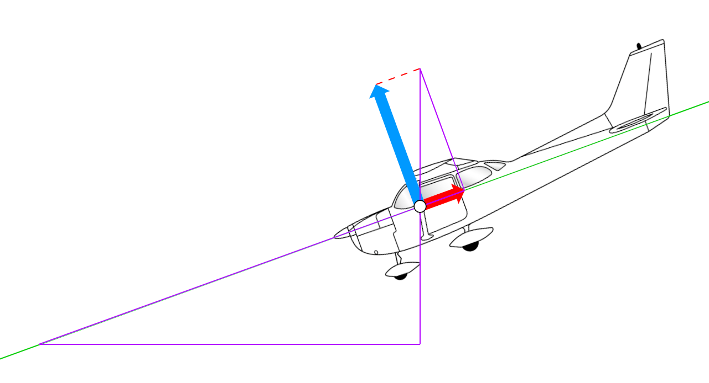

<!--
Let's draw a triangle with one side being defined by the strength of the lift force, and the other being defined by the strength of the drag force. Similar triangles have all the same angles, so the ratio between sides will be equal.
-->

---

<!--
_class: lead
-->

## Glide range 

$$
\frac{lift}{drag} = \frac{distance}{height}
$$

<!--
    Distance/height and lift/drag create similar triangles
        Lines intersect (= angles at point of intersection) + right angle triangles = similar triangles

    Therefore distance/height = lift/drag, which means glide distance is determined by lift/drag ratio.
-->

---

<!--
_class: lead
_backgroundColor: #fff
-->

## Lift/drag ratio

$$
\frac{lift}{drag} =
    \frac
        {C_L \; \frac{1}{2} \; \rho \; V^2\;  S}
        {C_D \; \frac{1}{2} \; \rho \; V^2\;  S}
$$

<!-- We've seen the lift formula plenty of times, you might not have seen the drag formula. The only difference is that instead of coefficient of lift, we multiply by coefficient of drag. -->

---

<!--
_class: lead
_backgroundColor: #fff
-->

## Lift/drag ratio

$$
\frac{lift}{drag} =
    \frac
        {C_L \; \cancel{\frac{1}{2} \; \rho \; V^2\;  S}}
        {C_D \; \cancel{\frac{1}{2} \; \rho \; V^2\;  S}}
$$

<!-- Recall high school maths, if a value is present on both the top and bottom of a fraction we can cancel it. -->

---

<!--
_class: lead
_backgroundColor: #fff
-->

## Lift/drag ratio

$$
\frac{lift}{drag} =
    \frac
        {C_L}
        {C_D}
$$

<!-- Therefore, lift/drag is defined by the ratio of the coefficient of lift over the coefficient of drag. -->

---

<!--
_class: lead
_backgroundColor: #fff
-->

## Lift/drag ratio

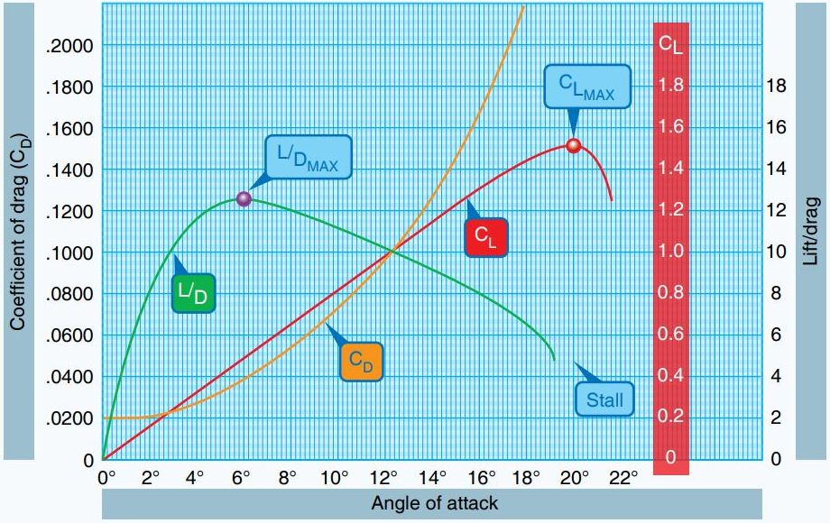

<!--
Just like coefficient of lift, coefficient of drag is measured in a wind tunnel by keeping all factors constant and measuring how the wing behaves at different angles of attack.

Importantly, you can see these values are all defined by angle of attack. How do we determine angle of attack in a plane? We have no AoA indicator, so manufacturers will provide a recommended speed for best glide which will put us at the most efficient angle of attack.
-->

---

<!--
_class:
-->

## Glide range

*   The lift/drag ratio determines glide range
    <!-- DRAW: 4 forces at different lift:drag ratios, remembering R1 (= L + D) must equal W. Draw the glide path second, then L and D can be inferred, -->
*   Best lift/drag ratio occurs at a specific angle of attack
*   We don't have an angle of attack indicator, so manufacturers provide a recommended glide speed which will achieve best lift/drag ratio
    <!-- In heavier planes you will notice that the POH specifies different glide speeds for different weights, which allow the pilot to achieve the best lift/drag angle of attack at various weights. The 172 has a small range of operating weights, so the POH specifies a single speed that is about right at any weight. -->
*   In a C172 we get the best lift/drag ratio of about 9:1 at 65kts
    <!-- C172 has a lift/drag ratio of 9:1. So at 6000ft AGL (1nm) we could glide about 9nm (1.5nm per 1000ft). Gliders have a lift/drag ratio of 50:1 or even greater, so can glide huge distances even without thermals. -->

---

## Factors affecting descent performance

*   Weight
    *   In nil wind, weight has no effect on glide distance
    *   Faster speed will be required to maintain the best lift/drag angle of attack
    *   Therefore, weight increases rate of descent

<!--
Lift/drag ratio is what determines glide distance

As unintuitive as it is, weight has no impact

Now, why might we need a faster IAS? Straight and level lift = weight, weight++ means lift++, and from the pilot's lift formula our tools are speed and AoA. So if we want to maintain the best lift/drag AoA, then we need to increase speed.
-->

---

<!--
_class: 
-->

## Factors affecting descent performance

*   Wind
    *   No impact on rate of descent
    *   Headwind = steeper angle and reduced distance

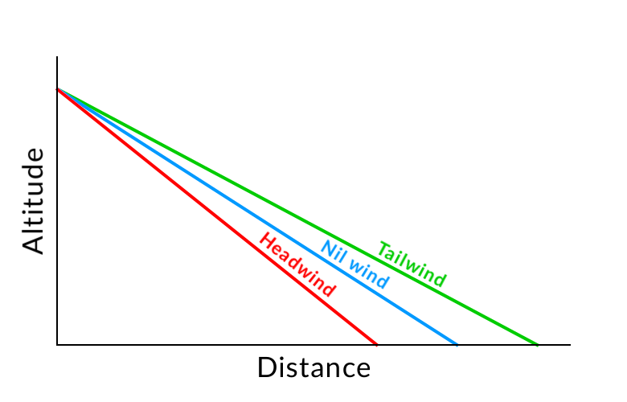

<!--
Although rate of descent is the same, the parcel of air we're flying in is moving so that affects our distance across the ground

This can be a very important effect, especially when we get to circuit emergencies and forced landings

Interestingly, because more weight = increased rate of descent, we spend less time in a headwind when gliding at a heavier weight, so in a headwind a heavier plane will glide further than a lighter plane
-->

---

<!--
_class: 
-->

## Factors affecting descent performance

*   Power
    <!-- As we saw earlier, reducing power in straight and level lead to an increased descent angle and rate of descent. It therefore follows that increasing power will reduce the descent angle and slow the rate of descent. -->
    *   Shallows angle and increased distance
    *   Reduces rate of descent

---

## Factors affecting descent performance

*   Flaps
    *   Increases drag (and lift, to a lesser extent)
    *   Steepens angle and reduces distance
    *   Increases rate of descent

<!--
Remembering back to EOC, what do flaps do?
-->

---

## Factors affecting descent performance

<table width="100%">
    <thead>
        <tr>
            <th>Factor</th>
            <th>Glide distance</th>
            <th>Rate of descent</th>
        </tr>
    </thead>
    <tbody>
        <tr>
            <td>Weight</td>
            <td></td>
            <td></td>
        </tr>
        <tr>
            <td>Wind</td>
            <td></td>
            <td></td>
        </tr>
        <tr>
            <td>Power</td>
            <td></td>
            <td></td>
        </tr>
        <tr>
            <td>Flaps</td>
            <td></td>
            <td></td>
        </tr>
    </tbody>
</table>

<!--
Weight   | Decrease                 | Decrease
Altitude | Decrease                 | Decrease
Flap     | Decrease                 | Decrease
Wind     | Hw Increase, Tw Decrease | Nil
-->

---

## Application

---

## Threat and error management

*   Traffic
    *   Lookout
*   Carb ice
    *   Use carb heat when operating below green arc (2000 RPM)
*   Pressure imbalance in ears
    *   Limit descents to 600–700fpm for passenger comfort (500fpm is recommended)

---

## Threat and error management

*   Situational awareness
    *   Airspace
    *   Weather
    *   Minimum altitudes

---

## Review questions

*   What are the 3 types of descent?
*   Compared to straight and level, how does the lift force change in a descent?
*   An aircraft with a lift/drag ratio of 10:1 is 3000ft (0.5nm) above the ground. What is the glide range in nm?
*   How does a headwind affect glide range?
*   Your instructor leaves the plane for you to go solo. What effect does the reduced weight have on glide range?

---

## Objectives

You should now be able to:

*   State the three types of descent
*   Describe the arrangement of forces in a descent
*   Determine glide range given lift/drag ratio
*   List the factors affecting glide performance and state their effect