## Aim

*   To learn the effects of the flight controls and ancillary controls of an aeroplane and how to operate them

---

## Motivation

*   You're here to learn to fly!!
    <!-- You're here to learn to fly, so knowing the controls is pretty important! Normally in these briefs I'll give some motivation or reason why this particular lesson is important, but for this one I'll turn it over to you. Why are you interested in learning to fly? -->

---

## Objectives

By the end of this brief you should be able to:

*   List the 3 flight controls and their primary effect
*   State secondary effects of the 3 flight controls
*   Indicate ancillary controls on the poster
*   List the 4 factors which affect the reaction force generated by control surfaces
*   Show the 3 axis of motion on the model

---

## Lesson overview

Duration: approx 60 mins

*   Four forces
*   Control surfaces
*   Aircraft axis
*   Flight controls & instruments
*   Application
*   Threat and error management
*   Review questions

---

## Revision

*   When you moved the control column forward and back during your trial flight, what did the aircraft do?
    <!-- The nose of the aircraft moved up and down -->
*   What about when you turned the control column left or right?
    <!-- The wings tilted to the left or right -->
*   What happened when you pressed on the rudder pedals?
    <!-- The nose of the aircraft moved to the left or right -->

<!--
What you experienced in that flight—the nose moving up and down, the wings tilting, and the nose swinging left or right—that is movement in pitch, roll, and yaw. These are the three ways any object can rotate in 3D space.

In this session we'll build on what you felt in your trial flight and see how the flight controls contribute to these movements.
-->

---

<!--
_class: lead
-->

## Four forces

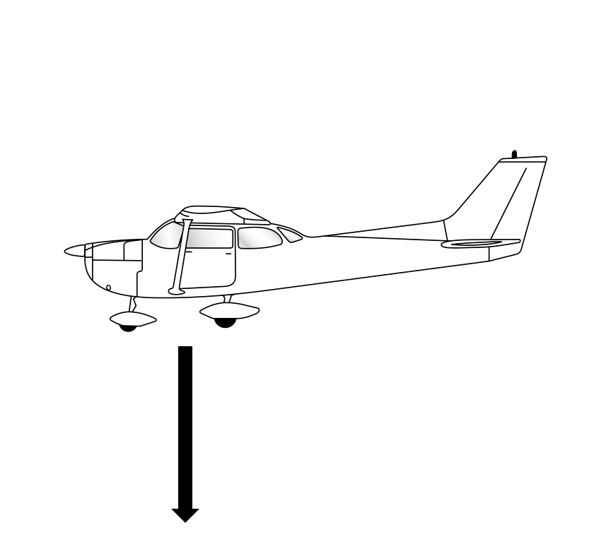

<!--
We're going to start by introducing the four forces acting on a plane in flight. This will be foundational for your understanding of how an aircraft flies.

*drop marker to illustrate weight* What would you say just happened? That was weight in action. The force of gravity pulled the pen towards the earth, and we call that weight. Weight always acts straight down towards the center of the earth.

We illustrate this force using a vector. A vector is an arrow which shows direction and strength. A longer arrow indicates a more powerful force.
-->

---

<!--
_class: lead
-->

## Four forces

<!-- The next force is lift, which is generated by the wings to oppose weight. It's only because of the lift force that we can actually fly. Lift acts perpendicular to the plane's motion through the air. -->

---

<!--
_class: lead
-->

## Four forces

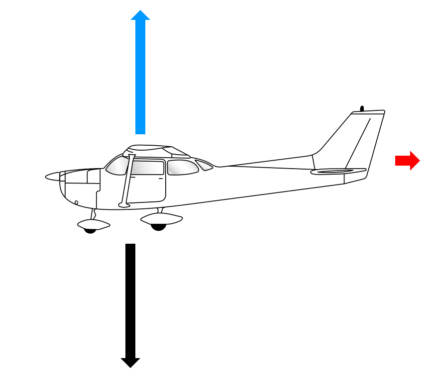

<!--
The third force is drag. Drag is the force opposing the plane's motion through the air. If you imagine sticking your hand out the window of the moving car you will feel your hand being pushed backwards.

If you had to guess, which direction do you think the last force is acting?
-->

---

<!--
_class: lead
-->

## Four forces

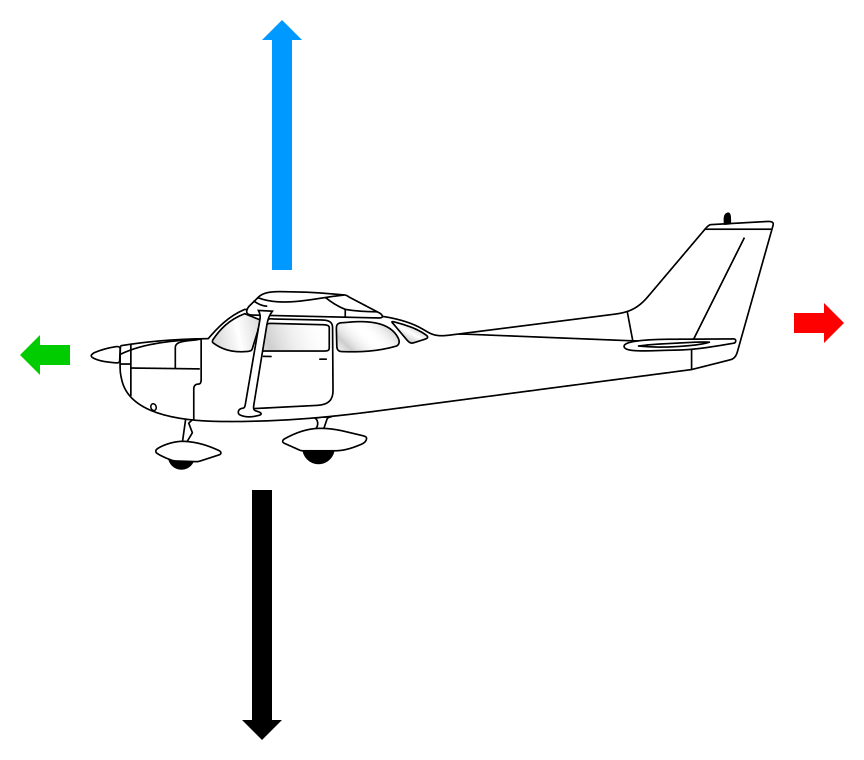

<!-- The final force is thrust. Thrust acts forwards to pull the plane through the air. Thrust is created by the engine and propeller, just like the propeller on a boat except our propeller is at the front. -->

---

<!--
_class:
-->

## Control surfaces

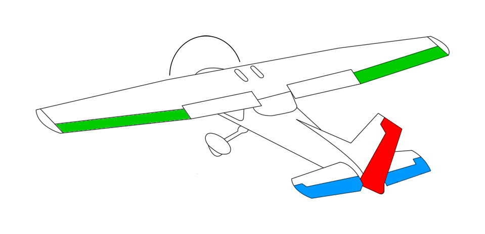

<!--
An aerodynamic control surface is a small moving part of the aircraft—like the elevator, ailerons, or rudder—that changes the direction of the airflow creating a force which causes the plane to rotate.

This sheet of paper is like an aerodynamic control surface. If I hold it flat and move it through the air then very little force is created. But if I tilt the paper—air will hit the angled surface and get deflected downwards, which pushes the paper upwards. This is simply Newton's 3rd law, for every action there is an equal and opposite reaction.

We can change the magnitude of the force created by the control surface by changing: 1) the angle of the control surface, 2) the speed it moves through the air, 3) the size of the control surface, or 4) the air density.
-->

---

## Aircraft axis

*   An axis is an imaginary line about which a body rotates
*   An aircraft has 3 axis about which it can rotate:
    *   Longitudinal axis
    *   Lateral axis
    *   Normal (vertical) axis
*   All 3 axis intersect at the aircraft's centre of gravity

---

<!--
_class:
-->

## Longitudinal axis

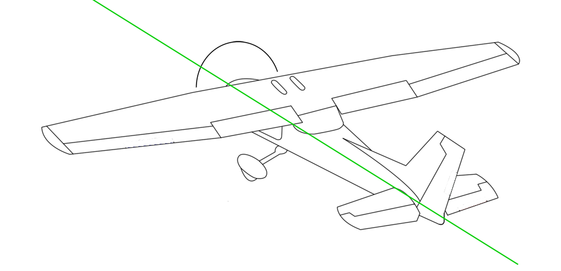

<!-- Longitudinal axis runs down the length of the plane, and when the wings tilt the aircraft is rotating about the longitudinal axis -->

---

<!--
_class:
-->

## Lateral axis

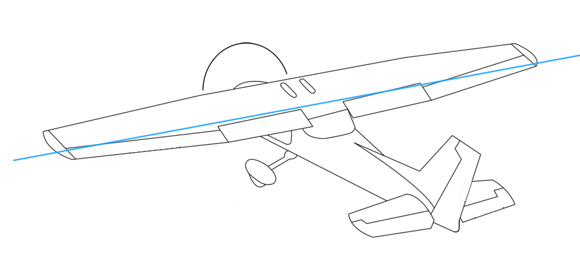

<!-- The lateral axis runs through the plane from wingtip to wingtip. When the nose moves up and down the aircraft is rotating about the lateral axis. -->

---

<!--
_class:
-->

## Normal (vertical) axis

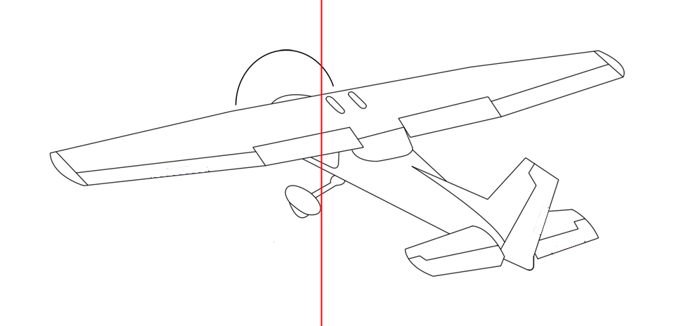

<!-- The normal axis is also known as the vertical axis, and it runs from top to bottom through the plane's centre of gravity. When the nose moves left or right the aircraft is rotating about the vertical axis. -->

---

<!--
_class:
-->
## Flight controls

<!-- Demo with model -->

*   Elevator
    <!-- Pushing the control column forward tilts the elevator down. The air hitting the elevator causes the tail to move up, and the nose to move down. This is called pitch. -->
    <!-- Primary effect: pitch up and down -->
*   Ailerons
    <!-- Turning the control column moves the ailerons in opposite directions. When you turn the control column left the left aileron will move up, and the right aileron will move down. This pushes the left wing down, and the right wing up. This is called roll. -->
    <!-- Primary effect: roll -->
    <!-- Tilts the wings reaction force, causes aircraft to start moving sideways through the air. Air hits the vertical tail fin, which causes a yaw in the direction of roll. Therefore the secondary effect of ailerons is yaw. -->
*   Rudder
    <!-- Pushing one of the rudder pedals in moves the rudder. For example pushing the left rudder moves the rudder to the left, which moves the tail right and the nose left. This is called yaw. -->
    <!-- Primary effect: yaw -->
    <!-- As the plane yaws, the outside wing travels a longer path through the air, and therefore is travelling faster. Speed increases the reaction force from the outside wing, which means the outside wing moves upwards. Therefore the secondary effect of rudder is roll. -->

---

## Flight controls

Flight control | Primary effect | Secondary effect
---------------|----------------|-----------------
Elevator       | Pitch          | Nil
Ailerons       | Roll           | Yaw
Rudder         | Yaw            | Roll

<!-- What can you tell me about the effects of ailerons vs rudder? Their primary and secondary effects are opposite. -->

---

<!--
_class: lead
-->

## Ancillary flight controls

---

<!--
_class:
_backgroundColor: #fff
-->

## Trim

*   Trim tabs are small aerodynamic surfaces connected to the trailing edge of a primary control surface
*   Adjusting a trim tab changes the aerodynamic balance of an aerodynamic surface to adjust its "resting" or "neutral" position
*   We use trim to relieve heavy control feel and reduce fatigue

---

<!--
_class:
_backgroundColor: #fff
-->

## Trim

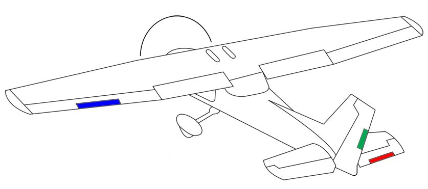

<!-- An aircraft can have trim tabs on all control surfaces and you will find that larger and more powerful planes, particularly multi-engine planes, do have 3 trim controls. The Cessna 150 however only has trim on the elevator. -->

---

<!--
_class:
_backgroundColor: #fff
-->

## Trim

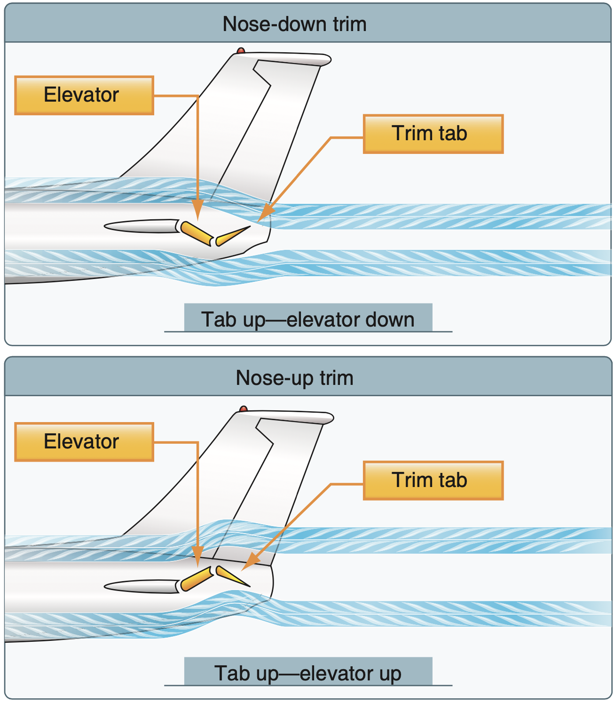

<!-- The trim tab is deflected into the wind in the opposite direction that you want the primary control surface to move, and because it's at the end of a long lever it only needs to create a relatively small force to balance with the control surface in its new position. -->

<!--
We control the trim by moving the trim wheel. If we roll the trim wheel forward the elevator will be trimmed to a more nose-down position. If we roll it backward the elevator will be trimmed to a more nose-up position. The way I remember this is if I'm holding forward pressure, I need to roll the trim wheel forward. If I'm holding back pressure, I need to roll the trim wheel backward.

Importantly, we don't fly using trim as our means to control attitude. We set the attitude using the elevator, and then trim to relieve control pressure. And in the plane you will find that the adjustments needed to the trim are quite small, particularly when you are trying to get the trim just right—you might only need to move the trim half a centimeter to get it right. We know we've gotten it right because we can take our hands off the yoke and the attitude stays exactly where it is.
-->

---

<!--
_class:
_backgroundColor: #fff
-->

## Flaps

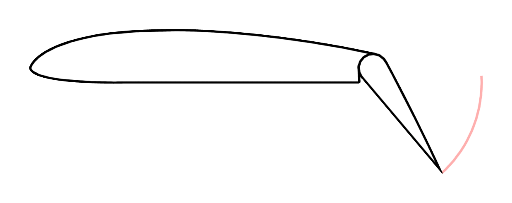

<!--
Flaps allow us to change the size and the shape of the wing. Remembering back to our piece of paper, what does that do to the reaction force? It increases it! Flaps also affect the drag force, which is the one that resists our movement through the air. What would you guess flaps does to the drag force, increase or decrease it? Increase it! That extra flaps allows us to descend at a steeper angle without going faster.

Because we're changing the shape of the wing we also change the structural limitations of the wing. If we look at the airspeed indicator you'll see a white arc, that arc shows the flaps operation speed. We are only allowed to operate the flaps when our speed is within that white arc.
-->

---

<!--
_class: lead
-->

## Engine controls

---

## Throttle

*   The throttle control changes the power produced by the engine
    *   Hence RPM
    *   Hence airspeed
    <!-- Unlike a car or a motorbike where we are constantly adjusting the throttle, in a plane we typically set the throttle once for the flight configuration and then leave the power constant -->

<!-- The throttle control is the black push-pull control located in the center underneath the instrument panel. Fully pushed in is full power, and fully pulled back is idle power. -->

---

## Throttle

*   Slipstream
    *   Creates a rightwards push on the vertical tail fin, pushing the nose left
    *   Right rudder required to compensate at high power and low speeds

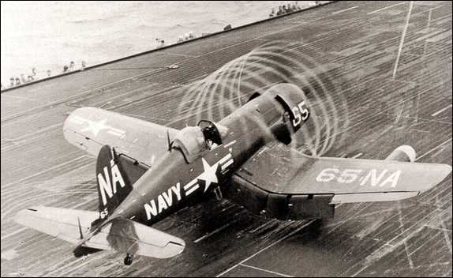

<!-- Engineers counter the slipstream effect by introducing small assymetries into the plane, so that in cruise flight the forces are balanced. But this doesn't work for all power configurations, so we need to compensate with rudder at high and low power settings to keep the plane balanced. -->

---

<!--
_class:
-->

## Throttle

*   Pitching motion
    *   More power = pitch up
    *   Less power = pitch down

<!-- When we talk about the four forces we can imagine that thrust and drag form a "couple" and that lift and weight form a "couple". A couple is when two forces are acting in opposite directions, but they don't line up. Because of this they cause a rotation. The engine produces thrust which pulls forward from down low, while drag pulls the plane backward from up higher. So you can imagine if we add thrust that will cause the nose to pitch up, whereas if we reduce thrust the nose will pitch down. -->

---

## Mixture

*   The mixture control allows the pilot to adjust the air:fuel mixture
*   The ideal air:fuel mixture is about 15:1
    *   Too rich = carbon & lead buildup, misfire, excessive fuel burn
    *   Too lean = rough running, possible engine shutdown
*   At altitude the air is thinner, so we need to reduce the amount of fuel going to the engine to keep the optimal mixture

<!-- The mixture control is the red push-pull control next to the throttle. Fully pushed in is full rich, and fully pulled back is engine cutoff. It can be controlled in one of two ways. 1. By pushing the button on the end of the lever and pulling or pushing the control in for coarse adjustments 2. By twisting the control lever left or right we can make fine adjustments. We always use the twist method to adjust in flight, because if we lean the mixture too much we can accidentally shut the engine down in flight. -->

---

<!--
_class:
_backgroundColor: #fff
-->

## Carburetor heat

<!-- Before we talk about carb heat we need to briefly talk about what a carburetor is and how it works. The carburetor's job is to mix fuel and air before it enters the engine, and it works by using Bernoulli's principle to create an area of low pressure to pull fuel through a metering jet. The throttle controls how much air flows through the carburetor. -->

*   Two types of carburetor icing
    <!-- Carb heat exists to solve a problem called carburetor icing -->
    *   Throttle ice
        <!-- When the throttle is partially closed it creates a low pressure and therefore temperature area behind the throttle, which can cause moisture in the air to freeze on contact with the throttle butterfly -->
    *   Fuel vaporisation
        <!-- The atomised fuel instantly evaporates when it enters the carburetor throat which causes the air temperature to drop, which can cause moisture in the air to freeze on contact with the walls of the venturi -->
*   Can happen even on a warm day
    <!-- Can happen even with temperatures as high as 38 degrees. Because the air is cooled inside the carburetor, the outside air temperature isn't necessarily a protection against ice formation. It is particularly likely when temperatures are at or below 21 degrees and relative humidity is above 80%. -->
*   Carburetor heat redirects hot air from around the exhaust to melt the ice
    <!-- When applying carburetor heat the hot air is less dense than the ambient air and so the engine will produce less power, therefore RPM will drop. The engine will also run rough when it ingests water from the melting ice, but once the ice clears the engine will start to run better. You might ask why we don't always run carburetor heat. Well as stated, the hot air is less dense than atmospheric air so the engine produces much less power. Additionally the carb heat air is unfiltered, so particularly on the ground we don't want to have carb heat on otherwise we can ingest stones into the engine. -->

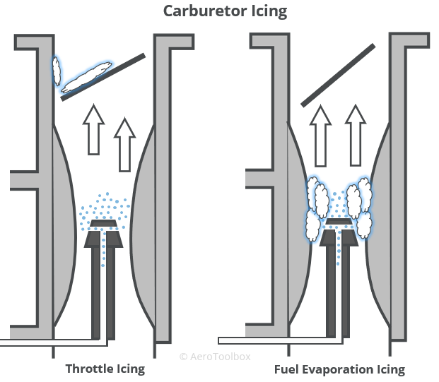

---

## Instrument panel

*   Standard 6 pack
    *   Airspeed indicator
    *   Attitude indicator
    *   Altimeter
    *   Vertical speed indicator
    *   Directional gyro
    *   Turn and balance indicator

---

## Instrument panel

*   Tachometer
*   Temperature and pressure guages
*   Magnetic compass
*   Radios
*   Transponder

---

## Application

---

## Threat and error management

*   Threat and error management (TEM) is a safety management approach
*   TEM is the process of detecting and responding to threats and errors before they compromise safety
*   **Threats** have the potential to have a negative effect on flight safety
*   **Errors** are flight crew actions (or inactions) which can lead to an **undesirable aircraft state** (UAS)
*   We combat threats and errors by implementing **countermeasures**

<!-- Before each flight we will identify relevant threats, and talk about the errors we could make and what countermeasures we would introduce to mitigate the threat -->

---

## Threat and error management

Threat | Error | UAS | Countermeasure
-|-|-|-
Traffic | Poor lookout | Near miss | Lookout, "clock code"
Dual controls | Control confusion | Control conflict, no one in control | "My controls" / "Your controls"
Sensitivate controls | Abrupt control inputs | Uncomfortable ride | Smooth control inputs

---

## Review questions

-   What are the primary and secondary effects of the flight controls?

Flight control | Primary effect | Secondary effect
---------------|----------------|-----------------
Elevator       |                |
Ailerons       | |
Rudder         | |

---

## Review questions

*   Using the model—demonstrate pitch, roll, and yaw
*   What are the factors which affect the reaction force created by control surfaces?
    <!-- Angle, speed, size, air density -->
*   On the poster:
    *   Where is the throttle control?
    *   Where is the flaps control?
    *   Where is the trim control?

---

### Objectives

You should now be able to:

*   List the 3 flight controls and their primary effect
*   State secondary effects of the 3 flight controls
*   Indicate ancillary controls on the poster
*   List the 4 factors which affect the reaction force generated by control surfaces
*   Show the 3 axis of motion on the model