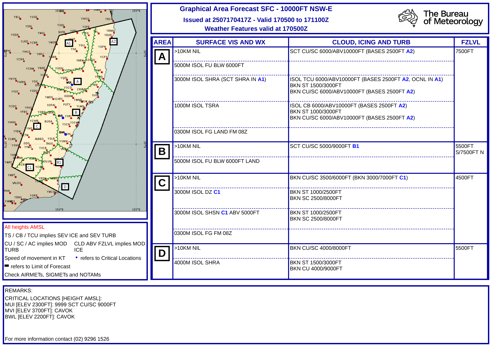
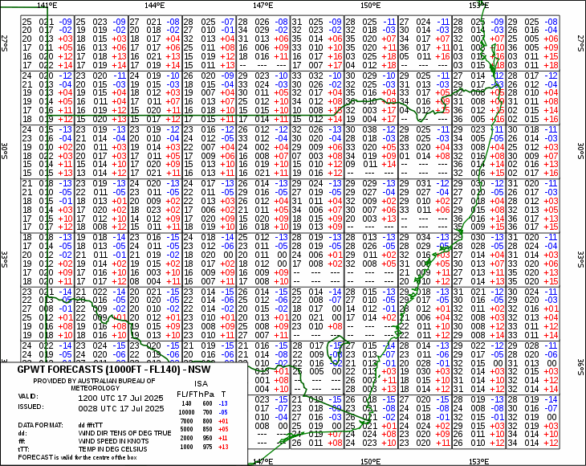
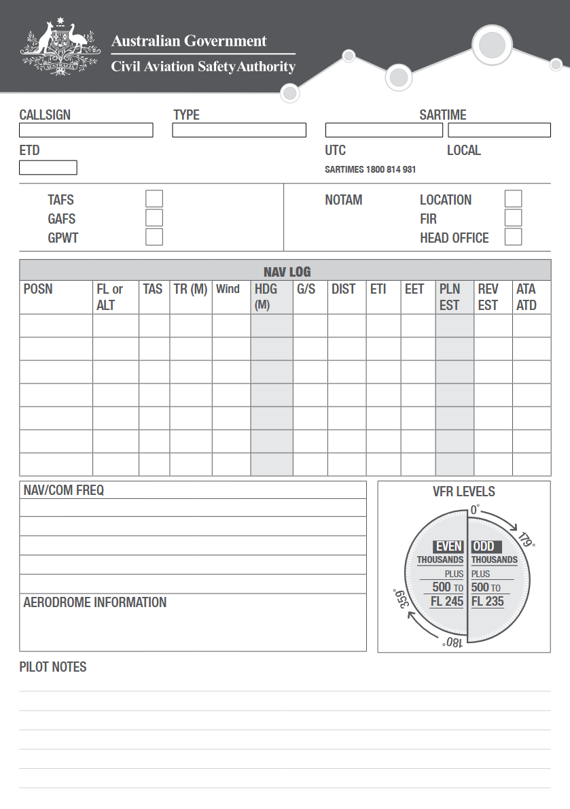
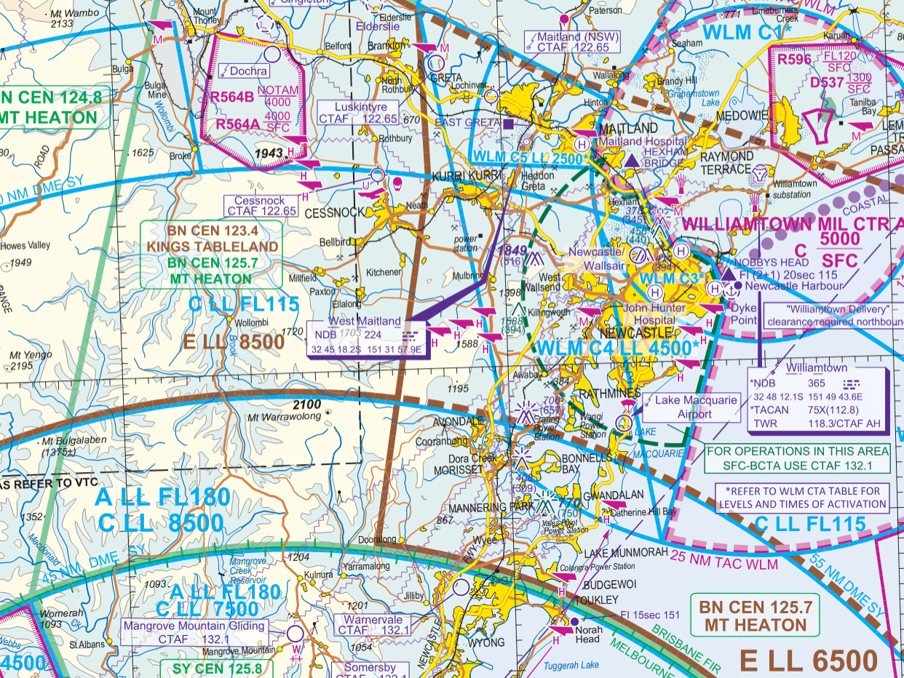
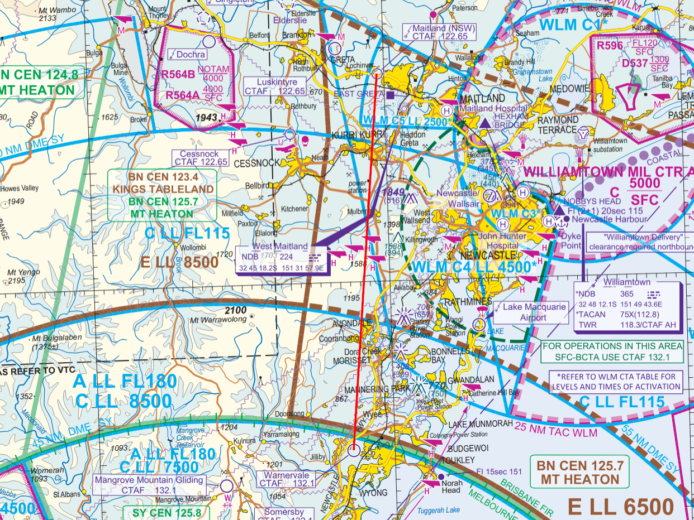
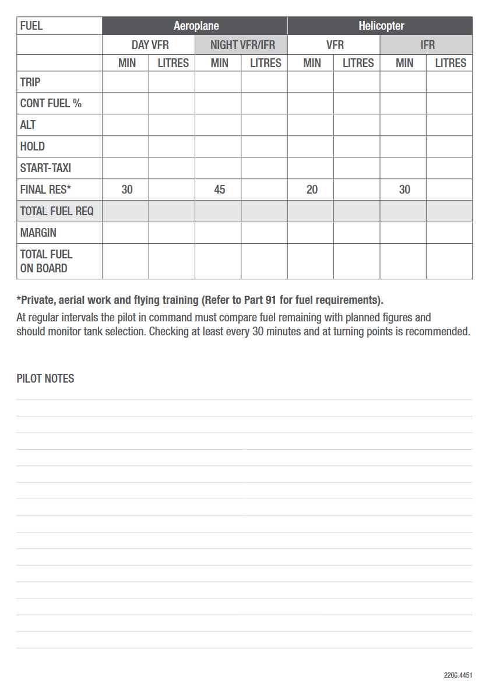
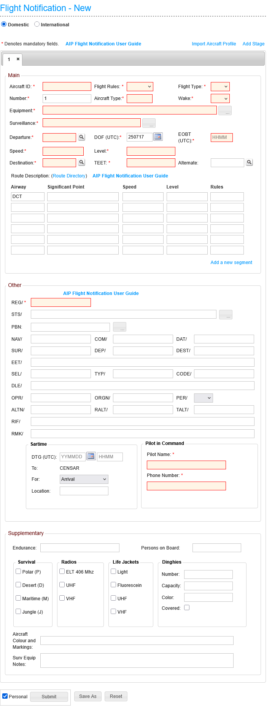
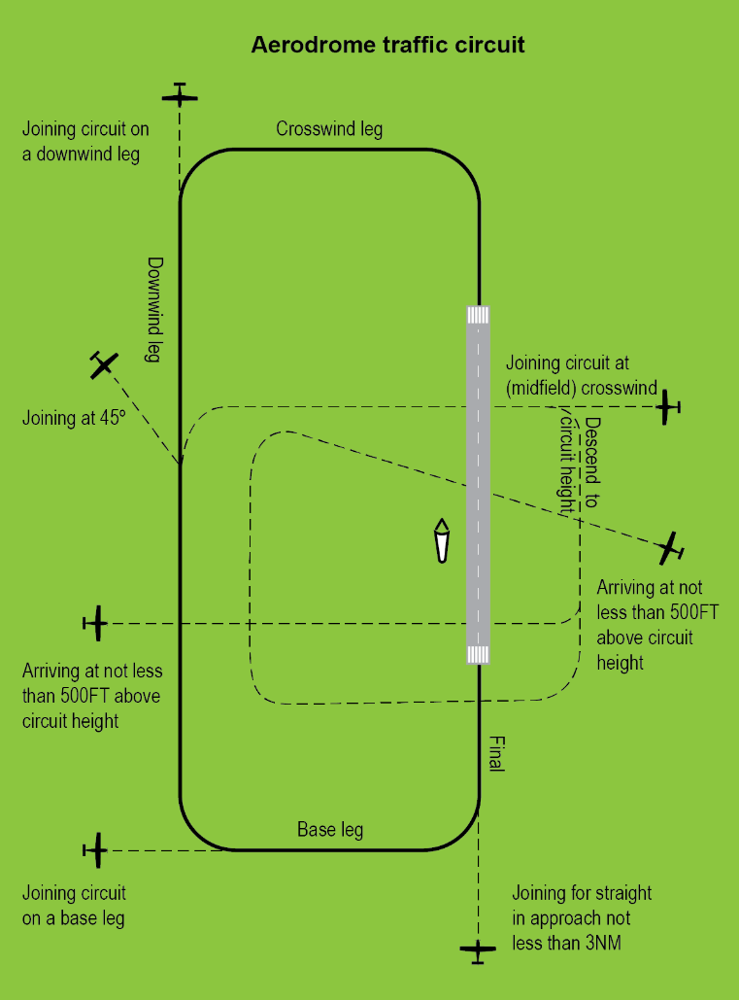

## Aim

*   To learn how to plan a cross country flight and the techniques that must be applied to fly safely and efficiently

---

<!--
_class:
-->

## Motivation

*   Flying cross-country expands the types of flying you can do, and opens up a new world of adventures
*   Good navigation technique is vital for safe, efficient flight
*   Learning to plan and fly cross country builds confidence and independence

---

## Objectives

By the end of this brief you should be able to:

*   Obtain weather forecasts, weather reports, and NOTAMS
*   Plan a route and altitude using appropriate charts
*   Calculate fuel required and manage fuel in-flight
*   Prepare and submit a flight plan and SARTIME
*   Describe class G airspace and non-towered aerodrome procedures
*   Use visual navigation techniques and maintain a navigation log

---

## Lesson overview

Duration: approx 2 × 60 mins

*   Navigation equipment
*   Flight planning
*   Class G airspace and SUA <!-- Special use airspace -->
*   In-flight management
*   Application
*   Threat and error management
*   Review questions

---

## Revision

*   Why is airspeed different from ground speed?
*   How do we correct for drift in the circuit?

---

<!--
_class: lead
-->

## Navigation equipment

---

<!--
_class: lead
-->

## Maps

---

## WAC

*   Scale = 1:1,000,000
*   Visual navigation chart
*   Topographic information
    *   Roads, rivers, railways, etc.
    *   Cities
    *   Elevation
*   Limited operational information
    *   Shows the boundaries of SUA
*   Lambert's Conformal Conic Projection

---

## VNC

*   Scale = 1:500,000
*   Topographic & operational information
    *   Controlled airspace <!-- Controlled airspace = upside-down wedding cake -->
*   Chart currency
    *   Regular update cycle <!-- WACs are updated at irregular times, some are years old -->

---

## VTC

*   Scale = 1:250,000
*   Topographic & operational information
*   Focused on the vicinity of major aerodromes
*   Philosophically, use the chart with the most detail for the area you are flying

---

## ERC

*   Operational information
    *   Controlled airspace, SUA, FIRs <!-- Special use airspace, flight information regions -->
    *   Also contains airways—routes which are commonly used for IFR flights
*   Varying scales
*   Used in combination with WAC for areas not covered by VNC or VTC
    *   Required outside of the "J curve"

---

## PCA

*   Used for high-level planning across large distances
*   Communication information (VHF coverage, HF frequencies)
*   Meteorological briefing areas
*   WACs
*   Some airports and critical locations
*   You will get questions on this in the PPL exam, so be familiar with how to use it

<!--
Here I've given a brief introduction to the various charts you'll use in navigation, but it's important you also spend some of your own time to become familiar with the charts. Study the legends and learn what the symbols mean.
-->

---

## Navigation equipment

*   Navigation is all about direction, and distance. If you have a known starting point, and you know in what direction and how far you have travelled, then you know your current position.
*   Ruler
*   Protractor

<!-- Measuring distance and direction, give example (remember magnetic vs true direction, east is least/west is best, check isogonals) -->

---

## Watch

*   Navigation is all about direction and distance, so we need to be able to measure those in the plane
*   Direction is measured using our directional indicator/compass
*   How do we measure distance?
*   Distance = speed × time
*   If we know our ground speed <!-- Air speed vs ground speed -->, and we measure the time since our last known position, then we know the distance travelled

<!--
Speed = distance / time
Distance = speed * time

Watch used in-flight for estimating distance travelled since last waypoint

Example: we crossed our previous waypoint 30 minutes ago, and we've been flying with a groundspeed of 90kts. Therefore we are 45nm from our previous waypoint.

Alternatively, we can estimate our ground speed by measuring the time between known waypoints. If we have 10nm markers on our map, and we measure 7 minutes between 10nm markers then we know our ground speed is 86kts.
-->

---

## E6B flight computer

*   Can be used to do lots of interesting calculations and conversions—read the manual!
*   Basic arithmetic
*   Conversions
*   Time, speed, and distance problems
*   Fuel consumption problems
*   True airspeed & density altitude
*   Winds—GS and drift calculations

<!-- Consider introducing this earlier, and using it for the mental math stuff we did before for estimating speed and distance -->

---

## ERSA (En Route Supplement Australia)

*   Contains information for:
    *   All certified aerodromes and many uncertified aerodromes
    *   Waypoints
    *   Special Use Airspace (SUA) <!-- SUA = Danger, Restricted, and Prohibited areas -->
    *   Special procedures and flight planning requirements
    *   Emergency procedures
*   Each airport has slightly different procedures and it's important to check those during planning

<!--
En Route Supplement Australia (ERSA) is an important flight planning document, providing information on aerodromes, navigation aids, flight planning requirements, and more.

Whenever we fly to an aerodrome it's important that we check the ERSA for aerodrome specific procedures. There's an entry here for most strips in Australia, and it should be your first port of call for aerodrome information. Even if it's an airport you're familiar with, these procedures do change and it's important to revise them before getting in the plane.
-->

---

<!--
_class: lead
-->

## Flight planning

---

## Obtaining preflight information (NAIPS)

*   NAIPS is an online system for obtaining weather information and NOTAMs, and submitting flight plans
*   https://www.airservicesaustralia.com/naips/

---

## TAF (Terminal Area Forecast)

*   Forecast weather conditions within 5nm of the aerodrome
*   Used for planning the departure and arrival from an aerodrome
*   Example:

        TAF YSCO 161832Z 1620/1708
        VRB03KT CAVOK
        FM170300 32007KT CAVOK
        PROB30 1620/1622 0300 FOG BKN001
        RMK
        T M01 07 15 17 Q 1018 1019 1017 1015

---

## METAR/SPECI

*   Report of observed conditions at an aerodrome
*   METAR = Meteorological Aerodrome Report
    <!--
    METAR
    *   Routine report of observed conditions at an aerodrome
    *   Issued every 30 minutes
    -->
*   SPECI = Special Meteorological Aerodrome Report
    <!--
    SPECI
    *   Issued when conditions meet specified critera (low visibility or cloud base, certain weather conditions such as TS, or significant changes from the previous report)
    *   Generally of greater operational significance
    -->
*   Example:

        METAR YSCO 170400Z AUTO 15005KT 9999 // NCD 15/05 Q1015 RMK
        RF00.0/000.0

<!-- http://www.bom.gov.au/aviation/data/education/metar-speci.pdf -->

---

## GAF (Graphical Area Forecast)

*   Forecast for a defined area
*   Used for planning the enroute phase of a flight
*   Covers airspace from the surface to 10,000ft
*   Issued 2 at a time, each with 6 hour validity

<!--
Importantly: check notes—certain weather implies ice and turbulence
-->

---

## GPWT (Grid Point Wind & Temperature)

*   Forecast wind and temperature information over an area
*   Each row represents a different altitude from 1,000ft to FL140

---

## NOTAMs

<!-- Notice to airmen -->

*   Aerodrome NOTAMs
    *   Runway or taxiway closures
    *   Changes to service availability (e.g. lights or fuel)
    *   Temporary hazards (e.g. an airshow)
*   FIR NOTAMs
    *   Airspace activation or temporary restrictions
    *   Hazards <!-- such as drone, survey, or miltary operations -->
*   Head Office NOTAMs
    <!--
    Head Office NOTAMs
    *   Information relevant to all pilots
    *   Changes in procedures, rules, publications, etc.
    -->

---

## Route selection

*   Terrain <!-- Terrain factors into our route selection, both because it influences the altitudes available for us to fly, but also because we should consider the possibility of a forced landing. A long leg over mountainous terrain gives us few options, whereas a slight diversion could see us spending the vast majority of the flight over relatively flat terrain with only a couple of minutes over mountainous terrain. -->
*   Airspace <!-- Our route should avoid any restricted or prohibited areas, and we should be aware of any controlled airspace along our route—for this first flight we'll stay out of controlled airspace but in the next brief we'll talk more about controlled airspace procedures -->
*   Ease of navigation <!-- Clear waypoints and features along your route will make navigation easier—for example following a coastline will be easier than a long leg over featureless terrain. Similarly, a number of short legs between waypoints with identifiable features can be easier than a more direct leg over featureless terrain. -->
*   Weather <!-- Weather can affect route selection, as an example clouds at 3,000ft may make a route over mountains impossible, but following the coast would still be possible -->
*   Fuel <!-- Range will be affected by the amount of fuel you can carry while remaining under MTOW, any alternate or holding requirements, and of course forecast winds. You may need to plan fuel stops along your route, and you can use the ERSA to check an airport's fueling facilities. -->
*   First light/last light <!-- Can be calculated using charts in the AIP, or checked via NAIPS -->

---

## Example

*   Let's plan a short flight between YWVA and YMND
*   Get a flight plan form to fill out the plan as we go

---

## Example

*   Find the relevant chart(s) for your flight
    <!--
    Relevant chart(s):
    *   Find the best chart for your route (technically the Williamtown VTC covers our flight, but I've chosen the Newcastle VNC do that we can see some other relevant airspace e.g. Dochra)
    -->
*   Route selection: direct
    <!--
    Route selection:
    *   Terrain, airspace, ease of navigation, weather, fuel, first light/last light
    -->

---

## Example

*   Draw flight planned track on the chart
*   Measure magnetic track
    *   True direction: 5°
    *   Variation = 12°E
    *   Magnetic direction: 353°
*   Measure distance
    *   Distance: 32nm

<!-- Check isogonals for magnetic deviation (12 degrees) -->

---

## Example

*   Draw 10nm markers along each leg
*   Select a cruising altitude, considering:
    <!-- Cruising altitude should consider surrounding terrain (aim for 1,000ft clearance over obstacles within 10nm either side of track) -->
    *   Terrain clearance
    *   Airspace
    *   Weather
    *   Hemispherical levels
        <!--
        0-179 = odd thousands + 500ft
        180-359 = even thousands + 500ft
        -->
    *   4,500ft

---

## Example

*   From the wind, TAS, and FPT calculate the planned heading and ground speed
*   From the GS and distance the ETI can be calculated
*   Make an allowance for the climb <!-- (add 1 minute for every 2,000ft) -->
*   From the ETI we can calculate trip fuel

---

## Example

*   Add the trip fuel, taxi fuel, final reserve, and any holding or alternate fuel to final total required fuel
*   Considering the total fuel on board calculate the margin

---

## Example

*   Finally...
*   Add any radio frequencies we will use <!-- Check maps and ERSA for relevant frequencies -->
*   Add information about your arrival airport (runways, circuit elevation, direction, etc.)
*   Add any notes you wish to refer to during flight <!-- Notes e.g. procedures -->

---

<!--
_class:
_backgroundColor: #fff
-->

## Flight notification & SARTIME

*   SARTIME = Search and rescue time
*   Flight notification must be submitted for operations in class C or D airspace
*   You must cancel SARTIME prior to the nominated SARTIME

<!--
Two options:
1.  Submit a SARTIME flight notification
2.  Submit an ICAO flight notification (required for ops in class C and D airspace)
    *   Submit either via NAIPS
    *   Include route, ETAs, fuel endurance, POB, etc.

Always cancel SARTIME to prevent unnecessary search operations
-->

---

## Class G departure procedures

*   Depart extending one of the standard circuit legs, or climbing to depart overhead
*   Aircraft should not turn opposite circuit direction until well outside the traffic area and no traffic conflict exists (normally 500ft above circuit height and 3nm from the departure end of the runway)
*   Make a departure radio call

<!-- advisory-circular-91-10-operations-vicinity-noncontrolled-aerodromes-2 -->

---

## Class G arrival procedures

*   Calculate top of descent
    *   500fpm cruise descent <!-- Calculate time and/or distance before destination, and add a little bit of slop in-case your descent is slower than intended (a couple of minutes is usually fine) -->
*   Broadcast inbound at 10nm
*   Join overhead if unsure of wind direction
*   Otherwise consider joining midfield crosswind or downwind as appropriate <!-- AWIS or other traffic in the circuit area may give you information about the active runway -->

<!-- Additionally, be aware of circuit heights (500ft for aircraft 55kts or below, 1,000ft for aircraft 55kts-150kts, and 1,500ft for aircraft over 150kts) -->

---

## Class G airspace

*   Avoid overflying a non-controlled airport at an altitude that could conflict with circuit operations
*   Broadcast intentions when operating in the vicinity of an airport (either 126.7 or the specified CTAF)
*   When outside the vicinity of an aerodrome monitor area frequency

---

## Special Use Airspace (SUA)

*   Prohibited areas
*   Restricted areas
*   Danger areas

---

<!--
_class: lead
-->

## In-flight management

---

## Visual navigation techniques

<!-- Legally we must obtain a visual fix at least every 30 minutes -->
*   Dead reckoning <!-- page 76 -->
    *   Fly a constant heading and speed
    *   Knowing your GS, and the time since your last waypoint you can work out your current position, estimate for next waypoint, etc.
*   Time-to-map-to-ground <!-- page 78 -->
    <!--
    Establish a dead reckoning position based on time since your last established fix, look to the map first and note the features you expect to see, then look out the window to locate the features you found on the map. Big features first, then smaller details. Look for a combination of features to confirm a position. Reading from ground to map increases the probability of jumping to conclusions.
    If that doesn't work, establish an area of probability (+-15 degrees track flown, and +-20% distance flown). You are very likely in this area. Then look for features on the ground, and try to relate them to features that lie within the area of probability.
    -->
*   One in 60 rule
    <!--
    *   If you maintain a constant heading and TAS your TMG will be a straight line
    *   A small change in heading will produce the same change in TMG with no change in GS
    -->
    *   Every mile off track after 60 miles along track is equivalent of 1° of track error
    <!--
    If you're 2 nm off after 30 nm then the track error is 4°
    You can also use the 1 in 60 rule to figure out the closing angle
    e.g. if there's 20nm to go, then the closing angle is 6°. So the total heading changle required to get to our destination is 6° + 4° = 10°.
    -->

---

## Maintaining a navigation log

*   Log departure time & estimate arrival for next waypoint
*   Revise estimate while en-route if required
*   Repeat...

---

## Fuel management

*   Engine management
    *   Set mixture
    *   Monitor T&Ps
*   Fuel log
    *   Note takeoff time and fuel onboard (mins)
    *   Every 30 mins, log fuel remaining and switch tanks if required

---

## Radio management

*   Monitor and broadcast intentions on CTAF within 10nm of an aerodrome (126.7 or CTAF defined in ERSA or on charts)
*   Monitor area frequency <!-- (use 2nd radio, or switch frequency when outside of vicnity of aerodrome) -->
    *   Set next frequency, and consider when you will switch

---

## CLEAROFFS

*   Compass <!-- directional gyro aligned -->
*   Log <!-- ETAs -->
*   Engine <!-- lean and green -->
*   Altitude <!-- as planned -->
*   Radios <!-- Current and next frequencies set, when will you switch? -->
*   Orientation <!-- Map to ground, confirm your location -->
*   Fuel <!-- check log, ensure correct tank selected -->
*   Forced landing <!-- check for suitable locations -->
*   SARTIME <!-- SARTIME still makes sense, don't need to amend arrival time or destination -->

---

## Application

---

## Threat and error management

*   High workload & distraction
    *   Aviate, navigate, communicate
    *   CLEAROFFS checks to keep on-top of workload
    *   Prepare on the ground rather than improvise in the air <!-- Consider alternates, possible deviations, TOD, etc. -->
*   Fuel management
    *   Fuel exhaustion is a common UAS—ensure you lean the mixture and maintain a fuel log
*   Thoroughly brief the weather and incorporate that into your plan
*   Submit a flight plan and SARTIME

---

## Review questions

*   When would you use a WAC and ERC?
*   How would you find information about an aerodrome?
*   Where would you obtain a weather briefing?
*   How do you convert a true heading into a magnetic heading?
*   Your ground speed is 80kts and your altitude is 4,500ft. You want to arrive overhead YWVA at 1,500ft. How far out should you start your descent?

---

## Review questions

*   If you are 3 miles off course after 20 miles, what is your track error?
*   Your ground speed is 95kts and you left your last waypoint 25 minutes ago. How far have you travelled?
*   What are the CLEAROFFS checks?

---

## Objectives

You should now be able to:

*   Obtain weather forecasts, weather reports, and NOTAMS
*   Plan a route and altitude using appropriate charts
*   Calculate fuel required and manage fuel in-flight
*   Prepare and submit a flight plan and SARTIME
*   Describe class G airspace and non-towered aerodrome procedures
*   Use visual navigation techniques and maintain a navigation log