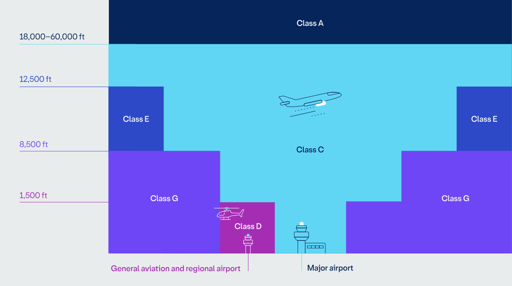
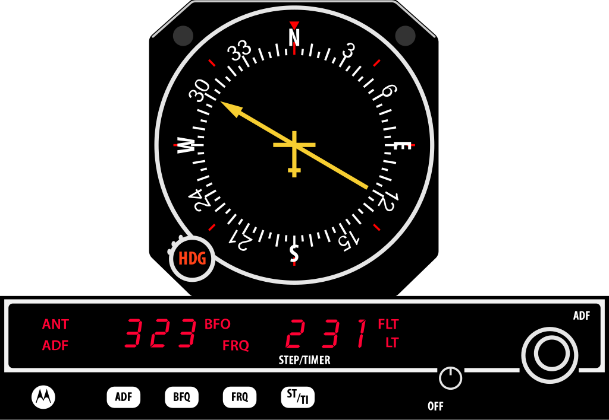
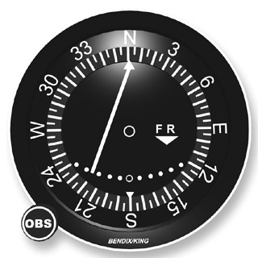
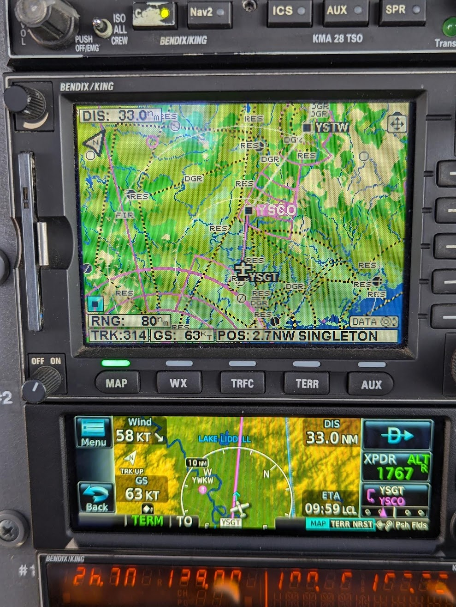
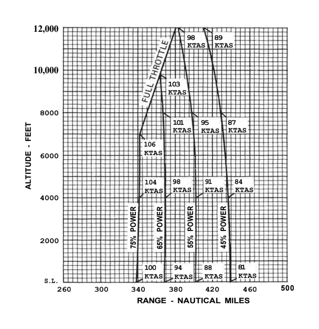
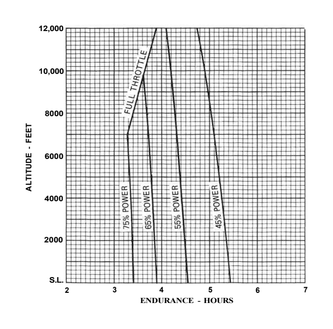
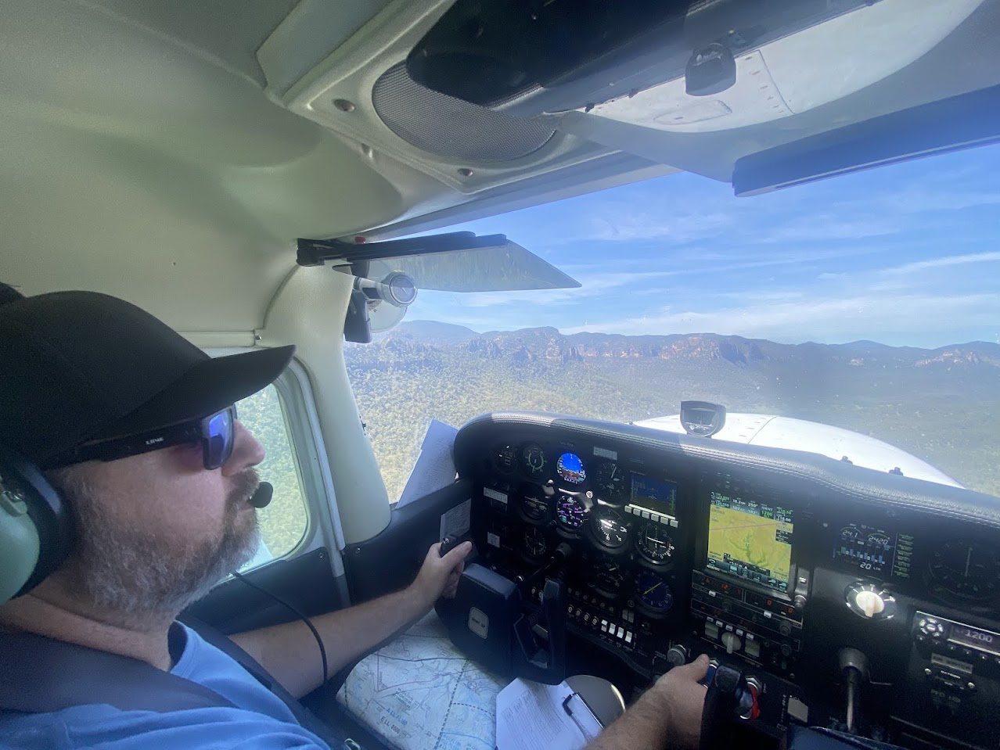

## Aim

*   To learn how to fly in controlled airspace, utilise navigation aids, and deal with unexpected operational circumstances

---

## Motivation

*   Controlled airspace expands where you can fly
*   Using navigation aids improves navigation accuracy
*   Understanding holding and alternate requirements helps to keep you safe on days where the weather isn't perfect
*   Learning diversion and lost procedures improves your ability to deal with unexpected situations

---

## Objectives

By the end of this brief you should be able to:

*   Describe controlled airspace procedures
*   Explain how navigation aids can be used to supplement visual navigation
*   State situations where holding fuel or an alternate is required
*   Explain how and when to fly for best range or endurance
*   List the procedure for carrying out a diversion
*   State the lost procedure

---

## Lesson overview

Duration: approx 60 mins

*   Controlled airspace
*   Navigation aids
*   Alternates & holding
*   Diversions, low level navigation, and lost procedures
*   Application
*   Threat and error management
*   Review questions

---

## Revision

*   What are the CLEAROFFS checks?
*   How would you find information about an aerodrome?
*   Where would you obtain a weather briefing?
*   How do you convert a true heading into a magnetic heading?

---

<!--
_class: lead
-->

## Controlled airspace

---

## Benefits of controlled airspace

*   Another pair of eyes keeping you safe
*   Saving time and track miles
*   Opens up access to larger and busier aerodromes

---

## Classes of airspace

*   **Class A** – high-level en-route controlled airspace (IFR only)
*   **Class C** – major airports
*   **Class D** – smaller controlled airports
*   **Class E** – mid-level en-route airspace (VFR uncontrolled)
*   **Class G** – uncontrolled

---

## Clearances

*   You require a clearance before operating in controlled airspace
*   Additionally you need clearances for:
    *   Take-off and landing
    *   Entering or crossing a runway
    *   Taxiing in a manouvering area <!-- e.g. taxiway or runway, not an apron area -->
*   When contacting ATC at a class D aerodrome ATC may simply acknowledge your call by repeating your call sign. This acknowledgement authorizes the aircraft to enter the class D—explicit clearance is not required. <!-- If you don't hear your call sign you may not enter the controlled airspace e.g.  Last calling aircraft, standby -->

---

## Class D arrival

*   Ensure you have a flight plan filed and have checked the ERSA/charts for arrival procedures
*   Before the boundry, get the ATIS
*   At the VFR approach point, or before the boundry, contact tower with your position, altitude, ATIS code, and your intentions <!-- Tamworth tower, Kilo Bravo Sierra, Duri Gap at 3,500, inbound with Charlie -->
*   Follow tower's instructions <!-- e.g. Kilo Bravo Sierra, join downwind 30L. Join downwind 30L, Kilo Bravo Sierra -->
*   Tower will clear you for a visual approach—you can then descend and manouvre as required to land <!-- Kilo Bravo Sierra is downwind 30L. Kilo Bravo Sierra, cleared visual approach 30L, report turning final. Cleared visual approach 30L, Kilo Bravo Sierra -->
*   You must have clearance to land <!-- e.g. Kilo Bravio Sierra, runway 30L cleared to land. Runway 30L cleared to land, Kilo Bravo Sierra -->

---

## Class D arrival

*   After landing, vacate the runway and contact ground <!-- Tamworth ground, Kilo Bravo Sierra, on November for GA parking -->
*   Follow ground's instructions <!-- Kilo Bravo Sierra, taxi to GA parking via Juliet, Hotel, Golf. Taxi to GA parking via Juliet, Hotel, Golf, Kilo Bravo Sierra -->

---

## Class D departure

*   Ensure you have a flight plan filed and have checked the ERSA/charts for departure procedures
*   Before contacting ground, get the ATIS
*   On ground request taxi clearance <!-- Tamworth ground, Kilo Bravo Sierra, information Golf, GA parking for Warnervale, request taxi for a Gate South departure. Kilo Bravio Sierra, taxi to holding point Lima, Runway 30L. Taxi to holding point Lima, Runway 30L, Kilo Bravo Sierra -->
*   Contact tower to report ready <!-- Tamworth tower, Kilo Bravo Sierra, ready at holding point Limi rynway 30L for a gate south departure. Kilo Bravo Sierra, runway 30L, clear for take-off. -->
*   After takeoff, give departure report if required <!-- Kilo Bravo Sierra, downwind 2,500ft, tracking to Werris Creek railway line -->

---

<!--
_class: lead
-->

## Navigation aids

<!--
Use navigation aids to back-up visual fixes or help you fly more accurately, but don't solely rely on them—we should still fly visually. This is particularly a risk with GPS because of how easy and ubiquitous it is. Navigation aids should be used to increase situational awareness, but if used improperly it can actually decrease situational awareness.
-->

---

## NDB

*   Non-directional beacon – transmits in all directions
*   ADF (automatic direction finder) displays relative bearing to the station <!-- Fixed card vs movable card -->
*   Subject to night effect, coastal refraction, and thunderstorms
*   Rated coverage for each NDB published in the ERSA

---

<!--
_class:
_backgroundColor: #fff
-->

## VOR

*   VHF omni-directional range – provides 360 radials to provide position information (nothing to do with heading)
*   Select the track you wish to fly to/from the VOR using the OBS (omni-bearing selector)
    <!-- Or rotate your until the needle is centred and the flag says FROM to find your current radial -->
*   Centre the needle to fly the track to/from the VOR
    *   Each dot represents 2° off the selected track
*   VHF signals travel in "line of sight"—rated coverage can be found in the AIP (GEN 1.5 2.3) <!-- 60nm below 5,000ft, 90nm between 5,000ft and 10,000ft -->

---

## DME

*   Distance measuring equipment—paired with some VORs
*   Gives "slant range" to the station <!-- less accurate at short distances -->
*   Can be used in combination with VOR to provide a position fix
*   Also "line of sight" coverage

---

## GNSS

*   Global navigation satellite system (e.g. GPS)
*   Very accurate position information
    <!--
    *   GNSS units can show a flight plan, groundspeed, time and distance to waypoints, winds, traffic information, and more
    -->
*   Should be used as a supplement <!-- Do not rely solely on GNSS -->
*   Check for RAIM outages <!-- FD (fault detection) + FDE (fault detection and exclusion), can be checked on NAIPS and on the unit itself -->
*   Ensure databases are up to date

---

<!--
_class: lead
-->

## Alternates & holding

---

## Alternates

*   If any of the following conditions are forecast within 30 mins of your arrival you must carry alternate or holding fuel:
    *   Cloud – more than SCT below 1,500ft above aerodrome elev
    *   Visibility – below 8km
    *   Wind – crosswind greater than max demonstrated
    *   Thunderstorms – any forecast during the arrival period
    *   Prob – 30% or greater probability of any of the above conditions
*   An alternate must have a forecast which doesn't itself require an alternate

<!-- ENR 1.1 10.7.2.1 -->

---

## Holding

*   Rather than carrying alternatue fuel, you may carry holding fuel to hold until the end of the forecast poor weather (+30 mins)
*   Sometimes deteriorating weather conditions are forecast to be short-lived
    *   INTER – periods up to 30 mins
    *   TEMPO – periods up to 60 mins
    *   Holding fuel is required for 30 or 60 minutes respectively
*   Some aerodromes require holding at certain times due to the possibility of traffic congestion (e.g. YBBN)

---

<!--
_class: lead
-->

## Best range & endurance

---

## Best range

*   Range is the distance an aircraft can travel with a given amount of fuel
*   Best range occurs at the minimum drag speed
*   Weight and forward CoG increase drag
*   Best range speed will be higher in a headwind and low in a tailwind

---

## Best endurance

*   Endurance is the time an aircraft can remain airborn with a given amount of fuel
*   Occurs at minimum power required speed
*   Weight, forward CoG, and flaps increase drag
*   Wind has no effect on endurance

---

## Diversions

*   Commonly due to poor weather
*   Establish a starting point along your current track where you can get an accurate position fix <!-- either a convenient ground feature or at a 10 mile marker which you can estimate using your watch/GS -->
*   Draw a freehand line between your starting point and your new destination
*   Estimate a true track, and apply magnetic variation to get a magnetic track
*   Estimate a distance and ETI
*   After turning onto your new track confirm progress as normal

---

<!--
_class: lead
-->

## Low level navigation

---

## Low level navigation

*   Generally due to low cloud
*   Maintain VMC at all times, always have an escape plan
*   Caution: other traffic also flying lower due to weather
*   Slow cruise, turn on all exterior lighting

---

## Low level navigation

*   Features can be more difficult to make out
*   Roads, rivers, valleys, and hills can be good to follow
*   Keep features on your left <!-- Features on left provides the greatest visibility -->
*   Eyes outside <!-- There is less time for looking at charts and navigation logs -->

---

## Lost procedure

*   Maintain heading until a visual feature is seen—do not wander
*   Climb for a better vantage point
*   Use any available assistance—GNSS, ground-based aids, or ATC
*   Use time-map-ground to establish an area of probability <!-- +-15 degrees track flown, +-20% distance flown , only possible if heading has been maintained -->
*   Hold over a visual feature while reading ground-to-map within your area of probability to confirm your position
*   Line features such as roads, railways, or coastlines can be followed until another features allows the actual position to be established

---

## Application

---

## Threat and error management

*   Miscommunication with ATC
    *   Study phraseology, required readbacks, and procedures prior to getting in the air
    *   Listen carefully, and request "say again" if unclear
*   Increased workload in controlled airspace or during a diversion or lost procedure
    *   Aviate, navigate, communicate <!-- The workload may be higher at certain moments, but often controlled airspace can be easier than uncontrolled -->
*   Forecast poor weather
    *   Plan alternates or holding fuel

---

## Review questions

*   Using your Tamworth VTC—how would you request clearance inbound?
*   How do you determine your current radial to an airport using a VOR?
*   When must you carry alternate fuel?
*   What is the difference between best range and best endurance?
*   How would you configure the plane for best endurance?
*   What is the procedure for planning a diversion?
*   How would you determine your position if you were lost?

---

## Objectives

You should now be able to:

*   Describe controlled airspace procedures
*   Explain how navigation aids can be used to supplement visual navigation
*   State situations where holding fuel or an alternate is required
*   Explain how and when to fly for best range or endurance
*   List the procedure for carrying out a diversion
*   State the lost procedure