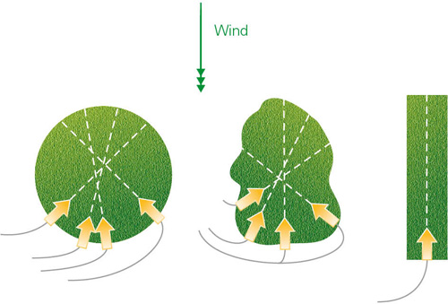
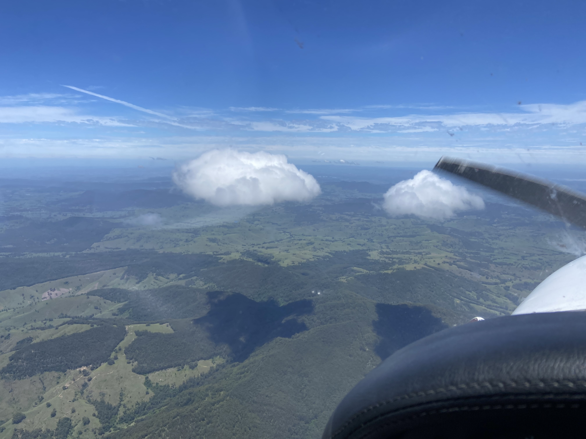
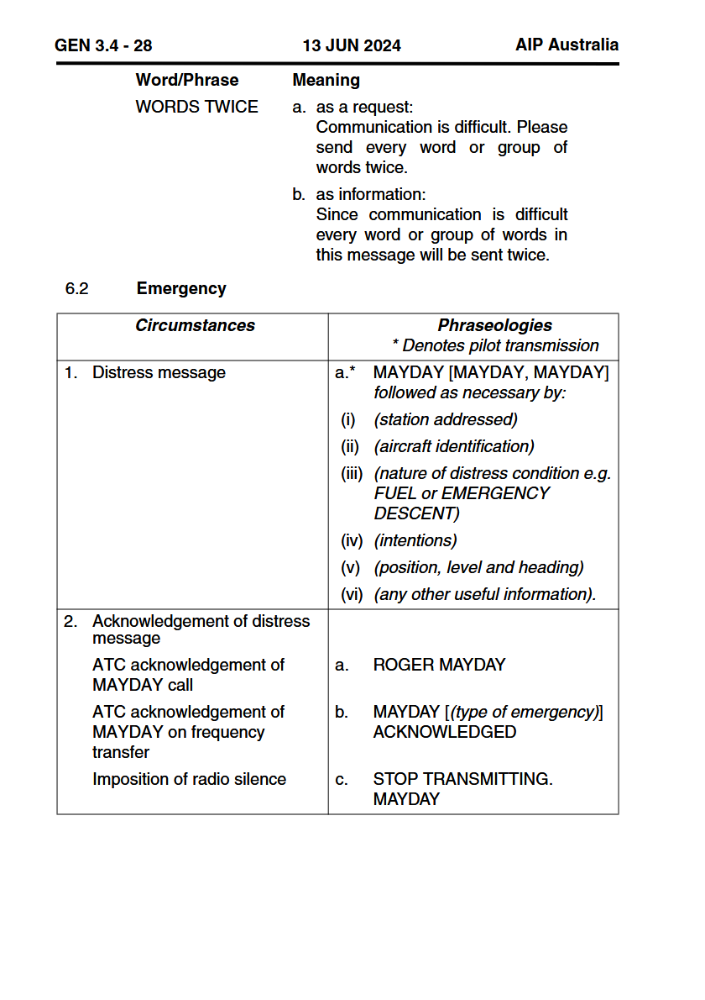

## Aim

*   To learn to deal with a loss of power when outside of the circuit area

---

## Motivation

*   Knowing how to react in an emergency increases your safety and confidence
*   Learning to accurately fly a glide approach helps to improve your handling and energy management skills

---

## Objectives

By the end of this brief you should be able to:

*   Describe how pre-flight inspection and correct in-flight management can prevent most engine failures
*   List the factors considered for landing area selection
*   State signs that we can use to assess wind direction
*   Plan the approach, and state actions if high or low
*   Perform a MAYDAY call using the correct format
*   List the key points to include in a passenger briefing

---

## Lesson overview

Duration: approx 45 mins

*   Engine failure causes
*   Landing site considerations
*   Planning a glide approach
*   MAYDAY call & passenger brief
*   Application
*   Threat and error management
*   Review questions

---

## Revision

*   Why is important to do a thorough pre-flight inspection and proper runups every time you fly?
*   What is our best glide speed?
*   What happens to our glide range if we lower the nose and start going 70kts?
*   What about if we raise the nose and start going 50kts? <!-- Do not stretch the glide! -->
*   What are our immediate actions in the case of an engine failure? <!-- FMCOST -->
*   What is our mnemonic for securing the engine? <!-- FMMM -->

---

<!--
_class:
-->

## Engine failure causes

---

<!--
_class:
_backgroundColor: #fff
--->

## Landing site considerations

*   Wind
    <!-- As with any other landing, we want to land into the wind to reduce our ground roll and—particularly if we're landing on a not-so-nice surface—to reduce our kinetic energy. Luckily we're taking off into wind, so if we land straight ahead we don't really need to consider wind. -->
*   Size
*   Shape
*   Slope
*   Surface
    <!-- Size, shape, slope, surface are our biggest considerations in engine failure after takeoff. This isn't a list you'll go through consciously in your head, it's just to give you an idea of things to consider. Basically we want to aim for a big flat area without any obstacles. -->
*   Surrounds
    <!-- Surrounds is intended to mean "where can I get help" -->
*   Sun
    <!-- Sun is about avoiding early-morning or late-afternoon sun in your eyes. -->

---

## Assessing wind direction

*   Smoke
    <!-- Common in Australian summers -->
*   Ripples on the surface of water
*   Cloud shadow
    <!-- Looking at the shadow underneath of clouds gives a very clear clue about the direction wind is blowing -->
*   Drift
    <!-- Use the drift of your own plane to assess wind direction. If your nose is point to the left of the track you are following, the wind is therefore coming from your left. -->
*   GPWT forecasts
    <!-- Grid point wind and temperature. Before a cross country flight you will refer to these forecasts, and that will give you information about the prevailing winds across your route. -->

<!--
Both the wind direction and the landing site are not things that you should be assessing after you've had an engine failure. You should be conscious of the wind direction throughout the flight, and you should be continuously assessing your surroundings so that you know where you will go if you have an engine failure.

Additionally, and we'll talk about this more when you start doing cross country flights, you should plan your routes to give yourself options for as much of the flight as possible e.g. consider a slightly longer route that is mostly over flat terrain rather than spending 2 hours flying over mountains for a direct route.
-->

---

<!--
_class:
--->

## Planning a glide approach

*   High key = 2500ft AGL abeam aiming point on "crosswind"
*   Low key = 1500ft AGL abeam aiming point on "downwind"
*   Not too literal, use **judgement** and **initiative**
    <!-- Anticipate the effect of wind, continually assess whether you are high or low, and **do something about it** -->
    <!-- If you are high, extend a leg of the circuit, perform s-turns, or extend flaps. If you are low, turn towards the aiming point. -->
    <!-- Additionally, you might not always have so much height to play with, or you might not be positioned to join from a crosswind position. This is an idealised view of a glide approach—use your judgement. -->

---

## MAYDAY call

*   Made on CTAF frequency if you're aiming to land at an airport, area frequency otherwise
*   In training, we only simulate this call—do not press the transmit button!
*   Transponder code should be changed to 7700

<!-- MAYDAY MAYDAY MAYDAY, Brisbane centre, Victor victor quebec, engine failure, south of Lake Macquarie, landing in a field, 2 POB, will call again on the ground -->

---

## Passenger brief

*   What is happening
*   What they need to do
    *   Remove sharp objects <!-- like pens and glasses from your pockets and face -->
    *   Tighten seat belts
    *   Open the door latch <!-- to prevent the doors from being jammed closed in-case of airfram deformation -->
    *   Brace before we touch down
    *   Meet behind the plane
*   Reduce stress/distract them <!-- give them a job, look at the landing area for traffic, watch a gauge, etc. -->

---

## Application

---

## Threat and error management

*   High workload, high stress
    *   Aviate, navigate, communicate
    *   Learn your immediate action items (FMCOST) and engine shutdown procedures (FMMM)
*   Engine checks every 1000ft
*   Minimum altitude of 500ft over non-populated areas
    *   In the practice area will go around before reaching 500ft
    *   When we practice forced landings at an aerodrome we can glide all the way in to landing

---

## Review questions

*   Why is important to do a thorough pre-flight inspection and proper runups every time you fly?
*   What items should we consider when selecting a forced landing area? <!-- Wind, Size, Shape, Slope, Surface, Surroundings, Sun -->
*   How can you determine the wind direction while flying? <!-- Smoke, water ripples, cloud shadows, drift, GPWT forecasts -->
*   When planning a glide approach, what are your two main key points? <!-- High key = 2500ft AGL abeam aim point on crosswind, low hey = 1500 AGL abeam aim point on downwind -->
*   What can you do to lose height if you're too high on approach?

---

## Review questions

*   What key information must be included in a MAYDAY call?
*   What instructions would you give to a passenger when briefing them during an engine failure?
*   What is the most important priority during an engine failure? <!-- Fly the plane! -->

---

## Objectives

You should now be able to:

*   Describe how pre-flight inspection and correct in-flight management can prevent most engine failures
*   List the factors considered for landing area selection
*   State signs that we can use to assess wind direction
*   Plan the approach, and state actions if high or low
*   Perform a MAYDAY call using the correct format
*   List the key points to include in a passenger briefing