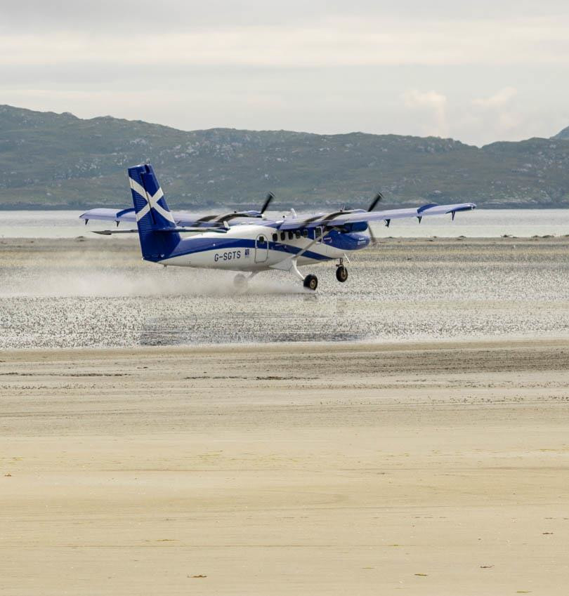
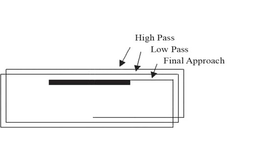
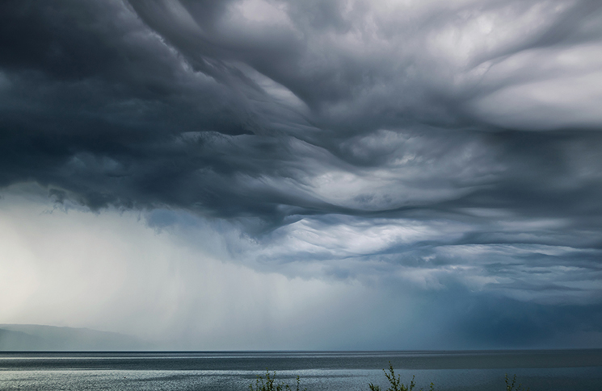
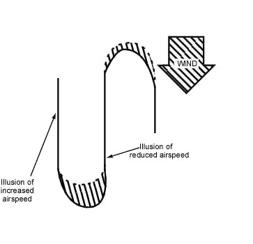
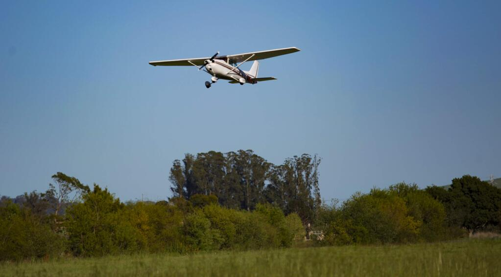
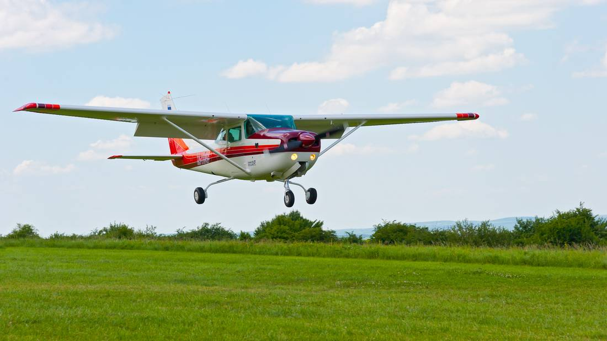

## Aim

*   To learn the procedure to follow in the event that you need to land somewhere other than a certified aerodrome

<!--
This procedure differs from our forced landing procedure because the aircraft has power and it's therefore possible to search for the most appropriate landing site for the circumstances, or even continue the flight if the situation improves
-->

---

<!--
_class:
-->

## Motivation

*   Urgent/emergency landing
    *   Low fuel
    *   Last light
    *   Poor weather
    *   etc.
    <!-- An off-field landing is our last option, and you should avoid ever being in this situation by proper pre-flight planning, and making better decisions in the air like choosing to divert or turn-back early. However, if you are in a situation where it is the safest option, don't push on into a more dangerous situation. Accept the mistake, and land safely. -->
*   ALA (Aircraft Landing Area)
    <!-- The other case is landing at an ALA, which is a non-certified aerodrome which can be anything from a basic strip to something with similar facilities to a certified aerodrome. While this isn't an emergency situation, we still want to inspect the strip condition to ensure the field condition is safe for landing. -->

---

## Objectives

By the end of this brief you should be able to:

*   List the circumstances which may require a precautionary search and landing
*   State the PSL procedure, and describe how you would adjust the procedure in different scenarios
*   Describe two low-flying illusions and state the correct instruments to reference instead of trusting your eyes
*   List the major hazards associated with low flying

---

## Lesson overview

Duration: approx 45 mins

*   Circumstances which may require a PSL
*   Procedure
*   Considerations
*   Low flying illusions
*   Application
*   Threat and error management
*   Review questions

---

## Revision

*   What would you look for when considering whether a field is appropriate to land on? <!-- WSSSSSS, Consider whether the aircraft can takeoff again from the field -->
*   What is our safe slow config in the Cessna 150? <!-- 10 degrees flaps, 70kts -->
*   If you had an engine failure, what information would you include in your MAYDAY call?
*   In the same scenario, what information would you include in your passenger brief?

---

<!--
_class:
_backgroundColor: #fff
-->

## Procedure

*   **1st pass:** 500ft, visual assessment of surface and obstacles, length estimate
*   **2nd pass:** 300ft, assess surface in detail
*   **3rd pass:** if required, 100ft (keeping clearance over obstacles), assess fine surface detail

 
---

<!--
_class:
_backgroundColor: #fff
-->

## Procedure

*   **PAN PAN call:** on area frequency, PAN PAN × 3, station addressed, call sign, nature of urgency, intentions, position
*   **Passenger brief:** what is going on, what they need to do, brace position, actions after landing

<!--
What is the difference between MAYDAY and PAN PAN?

MAYDAY = aircraft/ocupants threatened by imminent danger OR require immediate assistance

PAN PAN = urgent message regarding safety of my aircraft, or another craft/person within sight but no immediate assistance required

Example: PAN PAN PAN PAN PAN PAN, Brisbane Centre, VVQ, performing a precautionary landing in a field due to reduced cloud-base, approximately 30nm west of Tamworth, will call again once on the ground

Example pax brief: Due to the low clouds we can't continue the flight so we're going to make a precautionary landing in that field. Please remove any sharp objects from your pockets and place them in the pocket next to the door beside your feet. Ensure your seatbelts are secure. As we approach the landing brace by putting your hands across your chest and placing your chin against your chest. After we land I will shut down the plane, then exit via the door beside you and we will meet behind the plane.
-->
 
---

<!--
_class:
_backgroundColor: #fff
-->

## Procedure

*   **Final approach:** go around if unsure of making touchdown zone, consider practice approaches, soft field landing technique
*   **After landing:** ensure safety of passengers, secure the aircraft, radio call from the ground if possible

 
---

<!--
_class:
-->

## Considerations

*   **Bad weather:** maintain visibility with the ground, safe slow cruise
*   **Partial power:** assume engine could fail at any time, fewer passes, no passes below 500ft
*   **Landing at an ALA:** no PAN PAN or pax brief required

 
---

<!--
_class:
_backgroundColor: #fff
-->

## Low flying illusions

*   Slip/skip illusion
    <!--
    *   Turn from upwind to downwind illusion is slipping
    *   Turn from downwind to upwind illusion is skidding
    -->
    *   Trust the balance ball—fly a balanced coordinated turn
*   Air speed illusion
    *   Trust the air speed indicator <!-- Airspeed is airspeed, trust the instrument that gives you that information -->

---

## Low flying hazards

*   Stalling at low level
    *   Avoid turning below 500ft
    *   Ensure you maintain airspeed
*   Obstacles (collision risk)
    *   Keep a good lookout—power lines and towers can be difficult to spot from the air
    *   Exercise caution around obstacles
    *   Be conservative with altitude <!-- Don't go lower than needed to verify that a safe landing can be achieved -->

 
---

## Application
 
---

## Threat and error management

*   Avoid causes
    *   PSL is almost always avoidable through thorough pre-flight planning and making timely decisions to not fly or divert
    *   However, it it is the safest thing to do then it must be done
    *   Assess your situation and make decision early so that you have time to conduct a thorough PSL and land safely
*   Poor situational awareness (flying into terrain, into cloud, etc.)
*   Low flying illusions due to wind
 
---

## Threat and error management

*   No flight below 1000ft over populated areas or below 500ft over non-populated areas—simulated PSL will be conducated at an aerodrome 
*   Fly neighbourly (avoid houses or livestock)

---

## Review questions

*   Why would you need to perform a PSL? <!-- What are some examples of situations where a PSL would be necessary? -->
*   How could you avoid having to do a PSL?
*   What are the steps in a PSL procedure?
*   How would that procedure change if you were just performing a precautionary search at an ALA?
*   Give an example PAN PAN call for a precautionary landing due to low fuel
*   Give an example passenger brief for the same landing

---

## Review questions

*   How does the slip/skid illusion occur? <!-- If you feel as if you are skidding, how can you verify whether the plane is in balance? -->
*   Why could wind cause you to misjudge your airspeed when flying low to the ground? <!-- If you feel as if your air speed is too high, how can you check your actual air speed? -->
*   What are two major hazards to be aware of when flying at low level?
 
---

## Objectives

You should now be able to:

*   List the circumstances which may require a precautionary search and landing
*   State the PSL procedure, and describe how you would adjust the procedure in different scenarios
*   Describe two low-flying illusions and state the correct instruments to reference instead of trusting your eyes
*   List the major hazards associated with low flying