## Aim

*   To verify, by calculation, that there is adequate runway for takeoff and landing in accordance with the plane's POH
*   To learn to fly a short field takeoff and landing

---

## Motivation

*   Short field technique is necessary:
    *   When the runway is relatively short
    *   When there are obstacles at the approach or departure ends of the runway

<!--
Why might we want to use short field takeoff or landing technique?

When we talk about a runway being short, we mean short relative to the performance of the aircraft on the day. A runway may be relatively long for one aircraft while still being relatively short for another. A runway may also usually be fine for your aircraft, but may be too short on a particularly hot day with low atmospheric pressure and enough passengers and luggage to bring the plane to MTOW.

What do these runway markings mean? Displaced threshold—obstacles infringe the approach path and aircraft may not land in the area behind the displaced threshold. In the case of Warnervale, we have trees which infringe on the approach path, and that is why our threshold is displaced. This obviously reduces the available runway for landing.
-->

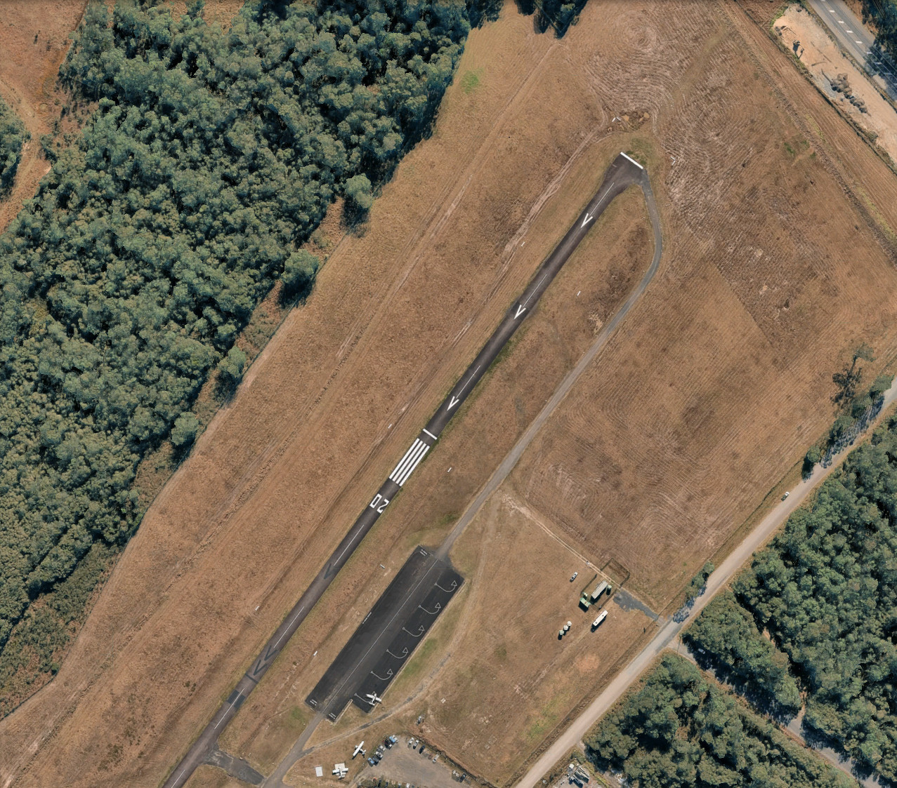

---

## Objectives

By the end of this brief you should be able to:

*   List the factors affecting takeoff and landing performance
*   Calculate pressure height
*   Determine headwind and crosswind components
*   Calculate takeoff and landing distance required

---

## Lesson overview

Duration: approx 45 mins

*   Factors affecting takeoff and landing performance
*   Calculating pressure height
*   Calculating headwind component
*   Performance charts
*   Application
*   Threat and error management
*   Review questions

---

## Revision

*   What do the numbers at the end of a runway indicate? <!-- Direction in 10s of degrees magnetic -->
*   Why do we takeoff and land into wind? <!-- Reduced ground roll, steeper climb and descent angles -->
*   Where can we find information about an aerodrome? <!-- The ERSA -->

---

<!--
_class: lead
-->

## Factors affecting takeoff and landing performance

---

## Definitions

*   **Takeoff distance**
    *   The total horizontal distanced traveled from the start of the takeoff to the point where the aircraft is 50ft above the ground
*   **Landing distance**
    *   The total horizontal distance traveled from the point where the aircraft is 50ft above the ground until it comes to a complete stop on the runway surface

---

## Air density

*   Air density is a measure of the mass of air in a given volume
*   As air density decreases, both engine and aerodynamic performance decrease
*   Atmospheric pressure decreases as altitude increases
*   As temperature increases, air expands and becomes less dense
*   Air density also decreases as humidity increases
*   Weather systems affect atmospheric pressure over a large area
*   Hot, high, humid, and a low pressure system = worst case

<!--
Draw box with low density of air molecules, and high density of air molecules

Air density affects: lift generated by wings, power produced by engine, and thrust produced by propeller. It has a large effect on performance.

What affects air density? Any ideas?

Water vapour is lighter than air
-->

---

## Runway surface

*   Different types of surface:
    *   Paved
    *   Grass (short vs long)
    *   Gravel, sand, etc.
    *   Dry vs wet
    <!-- Why might surface affect our takeoff and landing distance? -->
*   Affects braking traction
    <!-- Wet surfaces, particularly wet grass, have significantly less braking traction and will increase braking distance on landing -->
*   Affects rolling resistance
    <!-- Soft surfaces like long grass and soft sand increase rolling resistance, increasing takeoff distance and reducing landing distance -->

---

## Slope

*   Slope affects acceleration and braking distance
*   Better to takeoff downhill and land uphill

<!-- How would you think an upsloping runway would affect acceleration? What about braking? It's the opposite for a downsloping runway. Would we get a shorter takeoff distance by going uphill or downhill? What about landing distance? -->

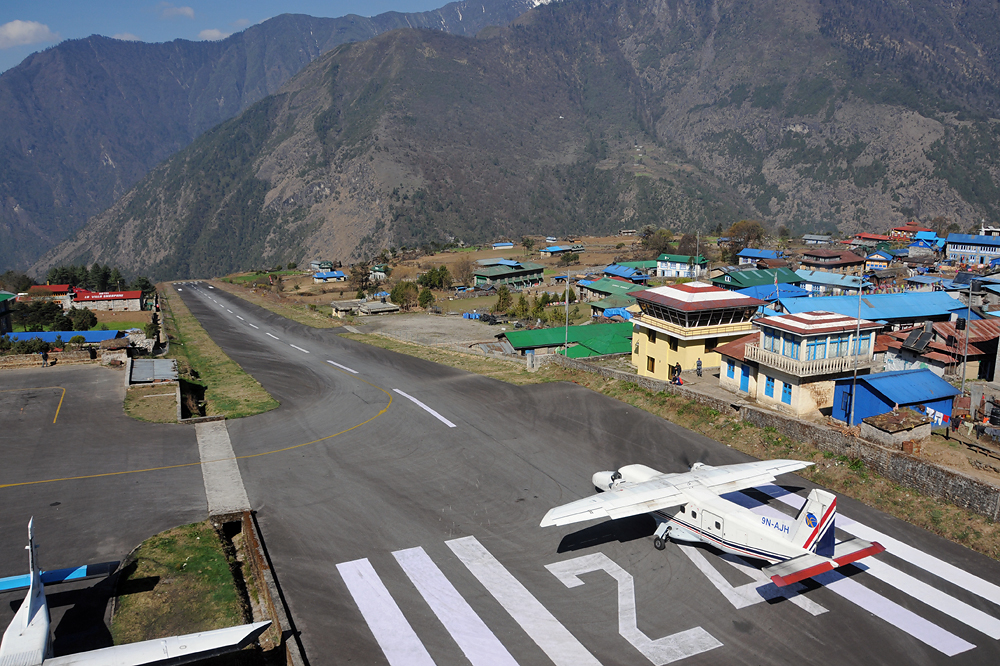

---

## Wind

*   Specifically, not the entire wind, but the component acting down the runway
    *   We will learn how to determine this shortly
*   A headwind component reduces takeoff roll and landing distance

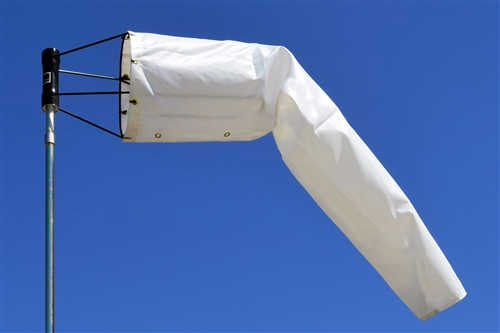

---

## Weight

*   Increased weight slows acceleration during the takeoff roll, and reduces climb performance
*   Although weight increases our momentum, it also increases braking traction. Overall, weight tends to increase landing distance, but the effect is less significant than on takeoff.

---

## Flaps

*   Flaps reduces the stalling speed and can enable takeoff at a lower airspeed
*   This can reduce ground-roll, but may not reduce takeoff distance to 50ft due to the reduced rate-of-climb
*   Always use the configuration specified in your plane's POH
    *   In the Cessna 150 flaps zero is specified for a short field takeoff

---

## Factors affecting takeoff and landing performance

*   Air density
*   Runway surface
*   Slope
*   Wind
*   Weight
*   Flaps

---

## International Standard Atmopshere (ISA)

*   A static model of how pressure, temperature, etc. vary over a range of altitudes
*   Provides a standard reference for temperature and pressure
*   Useful for comparison—current conditions vs a "standard" day
*   Standard sea level temperature = 15°C
*   Standard sea level atmospheric pressure = 1013.2 hPa

---

## Pressure height

*   All aircraft performance data in a POH is in relation to the ISA
*   However, actual conditions at a particular aerodrome rarely match the ISA as every day we have variations in atmospheric pressure
*   Therefore we calculate **pressure height**:
    *   The height in the standard atmosphere where pressure is the same as it currently is at a particular aerodrome

<!-- Draw field on cliff, show "standard" day with QNH 1013 at sea level and field elevation, then "low pressure" day with QNH 1000—1013 is lower, and so the height of the field over 1013 is greater. That is our pressure height. If we just concerned ourself with barometric pressure, it is as if the field is at a higher elevation. -->

---

## Calculating pressure height

$$
Pressure\ height = Elevation + (1013 - QNH) \times 30
$$

<!--
To calculate pressure height we use this formula.

Elevation refers to the height of the aerodrome above sea level.

QNH refers to the atmopsheric pressure at sea level.

30 is a constant, and refers to the pressure lapse rate i.e. how much pressure drops as altitude increases. We assume that pressure drops 1hPa for every 30ft of height increase above sea level.
-->

---

## Calculating pressure height

For example, Warnervale with QNH 980 hPa:

$$
\begin{align}
Pressure\ height &= Elevation + (1013 - QNH) \times 30
\end{align}
$$

<!-- Let's start by figuring out the actual values of our variables. Do you remember the elevation of Warnervale? -->

---

## Calculating pressure height

For example, Warnervale with QNH 980 hPa:

$$
\begin{align}
Pressure\ height &= Elevation + (1013 - QNH) \times 30 \\
Elevation &= 25
\end{align}
$$

<!-- In this case we've been given the QNH, it's 980 hPa. -->

---

## Calculating pressure height

For example, Warnervale with QNH 980 hPa:

$$
\begin{align}
Pressure\ height &= Elevation + (1013 - QNH) \times 30 \\
Elevation &= 25 \\
QNH &= 980
\end{align}
$$

<!-- Then we can rewrite the formula with the variables subsituted. -->

---

## Calculating pressure height

For example, Warnervale with QNH 980 hPa:

$$
\begin{align}
Pressure\ height &= Elevation + (1013 - QNH) \times 30 \\
Elevation &= 25 \\
QNH &= 980 \\
\\
Pressure \ height &= 25 + (1013 - 980) \times 30
\end{align}
$$

<!-- Punch that into your calculator, what do you get? 1015 is the pressure height! -->

---

## Calculating pressure height

For example, Warnervale with QNH 980 hPa:

$$
\begin{align}
Pressure\ height &= Elevation + (1013 - QNH) \times 30 \\
Elevation &= 25 \\
QNH &= 980 \\
\\
Pressure \ height &= 25 + (1013 - 980) \times 30 \\
&= 1015
\end{align}
$$

<!-- Therefore, in this example the atmospheric pressure at Warnervale is the same as the atmospheric pressure in the standard atmosphere at an altitude of 1015ft. So would our performance be better or worse than we'd expect on a "standard" day? -->

---

<!--
_class:
_backgroundColor: #fff
-->

## Calculating headwind component

<!--Within your AIP you can find this wind component table, which allows you to calculate the headwind and crosswind component of the wind.

Examples. Using Warnervale's runways (what are they?), let's determine the headwind component for the following winds:
230/25 = RWY 20, 22kts headwind
010/10 = RWY 02, 9kts headwind
080/20 = RWY 02, 10kts headwind
-->

---

<!--
_class: invert lead
-->

## Performance charts

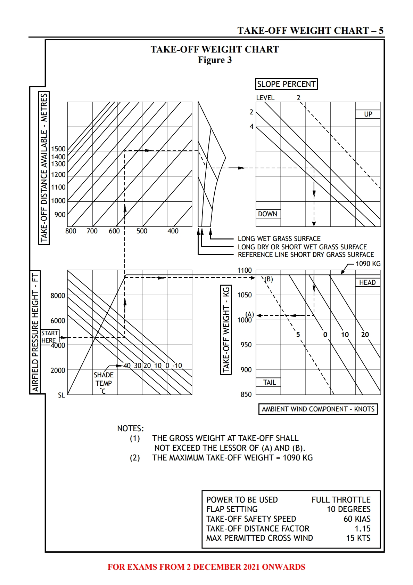 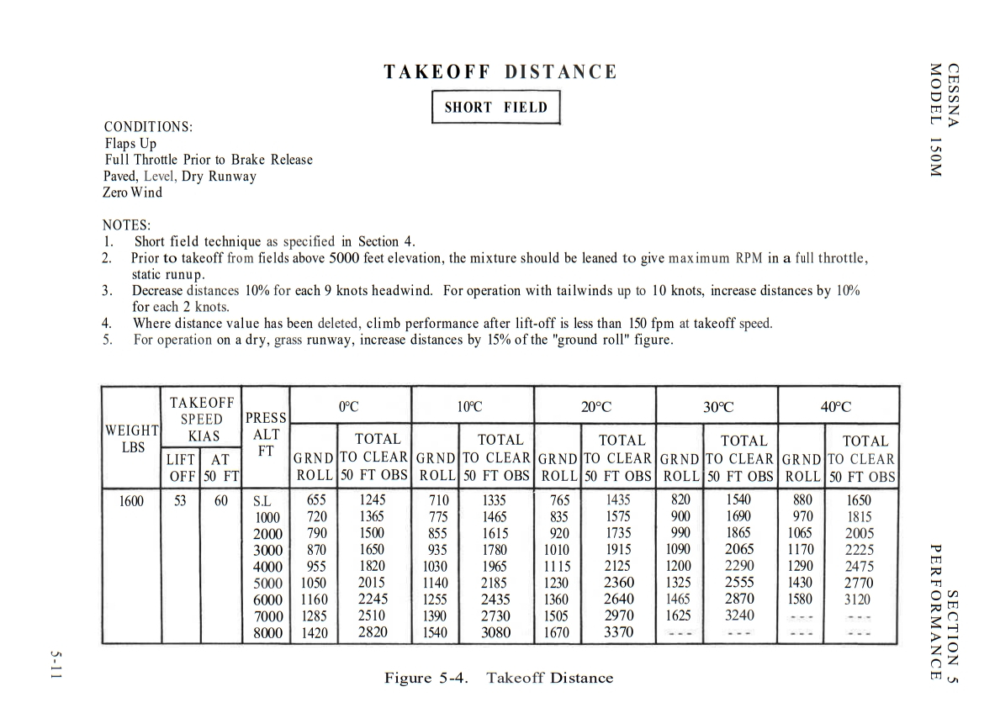

<!--
For the purpose of your theory exams CASA has created a number of charts to allow you to calculate takeoff and landing distances. We'll look at two of them today. There charts are based on a fictional plane, so you can't take figures from these and apply them to whatever plane you fly, but they give you an idea about how to use some of the real charts you might find in a POH.

Instead of charts, Cessna provides performance tables and we'll also take a look at how you'll use those to calculate takeoff and landing distance.
-->

---

## Takeoff chart

*   Takeoff configuration is specified on the chart
*   Takeoff distance factor is already applied (1.15×)
    <!-- For planes up to 2000kg MTOW, CASA recommends applying a safety factor of 15% on-top calculated takeoff and landing distances to allow for pilot technique, differences in the performance of individual planes, runway characteristics, etc. For heavier planes the recommended safety factor is even greater. In this chart, that factor has already been applied. -->
*   Chart can be used to calculate MTOW, or takeoff distance required
    <!-- 5 boxes: pressure + temperature (density), takeoff distance available, runway surface, slope, wind + takeoff weight. Chart is marked with instructions how to use: start with the pressure height and follow the boxes around clockwise. We'll explore how to use this to calculate both MTOW and takeoff distance required. Additionally, takeoff distance is defined as the distance to accelerate from a stop, takeoff, and climb to 50ft. -->

---

## Takeoff chart

-   Pressure height: 4000ft
-   Temperature: 30°C
-   Runway distance available: 1100m
-   Surface: short dry grass
-   Slope: level
-   Wind: 10kt headwind
-   Calculate maximum takeoff weight

---

## Takeoff chart

-   Pressure height: 4000ft
-   Temperature: 30°C
-   Runway distance available: 1100m
-   Surface: short dry grass
-   Slope: level
-   Wind: 10kt headwind
-   Calculate maximum takeoff weight

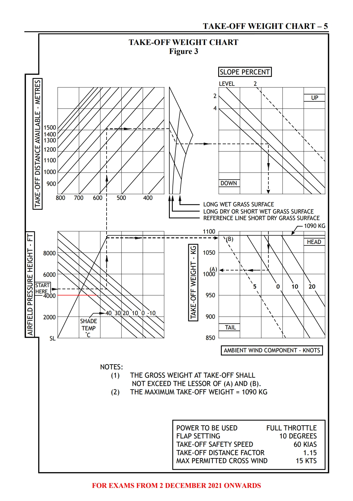

---

## Takeoff chart

-   Pressure height: 4000ft
-   Temperature: 30°C
-   Runway distance available: 1100m
-   Surface: short dry grass
-   Slope: level
-   Wind: 10kt headwind
-   Calculate maximum takeoff weight

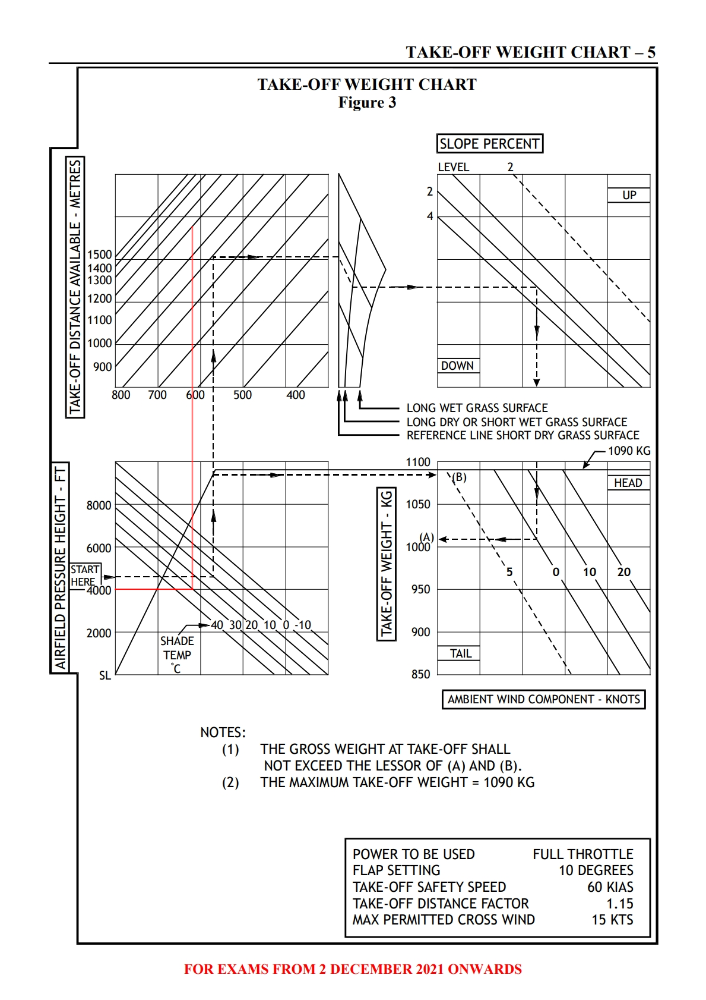

<!-- Now, the first thing we should notice is that the vertical line has intercepted this sloping line. This is the climb weight limit line. An aircraft must be able to achieve a certain climb gradient to ensure safe clearance above obstacles after takeoff. In  conditions of very high density altitude, some aircraft are unable to achieve that performance unless takeoff weight is reduced. Crossing this line alerts us to this fact, so in this case we must take the line across and we see that we cannot achieve the minimum climb performance unless we reduce our takeoff weight to 1040kg. -->

---

## Takeoff chart

-   Pressure height: 4000ft
-   Temperature: 30°C
-   Runway distance available: 1100m
-   Surface: short dry grass
-   Slope: level
-   Wind: 10kt headwind
-   Calculate maximum takeoff weight

---

## Takeoff chart

-   Pressure height: 4000ft
-   Temperature: 30°C
-   Runway distance available: 1100m
-   Surface: short dry grass
-   Slope: level
-   Wind: 10kt headwind
-   Calculate maximum takeoff weight

---

## Takeoff chart

-   Pressure height: 4000ft
-   Temperature: 30°C
-   Runway distance available: 1100m
-   Surface: short dry grass
-   Slope: level
-   Wind: 10kt headwind
-   Calculate maximum takeoff weight

---

## Takeoff chart

-   Pressure height: 4000ft
-   Temperature: 30°C
-   Runway distance available: 1100m
-   Surface: short dry grass
-   Slope: level
-   Wind: 10kt headwind
-   Calculate maximum takeoff weight

---

## Takeoff chart

-   Pressure height: 4000ft
-   Temperature: 30°C
-   Runway distance available: 1100m
-   Surface: short dry grass
-   Slope: level
-   Wind: 10kt headwind
-   Calculate maximum takeoff weight

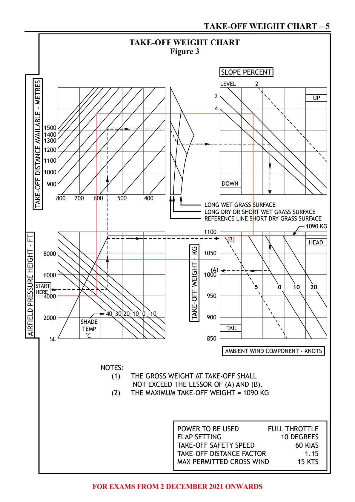

---

## Takeoff chart

-   Pressure height: 4000ft
-   Temperature: 30°C
-   Runway distance available: 1100m
-   Surface: short dry grass
-   Slope: level
-   Wind: 10kt headwind
-   **Maximum takeoff weight: 1040kg**

---

## Takeoff chart

-   Pressure height: 3000ft
-   Temperature: 15°C
-   Takeoff weight: 1050kg
-   Wind: 10kts headwind
-   Slope: level
-   Surface: long wet grass
-   Calculate takeoff distance required

---

## Takeoff chart

-   Pressure height: 3000ft
-   Temperature: 15°C
-   Takeoff weight: 1050kg
-   Wind: 10kts headwind
-   Slope: level
-   Surface: long wet grass
-   Calculate takeoff distance required

---

## Takeoff chart

-   Pressure height: 3000ft
-   Temperature: 15°C
-   Takeoff weight: 1050kg
-   Wind: 10kts headwind
-   Slope: level
-   Surface: long wet grass
-   Calculate takeoff distance required

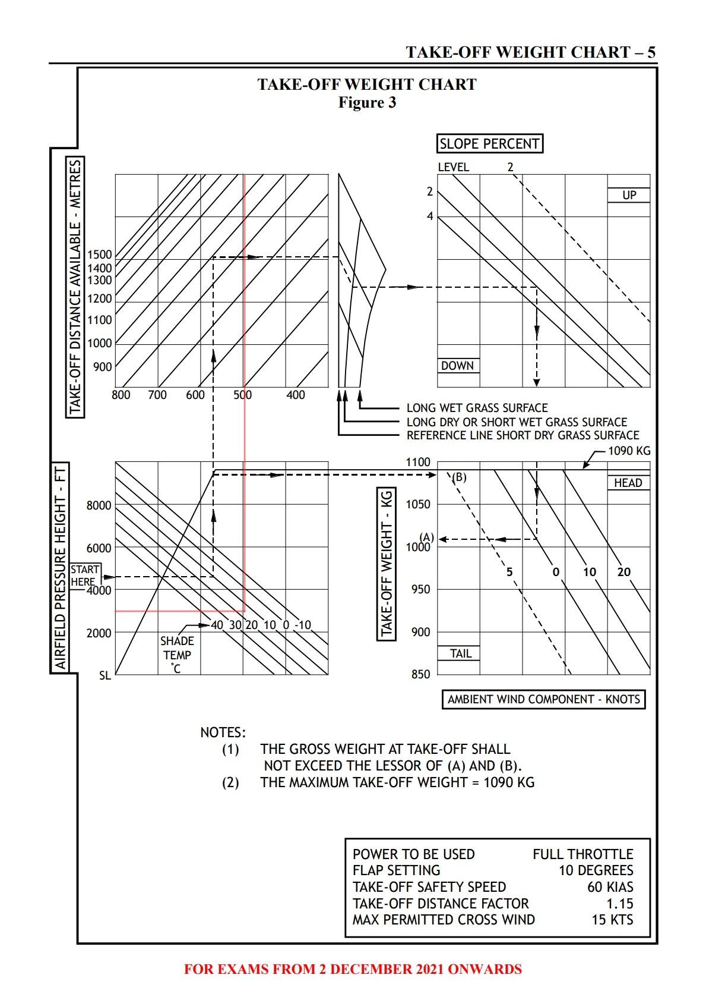

---

## Takeoff chart

-   Pressure height: 3000ft
-   Temperature: 15°C
-   Takeoff weight: 1050kg
-   Wind: 10kts headwind
-   Slope: level
-   Surface: long wet grass
-   Calculate takeoff distance required

---

## Takeoff chart

-   Pressure height: 3000ft
-   Temperature: 15°C
-   Takeoff weight: 1050kg
-   Wind: 10kts headwind
-   Slope: level
-   Surface: long wet grass
-   Calculate takeoff distance required

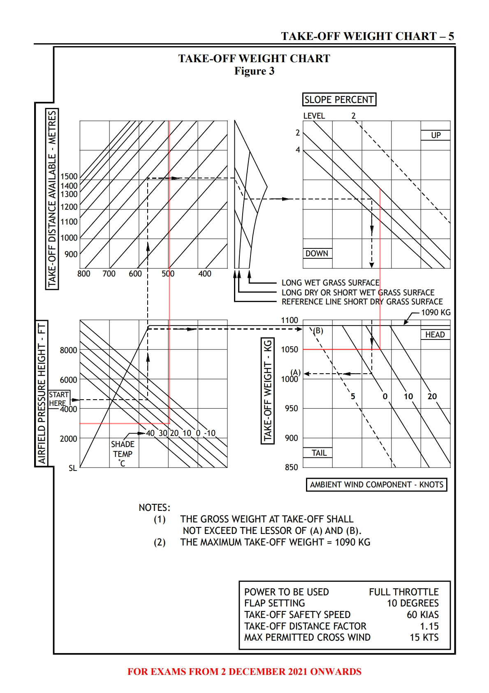

---

## Takeoff chart

-   Pressure height: 3000ft
-   Temperature: 15°C
-   Takeoff weight: 1050kg
-   Wind: 10kts headwind
-   Slope: level
-   Surface: long wet grass
-   Calculate takeoff distance required

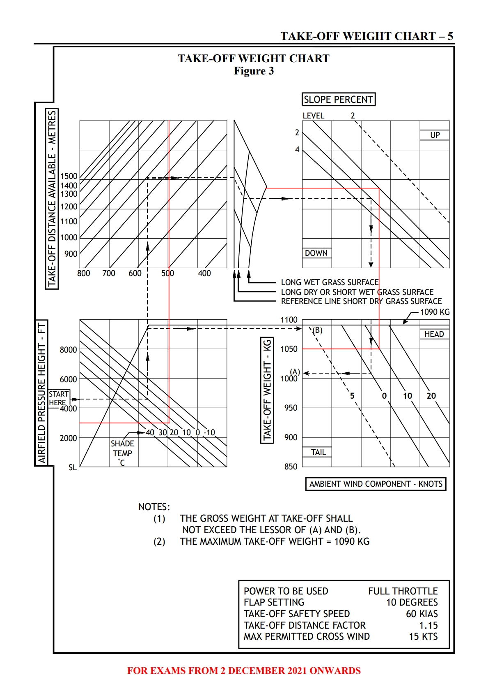

---

## Takeoff chart

-   Pressure height: 3000ft
-   Temperature: 15°C
-   Takeoff weight: 1050kg
-   Wind: 10kts headwind
-   Slope: level
-   Surface: long wet grass
-   Calculate takeoff distance required

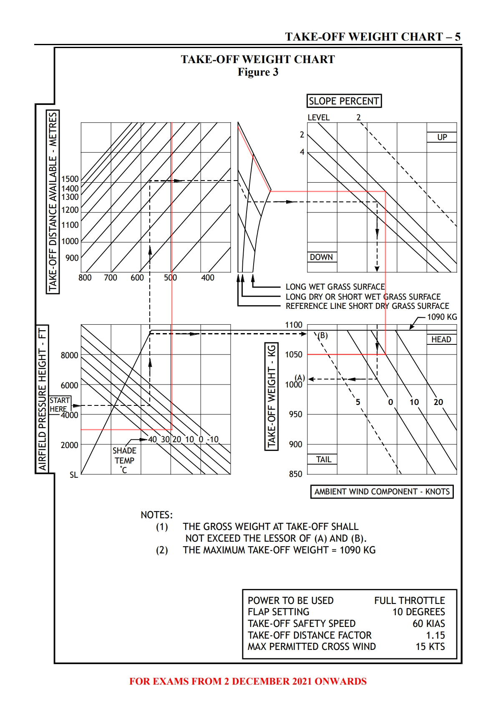

---

## Takeoff chart

-   Pressure height: 3000ft
-   Temperature: 15°C
-   Takeoff weight: 1050kg
-   Wind: 10kts headwind
-   Slope: level
-   Surface: long wet grass
-   Calculate takeoff distance required

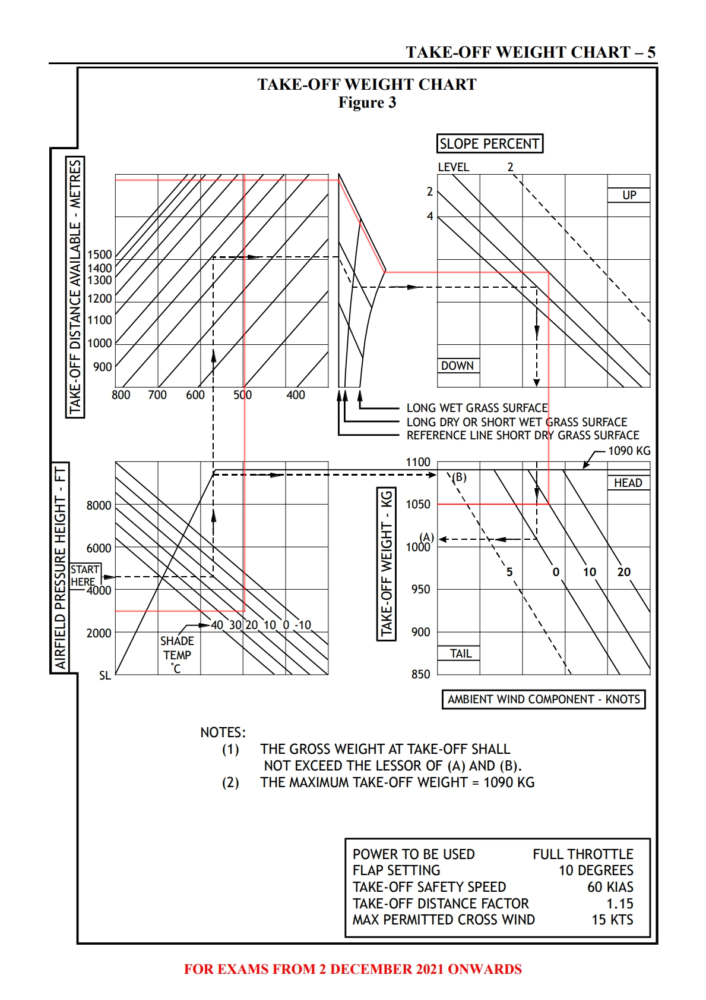

---

## Takeoff chart

-   Pressure height: 3000ft
-   Temperature: 15°C
-   Takeoff weight: 1050kg
-   Wind: 10kts headwind
-   Slope: level
-   Surface: long wet grass
-   Calculate takeoff distance required

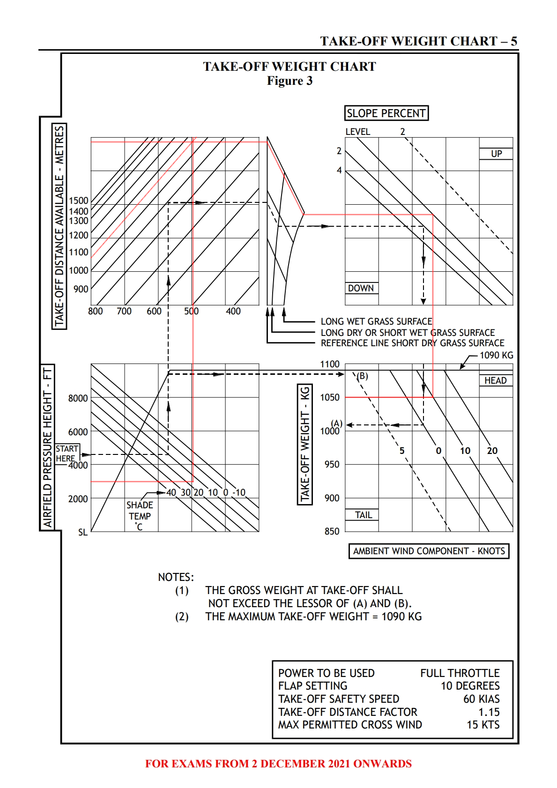

---

## Takeoff chart

-   Pressure height: 3000ft
-   Temperature: 15°C
-   Takeoff weight: 1050kg
-   Wind: 10kts headwind
-   Slope: level
-   Surface: long wet grass
-   **Takeoff distance required: 1050m**

---

## Landing chart

*   Landing configuration is specified on the chart
*   Landing distance factor is already applied (1.15×)
    <!-- Similarly to the takeoff charts, CASA recommends applying a safety factor of 15% on-top calculated landing distances. Once again, that safety factor has already been applied to this chart. -->

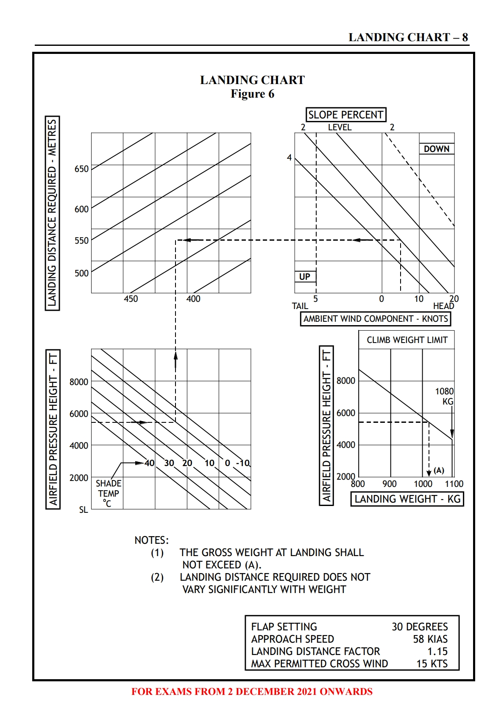

---

## Landing chart

-   Pressure height: 3000ft
-   Temperature: 30°C
-   Wind: 10kt headwind
-   Slope: level
-   Calculate landing distance required

---

## Landing chart

-   Pressure height: 3000ft
-   Temperature: 30°C
-   Wind: 10kt headwind
-   Slope: level
-   Calculate landing distance required

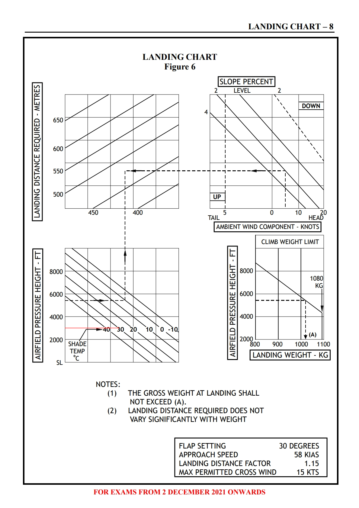

---

## Landing chart

-   Pressure height: 3000ft
-   Temperature: 30°C
-   Wind: 10kt headwind
-   Slope: level
-   Calculate landing distance required

---

## Landing chart

-   Pressure height: 3000ft
-   Temperature: 30°C
-   Wind: 10kt headwind
-   Slope: level
-   Calculate landing distance required

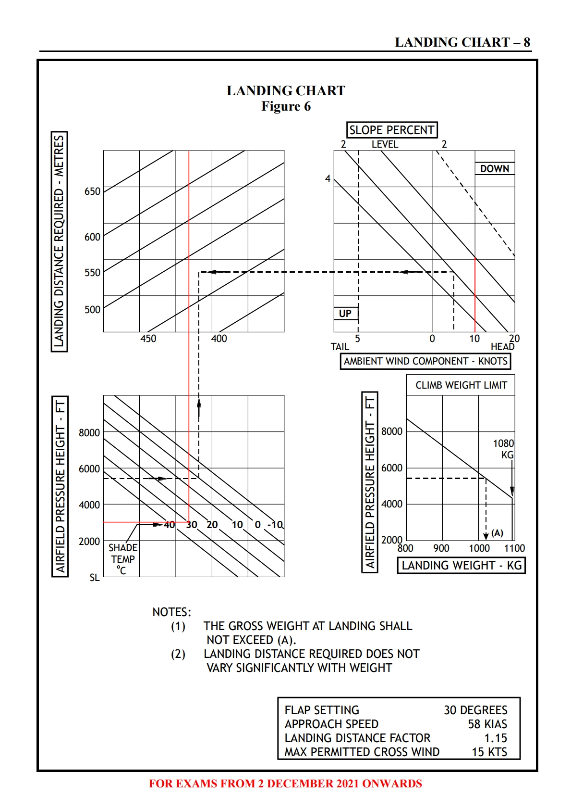

---

## Landing chart

-   Pressure height: 3000ft
-   Temperature: 30°C
-   Wind: 10kt headwind
-   Slope: level
-   Calculate landing distance required

---

## Landing chart

-   Pressure height: 3000ft
-   Temperature: 30°C
-   Wind: 10kt headwind
-   Slope: level
-   Calculate landing distance required

---

## Landing chart

-   Pressure height: 3000ft
-   Temperature: 30°C
-   Wind: 10kt headwind
-   Slope: level
-   Calculate landing distance required

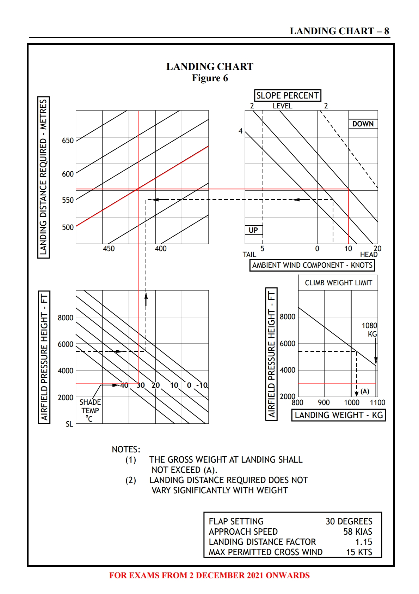

---

## Landing chart

-   Pressure height: 3000ft
-   Temperature: 30°C
-   Wind: 10kt headwind
-   Slope: level
-   Calculate landing distance required

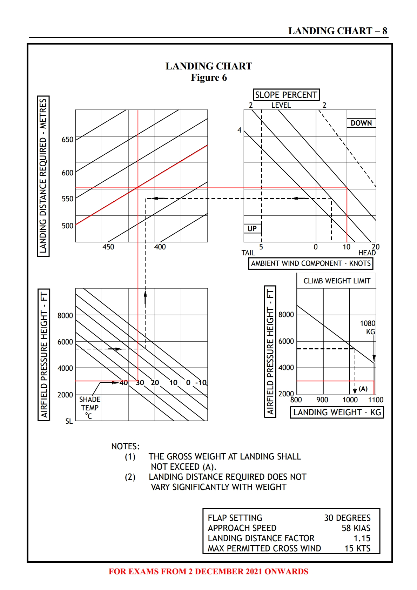

---

## Landing chart

-   Pressure height: 3000ft
-   Temperature: 30°C
-   Wind: 10kt headwind
-   Slope: level
-   **Landing distance required: 500m**

---

## Cessna 150 takeoff distance

*   Input pressure altitude and temperature
*   Instructions on how to adjust for wind and surface
*   Takeoff configuration specified
*   Safety factor not applied

---

## Cessna 150 landing distance

*   Input pressure altitude and temperature
*   Instructions on how to adjust for wind and surface
*   Landing configuration specified
*   Safety factor not applied

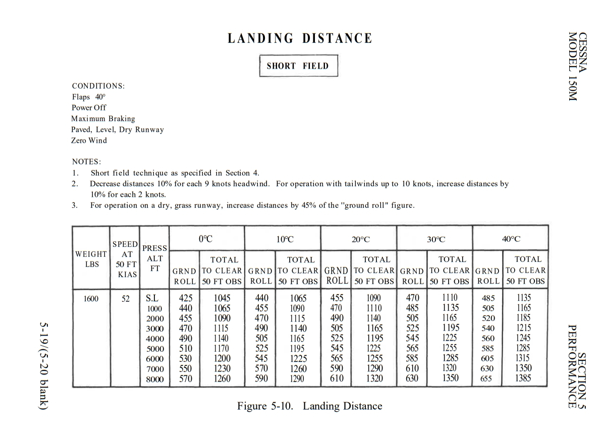

---

## Application

---

## Threat and error management

Threat | Error | UAS | Countermeasure
-|-|-|-
Lower safety margin | | Runway overrun | 

---

## Threat and error management

Threat | Error | UAS | Countermeasure
-|-|-|-
Lower safety margin | <small>Assuming runway is sufficient</small> | Runway overrun | <small>Always calculate takeoff/landing distance</small>

---

## Threat and error management

Threat | Error | UAS | Countermeasure
-|-|-|-
Lower safety margin | <small>Assuming runway is sufficient</small> | Runway overrun | <small>Always calculate takeoff/landing distance</small>
Turbulence | <small>Failure to maintain speed</small> | <small>Airspeed below final speed</small> |

---

## Threat and error management

Threat | Error | UAS | Countermeasure
-|-|-|-
Lower safety margin | <small>Assuming runway is sufficient</small> | Runway overrun | <small>Always calculate takeoff/landing distance</small>
Turbulence | <small>Failure to maintain speed</small> | <small>Airspeed below final speed</small> | <small>Add gust factor, monitor airspeed closely, go around</small>

---

## Threat and error management

Threat | Error | UAS | Countermeasure
-|-|-|-
Lower safety margin | <small>Assuming runway is sufficient</small> | Runway overrun | <small>Always calculate takeoff/landing distance</small>
Turbulence | <small>Failure to maintain speed</small> | <small>Airspeed below final speed</small> | <small>Add gust factor, monitor airspeed closely, go around</small>
<small>Different approach config</small> | Low and slow | Stall | 

---

## Threat and error management

Threat | Error | UAS | Countermeasure
-|-|-|-
Lower safety margin | <small>Assuming runway is sufficient</small> | Runway overrun | <small>Always calculate takeoff/landing distance</small>
Turbulence | <small>Failure to maintain speed</small> | <small>Airspeed below final speed</small> | <small>Add gust factor, monitor airspeed closely, go around</small>
<small>Different approach config</small> | Low and slow | Stall | Monitor airspeed closely, go around

---

## Review questions

*   How does low air density affect aircraft performance? <!-- Makes it worse. Reduces lift generated by the wings, power produced by the engine, and thrust produced by the propeller -->
*   What factors affect air density? <!-- Temperature, altitude, humidity, atmospheric pressure -->
*   What is the worst combination of those factors for aircraft performance? <!-- Hot, high, humid, low pressure system -->
*   Apart from air density, what other factors affect takeoff and landing performance? <!-- Runway surface, slope, wind, weight, flaps -->
*   Find the pressure height at Orange given a QNH of 1000 hPa <!-- YORG elev: 3112. Pressure height = elevation + (1013 - QNH) * 30. Pressure height = 3502ft -->
*   The wind at Warnervale is 255/25. What is the headwind component? <!-- 14kts -->

---

## Review questions

-   Pressure height: 2000ft
-   Temperature: 30°C
-   Wind: 5kt headwind
-   Slope: level
-   Calculate landing distance required <!-- 515m -->

---

## Objectives

You should now be able to:

*   List the factors affecting takeoff and landing performance
*   Calculate pressure height
*   Determine headwind and crosswind components
*   Calculate takeoff and landing distance required