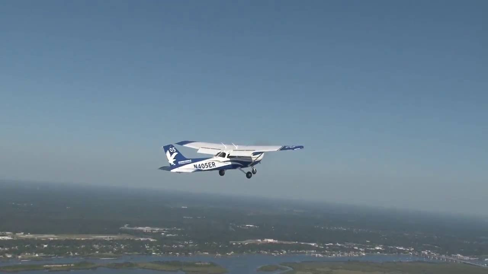
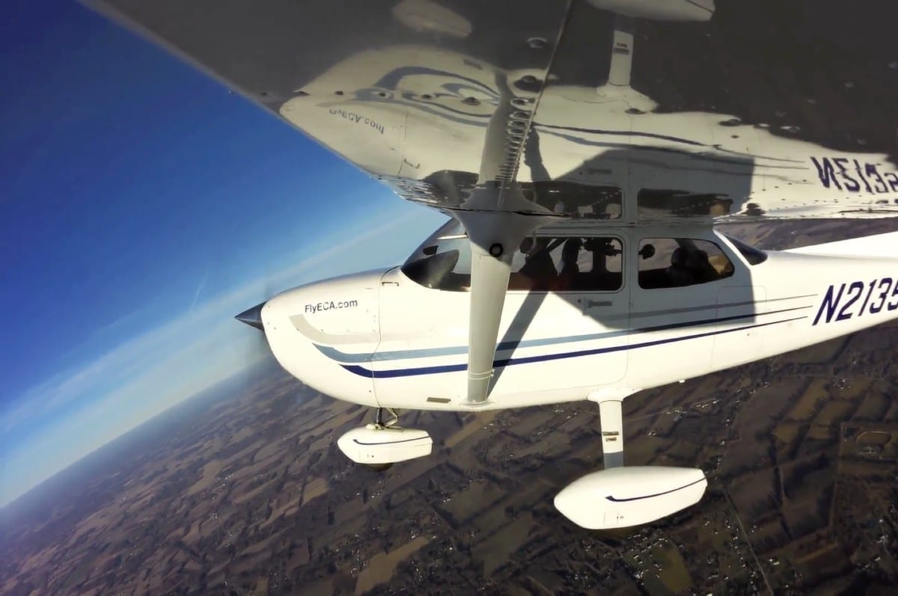

## Aim

*   To learn the aerodynamics behind stalling, the symptoms of a stall, and recovery from a stall

---

## Motivation

<!--
Unlike the lessons we've done so far, we're not practicing a manoeuvre that you'll be using in every flight. Instead, this lesson is about safety and equipping you with skills that could save your life.
-->

*   To avoid an inadvertent stall
    <!-- A stall doesn't just happen out of nowhere. There are many warning signs of an impending stall, and we will learn what these symptoms are and how to recover to avoid a stall ever happening in the first place. -->
*   To recover from an inadvertent stall
    <!-- An unintentional stall should never happen. When you experience the stall you will notice how extreme the control inputs are and how far we are from the normal flight envelope—you will probably think to yourself "how does anyone do this by accident?" -->
    <!-- But unfortunately, people still do. Getting too slow on approach to landing and stalling in the base–final turn is sadly common, as is dragging the plane in too slow on final, and pulling up too high after takeoff. -->
    <!-- Because stalling does happen, we practice stalling so that if we ever do inadvertently stall we know the recovery. -->

---

## Objectives

By the end of this brief you should be able to:

*   State the symptoms of an impending stall
*   Demonstrate the stalling motion with the model
*   Describe the stall recovery technique
*   List the factors affecting stall speed
*   State the pre-stall checks

---

## Lesson overview

Duration: approx 50 mins

*   Stall aerodynamics
*   Factors affecting stall speed
*   Symptoms of a stall
*   Control in the stall
*   Application
*   Threat and error management
*   Review questions

---

## Revision

*   What is the pilot's lift formula? <!-- Lift = Speed * AoA, so as we reduce speed we increase AoA. We'll see today that there's a limit this formula, we can't increase AoA forever, therefore there's a limit to how slowly we can fly. When we practice stalls, we're going to be in slow flight. -->
*   How does control feel change in slow flight? <!-- Why do the controls feel mushy in slow flight? -->

---

<!--
_class:
-->

## Stall aerodynamics

<video src="./boundary-layer-separation-and-stall.mp4" controls="controls" width="480" height="393" loop muted></video>

<!--
Air flowing near the surface of the wing is in the so-called boundary layer, where right at the surface the air has zero velocity, and the air's velocity increases to the free stream velocity as you move away from the surface. The area where airspeed is slowed is called the boundary layer.

Air in the boundary layer can either be laminar flow, which is a very smooth flow of air, or it can be turbulent flow, which contains swirls and eddies and creates much more drag than laminar flow.

As angle of attack increases the so-called point of separation, where laminar flow transitions into turbulent flow, moves further and further forward. As this occurs the centre of lift also moves forward, as lift is created by a smaller and smaller portion of the top surface experiencing laminar flow.

Eventually as angle of attack increases the wing can no longer effectively generate lift, and the large turbulent boundary layer results in huge amounts of drag. At this point the wing is stalled. Any further increases in angle of attack reduce the cooefficient of lift.
-->

---

<!--
_class:
-->

## Stall aerodynamics

<!--
Remembering back to our straight and level brief, we showed this coefficient of lift graph. Reading the graph, what happens to coefficient of lift as AoA increases? This is another way of telling the same story.

You can see that as angle of attack increases, so does coefficient of lift.

The rate of increase slows as we approach about 16 degrees, as the turbulent boundary layer makes the wing less effective at generating lift.

Further increases in angle of attack past 16 degrees result in less lift being produced. So for this wing, the stalling angle of attack is 16 degres.
-->

---

<!--
_class:
-->

## Stall aerodynamics

<video src="./airflow-during-a-stall.webm" controls="controls" width="854" height="480" loop muted></video>

<!--
One last video to help illustrate what's happening in a stall.

In this video, pieces of string have been attached to a wing in order to visualise the airflow. The pilots are then going to perform several stalls, and you can see how the airflow changes.

In level flight the airflow is attached to the wing in laminar flow. As the angle of attack increases the point of separation moves forward and you can see the strings affected by the turbulent air. As the pilots recover from the stall the airflow immediately reattaches and the wing is flying again.
-->

---

## Factors affecting stall speed

$$
\begin{align}
Lift &= AoA \times Speed
\end{align}
$$

---

## Factors affecting stall speed

$$
\begin{align}
Lift &= AoA \times Speed \\
Lift &= 16\textdegree \times Speed
\end{align}
$$

<!--
Because we know the stalling AoA is a constant, we can substitute the variable AoA with 16 degrees. So if we want to evluate how different factors affect stall speed, we just need to think about whether the wing needs to produce more or less lift as that factor changes.
-->

*   Cessna 150 VS is 47kts
    <!-- No flap, no power, max weight, most forward CG. Assumes straight and level, but we can stall at any speed during manouvres, as we shall soon see. -->
*   Weight
    <!-- If we increase weight, we need to increase lift. Therefore stall speed increases. -->
    <!-- DRAW: Four forces, increase weight vector and ask what needs to happen to achieve equilibrium -->
    *   Increased weight = increased stall speed
    <!-- Be cautious with added weight—particularly immediately after takeoff with a heavier load your stall speed can be noticeably faster. -->
*   Flaps
    <!-- If we add flaps, we increase lift produced at any given speed. Therefore we can fly slower and still generate enough lift, so stall speed decreases. How much does it decrease? Vs0 is the stall speed with full flaps (bottom of the white arc) -->
    <!-- Draw C_L diagram (C_L x AoA). C_L with flaps is just moved up on the Y axis. -->
    *   Adding flaps reduces stall speed. VS0 in Cessna 150 is 42kts. 
    <!-- Flaps are used in slow flight and landings to increase safety margin over the stall. -->

---

## Factors affecting stall speed

$$
\begin{align}
Lift &= AoA \times Speed \\
Lift &= 16\textdegree \times Speed
\end{align}
$$

*   Power
    <!-- Thrust vector is pointed up at high angles of attack, additionally it increases the speed of the airflow over parts of the wing which increases lift. Therefore stall speed decreases. -->
    <!-- DRAW: Four forces in level slow flight at high AoA and ask what direction thrust vector will point. Show thrust vector pointing up, resolve thrust into forwards component of thrust and vertical component of thrust. -->
    *   Adding power decreases stall speed
    <!-- Power can give us safety margin at low speed -->
*   Manoeuvres
    <!-- When in curving flight e.g. turning or pulling out of a dive, stall speed increases. -->
    <!-- DRAW: Four forces in a turn. Increase lift vector so vertical component of lift = weight. New term: load factor = lift / weight. -->
    *   During manoeuvring stall speed increases
    *   New VS = Old VS × √Load factor
        <!-- Illustrate load factor with four forces diagram. Load factor = lift / weight. -->
        <!-- Don't mix stall steep turns and low speed -->

---

## Factors affecting stall speed

$$
\begin{align}
Lift &= AoA \times Speed \\
Lift &= 16\textdegree \times Speed
\end{align}
$$

*   Turbulence
    <!-- During turbulence the direction of relative airflow can change. During updrafts our angle of attack is increased, which can push us over our stalling AoA. Therefore we say turbulence _can_ increase stall speed. -->
    *   Updrafts increase stall speed
    <!-- On a bumpy day we add speed for safety during our approach to the runway -->
*   Wing efficiency
    <!-- Contaminants on the wing surface such as dust, ice, and frost will increase stall speed -->
    *   Contaminants on the wing surfaces increases stall speed
    <!-- Particularly over the next few months it will become more common to find frost on the wings during the morning at Warnervale. Always check wings for frost and clear it off as part of your pre-flight inspection. -->

---

## Symptoms of a stall

<!--
Use the model to show approach to a stall (idle power, try to maintain altitude), and question students about symptoms.
-->

*   Reducing IAS
*   High nose attitude
    <!-- Low airspeed and high nose attitude are not always present in the approach to a stall e.g. a high speed stall can occur as a result of pulling out of a dive too sharply. However, during many phases of flight these symptoms will be present and they should trigger your spidey sense that a stall is imminent and corrective action must be made. -->
*   Control column far back
    <!-- Ultimately the elevator is the AoA control, and a stall occurs because we exceed the critical angle of attack. So a stall cannot occur unless the control column is held fairly far back. Note that control column forces won't necessarily be high, as trim will effect that. Particularly during a go around the plane might be trimmed such that you actually need quite strong forward control pressure to avoid a stall. -->
*   Reduced aerodynamic noise
*   Sloppy controls
    <!-- As experienced during slow flight, the controls will become less effective as airspeed is reduced as less air will be flowing over the control surfaces. -->
*   Stall horn
    <!-- As the stall is approached the stall horn will sound. The stall horn is a mechanical device, and as with any mechanical device it might fail and should not be relied upon. You cannot assume that you are safe from a stall just because you're not hearing the stall horn. -->
*   Control buffet
    <!-- Finally, as turbulent airflow from the wings strikes the rear tail assembly a buffeting can be felt through the controls. This can vary between aeroplane types, and for example isn't very noticeable in Cessnas but will be quite apparant in some other types. -->
*   Nose drop
    <!-- As the stall actually breaks, the wings will produce less lift and the nose will drop due to the lift/weight couple. -->

---

## Aircraft control in the stall

<!--
Use aircraft model to show stall motion. When the stall occurs, it is quite common for a small imbalance to cause one wing to stall more than the other. If that happens we get a "wing drop". How might you think to fix that?
-->

*   **Ailerons** – neutral
    <!-- We cannot use ailerons to combat the roll, as that will cause the dropped wing to increase its AoA and move deeper into the stall. -->
*   **Rudder** – to keep wings level
    <!-- How else could we control roll? Perhaps using a control's secondary effect? -->
*   **Elevator** – reduce back pressure
    <!-- The stall is caused by excessive angle of attack, and since the elevator is our angle of attack control we need to reduce back pressure to reduce angle of attack and get the wing flying again -->
*   **Power** – full
    <!-- Power to full to increase our speed, and then we can recover into normal straight and level flight or a climb to regain our altitude. Note that we can recover from a stall at idle power, we just need to reduce the angle of attack. The point of adding power immediately is to reduce the height loss during recovery. -->

---

## Application

---

## Threat and error management

*   Avoid a stall in the first place
    *   Know and fly well within the limits of the aircraft
    *   Avoid more than 30 degrees of bank in the circuit and at low level <!-- To reduce load factor and increase safety margin when low to the ground -->
    *   Remember that increasing wing loading increases stall speed <!-- Steep turns, pulling out of a dive, etc. -->

---

## Threat and error management

*   HASEL
    *   H – Height
        <!-- Recover by 3000ft AGL (therefore we perform stalls at at least 3500ft) -->
    *   A – Area
        <!-- Clear of built up areas, forced landing area identified -->
    *   S – Security
        <!-- Belts fastened, cargo secured -->
    *   E – Engine
        <!-- Ts & Ps, full rich -->
    *   L – Lookout
        <!-- 180 degree clearing turn + radio call -->

---

## Threat and error management

*   Smooth but positive control inputs
    <!-- Abrupt or jerky control inputs can exacerbate the stall or increase the altitude loss during the recovery -->
*   Human factors
    <!-- The first couple of times you are exposed to stalls it's normal to feel a bit anxious or uncomfortable, once you've done them a few times you will realise that practicing intentional stalls is not a big deal at all. Having said that, if you're not feeling well let me know and we can fly level until you're comfortable to continue. -->

---

## Review questions

Factor | Effect on stall speed
-------|----------------------
Increased weight | <!-- Increase -->
Increased power | <!-- Decrease -->
Extending flaps | <!-- Decrease -->
Frost on the wings | <!-- Increase -->
Performing a turn | <!-- Increase -->
Turbulence | <!-- Can increase -->

---

## Review questions

*   How could you recognise an impending stall?
    <!-- Reducing airspeed, high nose attitude, control column back, reduced aerodynamic noise, sloppy controls, stall horn, buffet -->
*   How would you recover from a stall?
    <!-- Ailerons neutral, opposite rudder, reduce backpressure, full power -->
*   Demo the stall motion with the model
*   What are the checks we perform before intentionally practicing stalls?

---

## Objectives

You should now be able to:

*   State the symptoms of an impending stall
*   Demonstrate the stalling motion with the model
*   Describe the stall recovery technique
*   List the factors affecting stall speed
*   State the pre-stall checks