## Aim

*   To explain the principles of straight and level flight at a constant altitude, airspeed, and heading.

---

## Motivation

*   Majority of nearly every flight is spent straight and level
*   It's a fundamental skill that all of our future manouvers will build upon

---

## Objectives

By the end of this brief you should be able to:

*   List the forces acting on an aeroplane in straight and level flight
*   State the factors a pilot can use to affect lift production
*   List the two primary types of drag and describe how they contribute to the total drag of the aeroplane at different speeds
*   Explain how static and dynamic stability influence an aircraft's response to a disturbance

---

## Lesson overview

Duration: approx 45 mins

*   The four forces
*   Lift
*   Drag
*   Stability
*   Application
*   Threat and error management
*   Review questions

---

## Revision

*   What are the different ways that a plane can move?
*   How does the plane respond when you increase power?
*   Why did we use the trim control?

---

<!--
_class: lead
-->

## The four forces

---

## Weight

*   Total weight of the aircraft, passengers, fuel, and equipment onboard
*   Acts to pull the plane downwards towards the earth
*   Acts through the plane's centre of gravity

---

## Lift

*   Component of aerodynamic forces which opposes gravity
*   Acts at 90° to the direction of motion
*   Acts through a single point called the centre of pressure

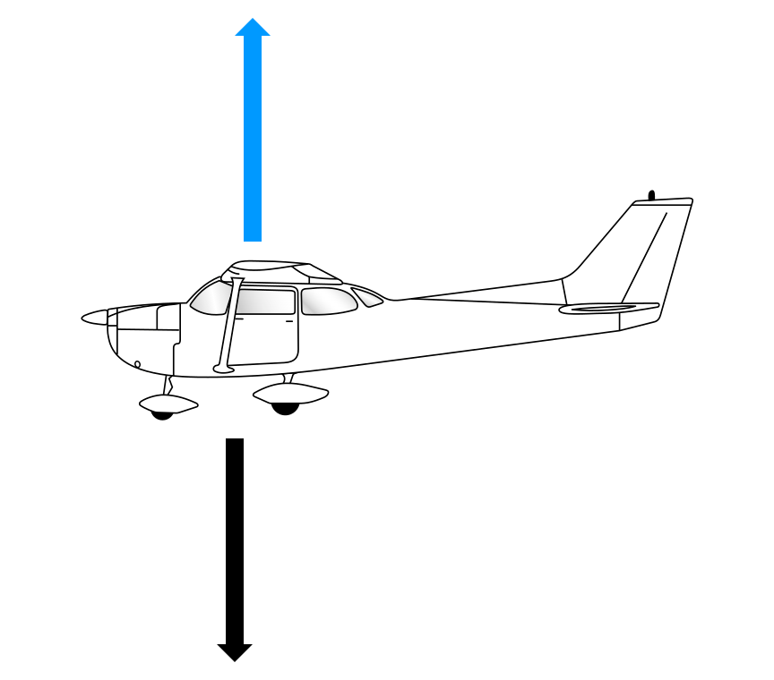

---

## Drag

*   Component of aerodynamic forces which resits the aircraft's movement through the air
*   Acts opposite the direction of motion
*   Acts through a single point called the centre of pressure

---

## Thrust

*   Force produced by the engine and propeller
*   Acts forward along the axis of the propeller
*   Acts through the centre of thrust

---

## Equilibrium

*   In steady straight and level flight the forces are in equalibrium
*   Couples:
    *   Lift = weight (nose down)
    *   Thrust = drag (nose up)

<!--
Equilibrium is when all the forces are in balance, so there's no net force acting on the plane.

Lift = weight, thrust = drag. These forces form what are called couples, which is when forces which are equal in strength act in opposite directions, but the forces don't line up. This creates a twisting force. DEMO: using fingers on the paper model, or wooden model.

This is why in the previous lesson when you increased power the nose pitched up.

In practice the nose down force from the lift/weight couple is greater than the nose up force from the thrust/drag couple, so the elevator is set at an angle to provide a slight down force to balance those forces.
-->

---

<!--
_class: lead
-->

## How lift is generated

---

## Aerofoil characteristics

*   Leading edge
*   Trailing edge
*   Chord line
*   Mean camber line
*   Maxmimum camber <!-- Maximum camber = point where mean camber line is furthest from the chort line. Point of maximum curvature. -->
*   Relative airflow
*   Angle of attack

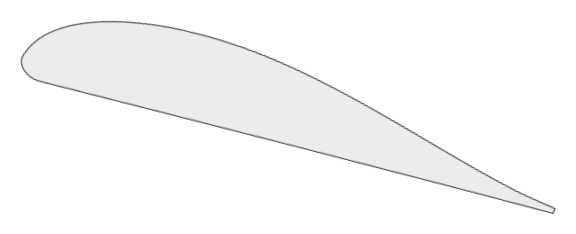

---

## Newton's 3rd law

>   For every action, there is an equal and opposite reaction

*   When air flows over a wing, the wing pushes the air downwards and reduces its speed
*   The _equal and opposite reaction_ is that the wing is pulled **upward** and **back** (this is called the **total reaction**)

---

<!--
_class: lead invert
-->

## Newton's 3rd law

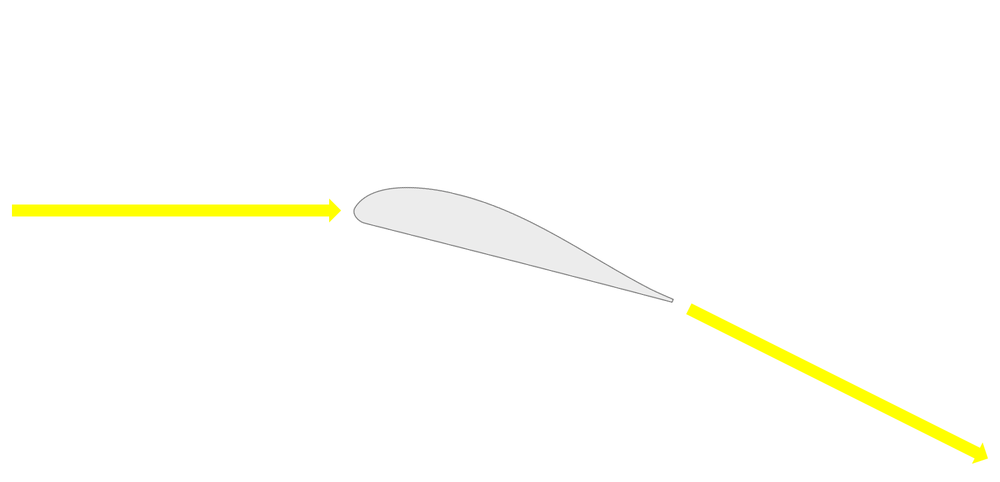

---

<!--
_class: lead invert
-->

## Newton's 3rd law

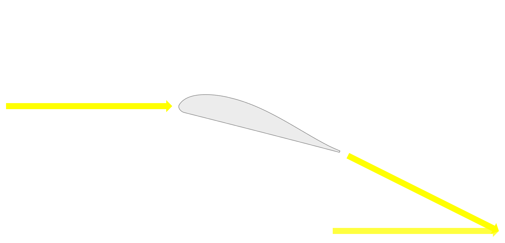

---

<!--
_class: lead invert
-->

## Newton's 3rd law

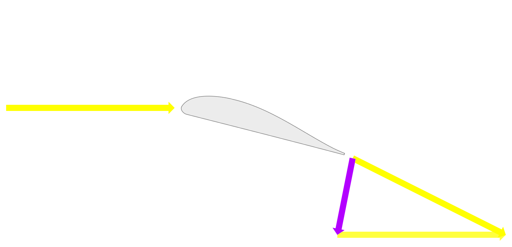

---

<!--
_class: lead invert
-->

## Newton's 3rd law

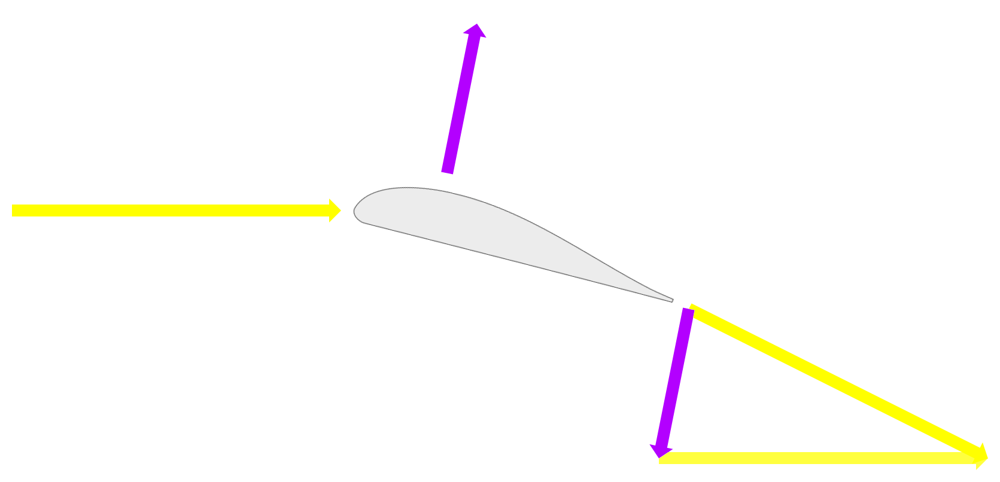

<!-- Additionally, we can resolve the total reaction by splitting it into two components: lift and drag -->

---

<!--
_class: lead invert
-->

## Newton's 3rd law

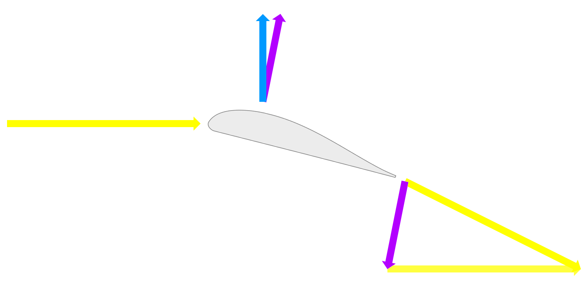

---

<!--
_class: lead invert
-->

## Newton's 3rd law

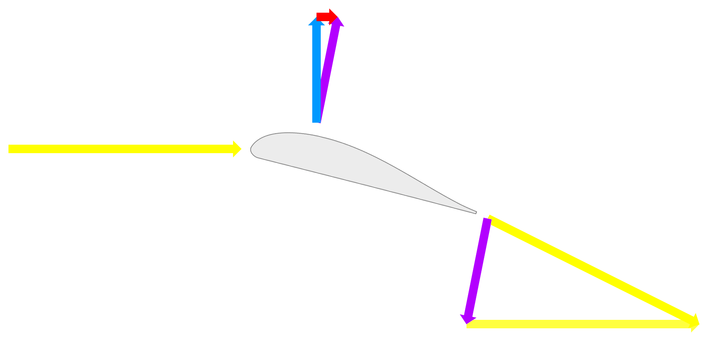

---

## Coandă effect

*   The Coandă effect is the tendency of a fluid jet to stay attached to and follow the curves of a nearby surface rather than continue its original path
*   This deflects the air downwards and creates a low pressure area above the wing

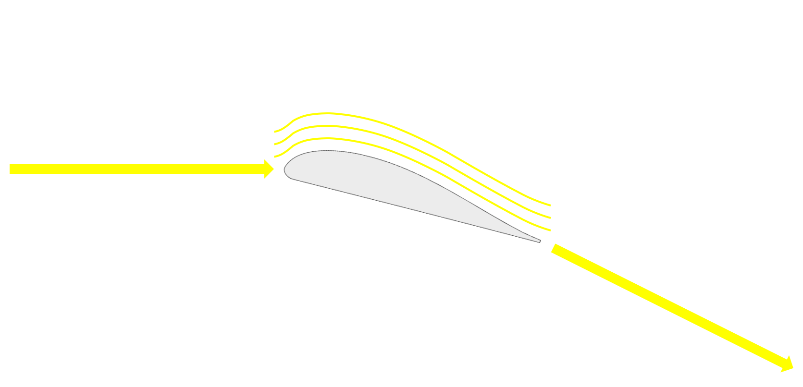

---

## Bernoulli's principle

*   Bernoulli's principle states that an increase in a fluid's speed is accompanied with a simultaneous decrease in pressure
*   Based on conservation of energy—if a fluid speeds up its kinetic energy has increased, so it must lose some pressure energy. The total energy stays the same, but more is in the form of motion and less as pressure.

---

<!--
_class: lead invert
-->

## Bernoulli's principle

$$
Total\ pressure = dynamic\ pressure + static\ pressure
$$

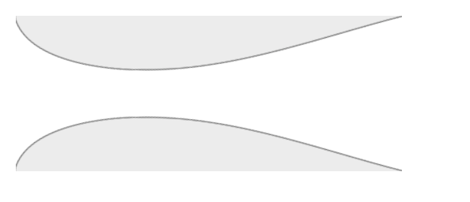

<!--
Another way to phrase Bernoulli's principle is total pressure = dynamic pressure + static pressure, where dynamic pressure is pressure due to the motion of a fluid (this is the pressure you feel when you stick your hand out of the window of a moving car), and static pressure is the pressure exerted by a fluid at rest. Total pressure stays the same, so if dynamic pressure increases then static pressure must decrease.

Lets have a look at Bernoulli's principle in action by examining a ventrui tube. A venturi has a wide entry section, a narrow throat in the middle, and a wide exit section. Fluid, including air, flows through the tube from wide to narrow and back to wide again.

The same amount of air must pass through each section of the tube per second, so when the area shrinks the air must speed up (dynamic pressure).

According to Bernoulli's principle, when the fluid speeds up the static pressure drops so that the total pressure remains the same.
-->

---

<!--
_class: lead invert
-->

## Bernoulli's principle

$$
Total\ pressure = dynamic\ pressure + static\ pressure
$$

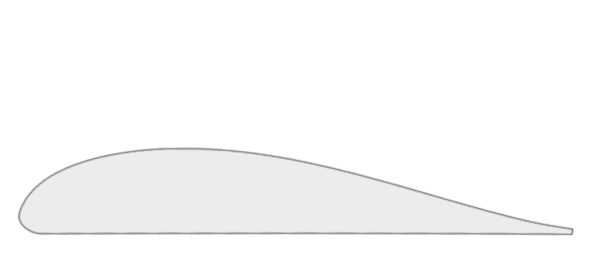

<!--
If we cut the venturi tube in half, we get something approximating the top surface of a wing, and we can see the same low pressure area created as air flows over the curved top surface.
-->

---

<!--
_class: lead
-->

## Factors affecting lift

---

<!--
_class:
-->

## Coefficient of lift

*   CL is measured in a wind tunnel by changing a wing's angle of attack while keeping all other factors constant (including speed)
*   CL increases as angle of attack increases (up to a point)

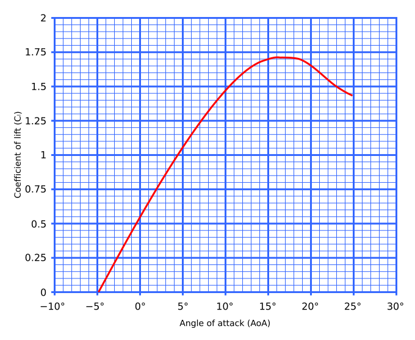

<!--
Ask the student: what happens to C_L as angle of attack increases.

Note: different wing shapes will have different coefficient of lift values at a given angle of attack, because the wing shape heavily influences how the air moves over the wing. So we therefore say that C_L is a product of angle of attack and wing shape.
-->

---

## Lift formula

$$
Lift = C_L \cdot \tfrac{1}{2} \cdot \rho \cdot V^2 \cdot S
$$

*   **CL** – wing shape & angle of attack
*   **ρ** – air density
*   **V2** – velocity through the air squared
*   **S** – surface area of the wing

<!-- Which factors can be controlled by the pilot? Pilot's lift formula: lift = angle of attack * speed -->

---

<!--
_class: lead
-->

## Drag

---

## Drag

*   Total of all aerodynamic forces which resist the aircraft's movement through the air
*   Induced drag
*   Parasite drag
    *   Form drag
    *   Skin friction drag
    *   Interferance drag

---

## Induced drag

*   Drag associated with the generation of lift
*   Air moves from high pressure to low pressure
*   Due to forward movement these vortices trail behind the wing tips
*   Increases at low speeds and high wing loadings

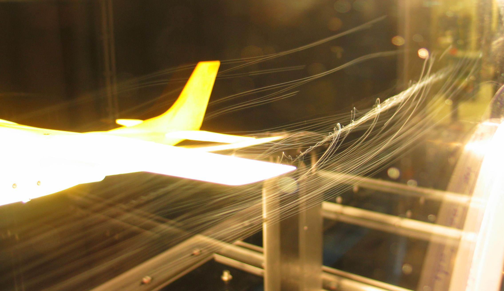

---

<!--
_class: lead
-->

## Induced drag

<video src="./Lift-induced_vortices_behind_aircraft_(DLR_demonstration).ogv.360p.webm" controls="controls" width="640" height="480" loop></video>

---

## Parasite drag

*   Form drag
*   Skin friction drag
*   Interference drag

---

<!--
_class:
-->

## Form drag

*   Caused by the shape of the object as it moves through the air
*   A less streamlined shape will cause more turbulence, therefore more drag

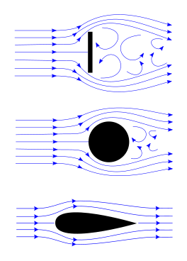

---

## Skin friction drag

*   Caused by the air "sticking" to the surface of the aircraft as it moves
*   Rivets, seams, and other surface imperfections increase skin friction drag
*   Contaminants such as ice, bugs, or dirt can also increase skin friction drag

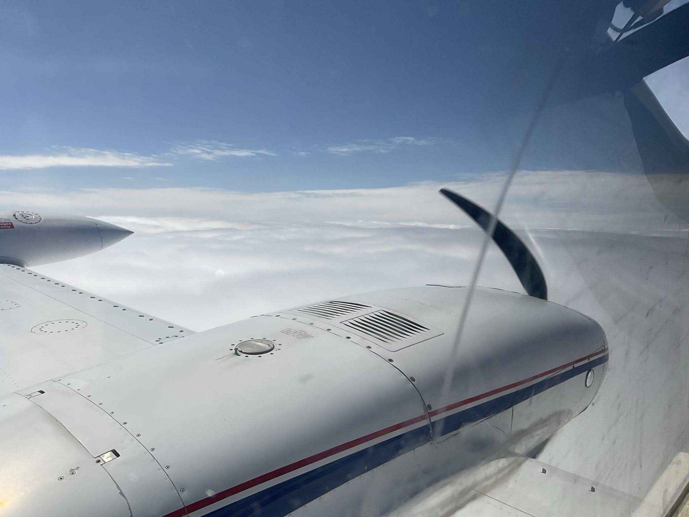

---

## Interference drag

*   Caused by the mixing of airstreams
*   Common at the junction of surfaces (e.g. where the wings meet the fuselage)

---

<!--
_class:
-->

## Total drag

$$
Total\ drag = induced\ drag + parasite\ drag
$$

As speed increases:

*   Induced drag decreases
*   Parasite drag increases
*   Total drag decreases to a point (VBG), and then increases

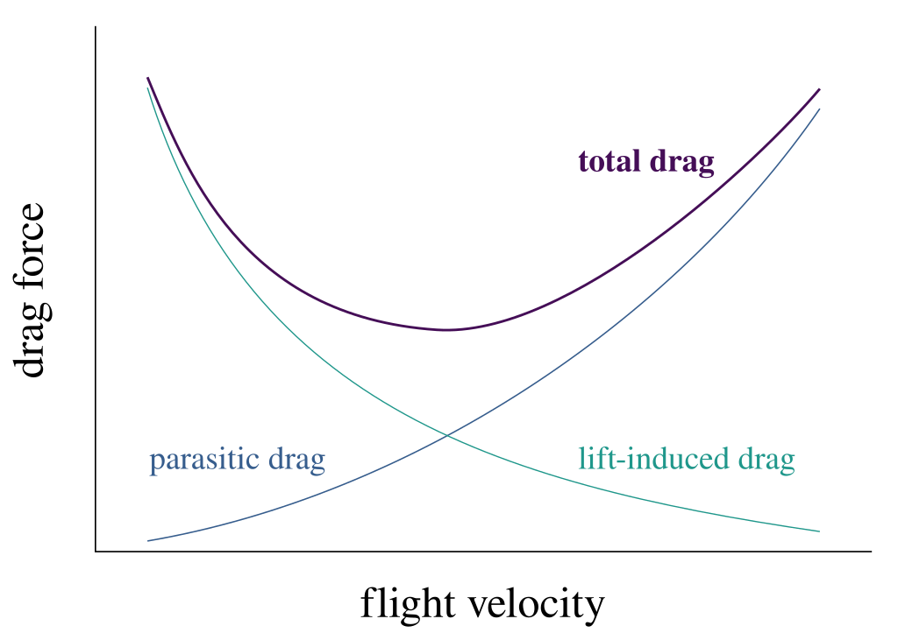

<!--
Ask the student: looking at the graph what happens to parasite drag as speed increases? What about induced drag? So if total drag is parasite drag + induced drag, what happens to total drag as speed increases?
-->

---

<!--
_class: lead
-->

## Stability

---

## Stability

*   The tendency of an object to return to its previous state after it has been displaced.
*   In the case of an aeroplane, it is the tendency of the plane to return to equilibrium in pitch, roll, or yaw after being displaced—_without any control input from the pilot_.
*   The opposite of stability is _manouverability_.

---

## Static stability

Static stability refers to the object's **initial tendency** after being displaced.

*   **Statically stable** — initial tendency to return to equilibrium
*   **Statically neutral stability** – no initial tendency to return to or diverge further from equilibrium
*   **Statically unstable** – initial tendency to diverge further from equilibrium

<!--
Draw example of ball + bowl
-->

---

## Dynamic stability

Dynamic stability refers to the behaviour of a statically stable object **over time as it oscillates** around equilibrium.

*   **Dynamically stable** – oscillations decrease in magnitude over time
*   **Dynamically neutral stability** – oscillations remain constant in magnitude over time
*   **Dynamically unstable** – oscillations increase in magnitude over time

---

## Longitudinal stability

*   Stability in pitch
*   Aeroplane pitches around its centre of gravity (CG), tail provides stabilising force
*   Decalage—the difference AoA of wing and horizontal stabilizer
    *   Wing flies at a higher angle of attack than the horizontal stabilizer <!-- Example wing 2, tail 1 -->
    *   CG further forward than centre of pressure, therefore horizontal stabilizer produces slight down force
*   Forward CG increases stability <!-- Longer level arm from the CG to the horizontal stabilizer -->

---

## Lateral stability

*   Stability in roll
*   Design features contributing to lateral stability:
    *   High wing (pendulum stability)
    *   Dihedral <!-- Dihedral is when the wings are fixed to the fuselage at an upward angle. When the aircraft rolls the aircraft will start slipping to the side, so the aircraft will present itself into the wind similarly to this photo. You can therefore see the angle of attack presented into the wing is greater on the inside wing, picking up the winside wing and therefore the aircraft tends to roll back to level. -->
    *   Keel surfaces <!-- Keel surfaces above the CoG increases dihedral, keel surfaces below the CoG decrease diherdral -->
    *   Sweep back <!-- Sweep back changes the amount of wing presenting to the wind when the aircraft is slipping, picking up the winside wing -->

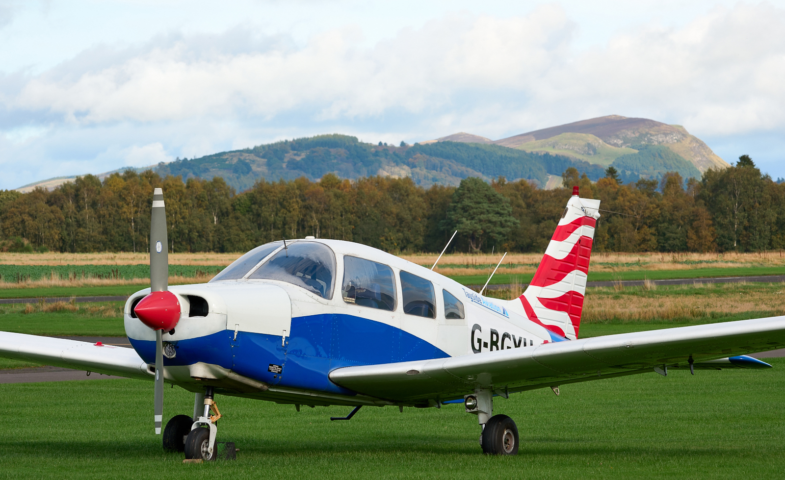

---

## Directional stability

*   Stability in yaw
*   Tail fin produces a strong stabilising force

---

## Typical training aircraft stability

*   **Longitudinal stability** – Moderate
*   **Lateral stability** — Weak
*   **Directional stability** – Strong

---

## Application

---

## Threat and error management

*   Traffic
    *   Keep a lookout for other traffic
    *   Listen out on the radio for conflicting traffic
    *   If you see something, say something!
*   Flap extension speed
    *   Check the white arc before extending flaps
    *   Don't accelerate through the white arc with flaps extended

---

## Review

*   Which force opposes gravity?
*   How can a pilot maintain lift as speed is decreased?
*   Why does the total drag curve form a "U" shape?
*   How does positive dynamic stability affect the pitch of an aircraft disturbed by turblulence?

---

## Objectives

You should now be able to:

*   List the forces acting on an aeroplane in straight and level flight
*   State the factors a pilot can use to affect lift production
*   List the two primary types of drag and describe how they contribute to the total drag of the aeroplane at different speeds
*   Explain how static and dynamic stability influence an aircraft's response to a disturbance