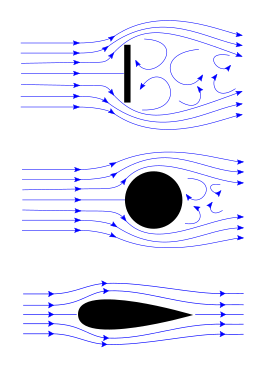

## Aim

To explain the principles of straight and level flight at a constant altitude, airspeed, and heading.

---

## Motivation

*   Majority of nearly every flight is spent straight-and-level
*   It's a fundamental skill that all of our future manouvers will build upon

---

## Objectives

*   Explain the forces acting on an aeroplane in straight and level flight
*   Explain the generation of lift and which factors can be controlled by the pilot
*   Explain the different types of drag and how they contribute to the total drag of the aeroplane
*   Explain stability and how the aeroplane is made stable in all three planes

---

## Lesson overview

*   The four forces
*   How lift is generated
*   Factors affecting lift
*   Drag
*   Stability
*   Threat and error management
*   Review

---

## Revision

*   What are the three planes of rotation?
*   What are the secondary effects of increasing power?

---

<!--
_class: lead
-->
## The four forces

---

### Weight

-   Total weight of the aircraft, passengers, fuel, and equipment onboard
-   Acts to pull the plane downwards towards the earth
-   Acts through the plane's centre of gravity

---

### Lift

-   Component of aerodynamic forces which opposes gravity
-   Acts at 90° to the direction of motion
-   Acts through a single point called the centre of lift

---

### Drag

-   Component of aerodynamic forces which resits the aircraft's movement through the air
-   Acts opposite the direction of motion
-   Acts through a single point called the centre of drag

---

### Thrust

-   Force produced by the engine and propeller
-   Acts forward along the axis of the propeller
-   Acts through the centre of thrust

---

### Equilibrium

-   In steady straight and level flight the forces are in equalibrium
-   Couples:
    -   Lift = weight (nose down)
    -   Thrust = drag (nose up)

---

<!--
_class: lead
-->
## How lift is generated

---

### Newton's 3rd law

>   For every action, there is an equal and opposite reaction

*   When air flows over a wing, the wing pushes the air downwards and reduces its speed
*   The _equal and opposite reaction_ is that the wing is pulled **upward** and **back** (this is called the **total reaction**)

---

### Newton's 3rd law

---

### Newton's 3rd law

---

### Newton's 3rd law

---

### Newton's 3rd law

---

### Newton's 3rd law

---

### Newton's 3rd law

---

### Coandă effect

The Coandă effect is the tendency of a fluid jet to stay attached to and follow the curves of a nearby surface rather than continue its original path.

This deflects the air downwards and creates a low pressure area above the wing.

---

### Bernoulli's principle

Bernoulli's principle states that an increase in a fluid's speed is accompanied with a simultaneous decrease in pressure (and vice versa).

    Total pressure = dynamic pressure + static pressure

---

### Bernoulli's principle

Bernoulli's principle states that an increase in a fluid's speed is accompanied with a simultaneous decrease in pressure (and vice versa).

    Total pressure = dynamic pressure + static pressure

---

<!--
_class: lead
-->

## Factors affecting lift

---

### Lift formula

Lift = CL ⋅ ½ρ ⋅ V2 ⋅ S

*   CL – ???
*   ½ρ – half the air density
*   V2 – velocity through the air squared
*   S – surface area of the wing

---

### Aerofoil characteristics

*   Leading edge
*   Trailing edge
*   Chord line
*   Mean camber line
*   Relative airflow
*   Angle of attack

---

<!--
_class:
-->

### Coefficient of lift (CL)

-   CL is measured in a wind tunnel by changing a wing's angle of attack while keeping all other factors constant (including speed)
-   CL increases as angle of attack increases (up to a point)

---

### Lift formula

Lift = CL ⋅ ½ρ ⋅ V2 ⋅ S

-   CL – angle of attack
-   ½ρ – half the air density
-   V2 – velocity through the air squared
-   S – surface area of the wing

---

<!--
_class: lead
-->

## Drag

---

## Drag

Total of all aerodynamic forces which resist the aircraft's movement through the air

*   Induced drag
*   Parasite drag
    *   Form drag
    *   Skin friction drag
    *   Interferance drag

---

### Induced drag

-   Drag associated with the generation of lift
-   Air moves from high pressure to low pressure
-   Due to the forward movement of the aircraft these vortices trail behind the wing tips
-   Increases at low speeds and high wing loadings

---

### Induced drag

<video src="./Lift-induced_vortices_behind_aircraft_(DLR_demonstration).ogv.360p.webm" controls="controls" width="640" height="480" loop></video>

---

### Parasite drag

-   Form drag
-   Skin friction drag
-   Interference drag

---

#### Form drag

-   Caused by the shape of the object as it moves through the air
-   A less streamlined shape will cause more turbulence, therefore more drag

---

#### Skin friction drag

-   Caused by the air "sticking" to the surface of the aircraft as it moves
-   Rivets, seams, and other imperfections in the aircraft surface can increase skin friction drag
-   Contaminants such as ice, bugs, or dirt can also increase skin friction drag

---

#### Interference drag

-   Caused by the mixing of airstreams
-   Common at the junction of surfaces (e.g. where the wings meet the fuselage)

---

<!--
_class:
-->

### Total drag

    Total drag = induced drag + parasite drag

As speed increases:
*   Induced drag decreases
*   Parasite drag increases
*   Total drag decreases to a point (VBG), and then increases

---

<!--
_class: lead
-->

## Stability

---

## Stability

The tendency of an object to return to its previous state after it has been displaced.

In the case of an aeroplane, it is the tendency of the plane to return to equilibrium in pitch, roll, or yaw after being displaced—_without any control input from the pilot_.

The opposite of stability is _manouverability_.

---

### Static stability

Static stability refers to the object's **initial tendency** after being displaced.

*   **Statically stable** — initial tendency to return to equilibrium
*   **Statically neutral stability** – no initial tendency to return to or diverge further from equilibrium
*   **Statically unstable** – initial tendency to diverge further from equilibrium

---

### Dynamic stability

Dynamic stability refers to the behaviour of a statically stable object **over time as it oscillates** around equilibrium.

*   **Dynamically stable** – oscillations decrease in magnitude over time
*   **Dynamically neutral stability** – oscillations remain constant in magnitude over time
*   **Dynamically unstable** – oscillations increase in magnitude over time

---

### Longitudinal stability

-   Stability in pitch
-   Aeroplane pitches around its centre of gravity (CG), tail provides stabilising force
-   Forward CG = longer arm = more stable

---

### Lateral stability

-   Stability in roll
-   Design features contributing to lateral stability:
    -   High wing (pendulum stability)
    -   Dihedral
    -   Keel surfaces
    -   Sweep back

---

### Directional stability

-   Stability in yaw
-   Tail fin produces a strong stabilising force

---

### Typical training aircraft stability

<table>
    <thead>
        <tr>
            <th>Longitudinal stability</th>
            <th>Lateral stability</th>
            <th>Directional stability</th>
        </tr>
    </thead>
    <tbody>
        <tr>
            <td>Moderate</td>
            <td>Weak</td>
            <td>Strong</td>
        </tr>
    </tbody>
</table>

---

## Application

---

## Threat and error management

<table>
    <thead>
        <tr>
            <th>Threat</th>
            <th>Error</th>
            <th>Undesired aircraft state</th>
            <th>Countermeasure</th>
        </tr>
    </thead>
    <tbody>
        <tr>
            <td>Traffic</td>
            <td>Enters runway w/ TFC on final</td>
            <td>Near miss</td>
            <td></td>
        </tr>
        <tr>
            <td>Structural limitations</td>
            <td>Extends flaps above VFE</td>
            <td>Exceeded maximumn flap entended speed</td>
            <td></td>
        </tr>
    </tbody>
</table>

---

## Review

*   The directional stability of an aeroplane is strongly affected by which control surface?
*   In straight and level flight, lift is always equal to which other force?
*   Describe what happens to the total drag force as an aeroplane accelerates from slow flight to fast flight?
*   How can a pilot increase lift as speed is decreased?
*   Define angle of attack

---

## Objectives

*   Explain the forces acting on an aeroplane in straight and level flight
*   Explain the generation of lift and which factors can be controlled by the pilot
*   Explain the different types of drag and how they contribute to the total drag of the aeroplane
*   Explain stability and how the aeroplane is made stable in all three planes