## Aim

*   To learn the principles & aerodynamics of a turn, as well as how to fly the three different types of turn:
    *   Level
    *   Climbing
    *   Descending

---

## Motivation

*   Learning to fly turns well will help develop your coordination and handling skills
*   It's one of the fundamental skills that will be required in nearly all of our future procedures

<!-- YTRE RWY 04 – YPMQ RWY 03 TRK 021° -->

---

## Objectives

By the end of this brief you should be able to:

*   Describe the forces acting on an aeroplane during a turn
*   List the factors that affect rate and radius of turn
*   Explain the causes of the overbank and underbank tendencies
*   Explain the cause of adverse yaw and how to counter it
*   Identify and recover from skid and slip

---

## Lesson overview

Duration: approx 50 mins

*   Forces during a turn
*   Types of turn
*   Aileron drag & adverse yaw
*   Controlling a turn
*   Application
*   Threat and error management
*   Review questions

---

## Revision

*   What is the primary effect of ailerons?
*   What is the secondary effect of ailerons?
*   What is the primary effect of rudder?
*   What is the secondary effect of rudder?
*   How does the direction of the lift force change when moving from straight and level into a climb?

<!-- Perpendicular to the relative airflow and to the wings -->

---

## Forces during a turn

<!--
Demo inertia + centripetal force
What happens when we stop swinging the string? The weight falls to the centre
What happens when we let go of the string? The weight flies outwards

Diagram snapshots of inertia + centripetal force = flight path
-->

*   **Intertia**
    <!-- According to Newton's first law of motion -->
    *   An object in motion will move in a straight line with the same speed and direction unless acted on by a force
    *   Not actually a force, just describes an object's resistance to changes in motion

---

<!--
_class:
-->

## Forces during a turn

*   **Centripetal force**
    *   Acts inwards towards the centre of the turn, changing the direction of the object's velocity
    *   Not a new force, just the name given to any force that causes circular motion (e.g. the tension in a string)

<!-- Add diagram showing inertia + centripetal force snapshots over time = flight path -->

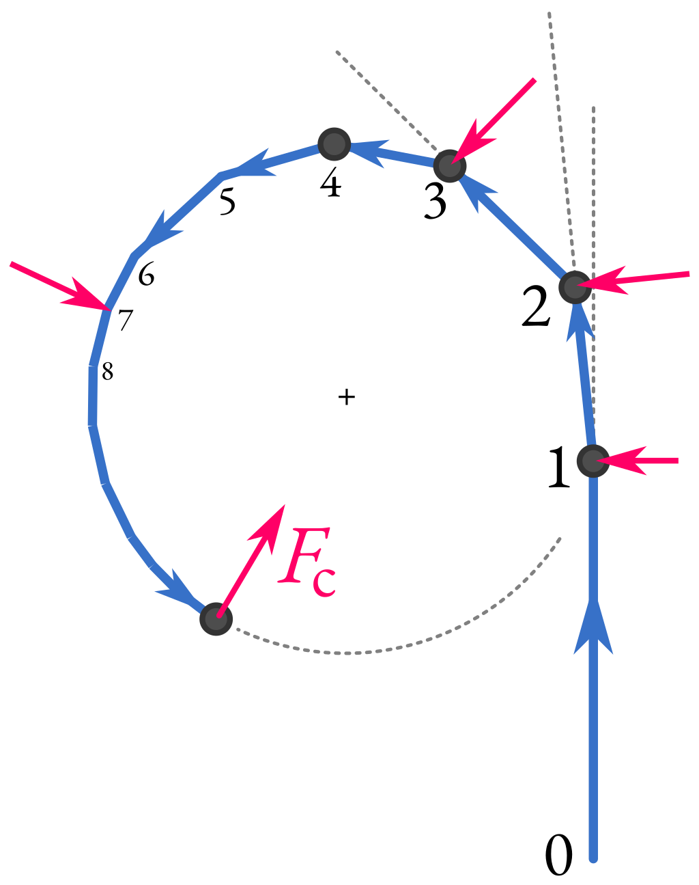

---

<!--
_class: lead
-->

## Forces during a turn

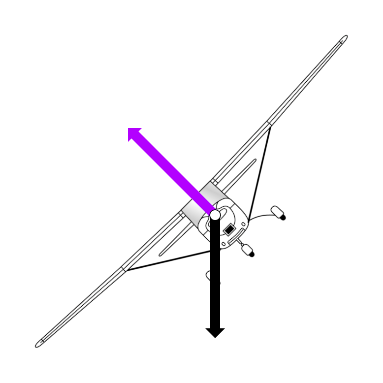

<!-- Banking the wings tilts the lift vector -->

---

<!--
_class: lead
-->

## Forces during a turn

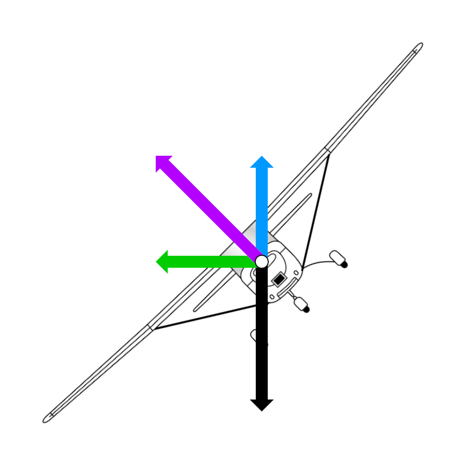

<!--
Lift acts perpendicular to the wings and direction of motion, so when the plane banks the lift force is tilted to the side.

This creates both a vertical and horizontal component of lift.

The horizontal component of lift gives us the centripital force, acting towards the centre of the turn and causing the plane's flight path to curve.

However, the vertical component of lift is less than weight. What will happen to the plane if the vertical component of lift is less than weight? It will start to descend.
-->

---

<!--
_class: lead
-->

## Forces during a turn

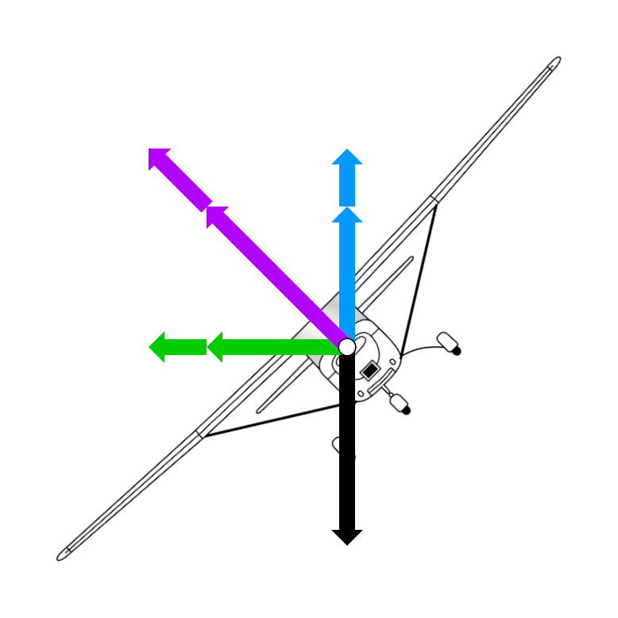

<!--
Therefore, in a turn we must increase the total lift force so the vertical component is equal to weight to prevent the plane descending. Remembering our pilots lift formula, what tools do we have to increase lift? AoA and speed.

In a turn we increase lift by increasing angle of attack by applying a back pressure on the yoke.
-->

---

<!--
_class: lead
-->

## Forces during a turn

 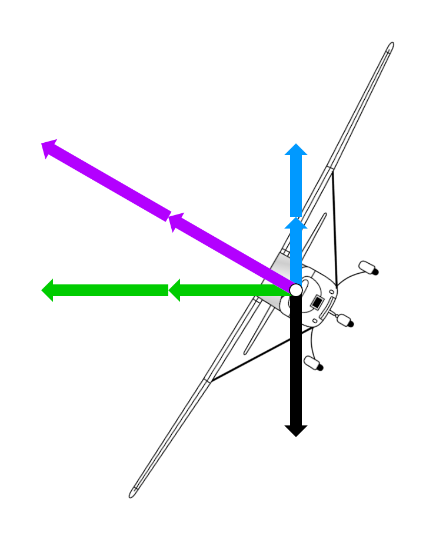

<!-- The greater the angle of bank, the more the lift vector tilts over. Therefore the more we need to increase lift to increase the vertical component. -->

---

## Turn performance

*   **Rate of turn**
    *   Describes how quickly a plane turns
    *   Particularly important in instrument flying (rate 1 turn = 3° per second or 360° in 2 minutes)
*   **Turn radius**
    *   Describes the size of the arc a plane travels as it turns
    *   Important when avoiding obstacles, and during certain types of airwork e.g. aerial photography

<!-- Diagram or teaching aid to describe how rate and radius are related (radius of 1, and radius of 2, same speed) -->

---

## Turn performance

*   Rate and radius of turn are impacted by:
    *   Speed
    *   Angle of bank
*   Slow speed = increased rate and decreased radius
    <!--
    Show vector diagrams (inertia vs centripetal force)
    What does a fast speed do to flight path?
    What about a slow speed?
    -->
*   High AoB = increased rate and decreased radius
    <!--
    Show vector diagrams (inertia vs centripetal force)
    What does a high AoB do to flight path?
    What about a low AoB?
    -->
    <!-- So how would we get the highest rate and smallest radius of turn? -->
*   Slow speed + high AoB = dangerous
    <!-- We'll get into this when we talk about stalling, for now we will limit our turns to 30° AoB -->

---

<!--
_class: lead
-->

## Types of turn

---

<!--
_class:
_backgroundColor: #fff
-->

## Level turn

*   Outside wing travels further in the same time
*   Increased speed = increased lift
*   Overbanking tendency

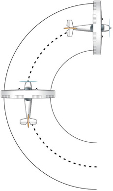

---

<!--
_class:
_backgroundColor: #fff
-->

## Climbing turn

*   Outside wing travels faster, and has higher AoA than inside wing
*   Increased overbanking tendency
*   We limit climbing turns to 15° to avoid losing too much climb performance

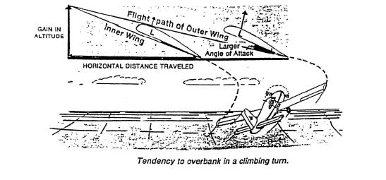

<!--
Why would turning decrease climb performance? We talked about how we need to increase AoA to maintain altitude in a level turn—how does increasing AoA effect drag? It increasing induced drag. Increased drag reduces our climb performance.
-->

---

<!--
_class:
_backgroundColor: #fff
-->

## Descending turn

*   Outside wing travels faster, but has smaller AoA than inside wing
*   Neutral or even underbanking tendency

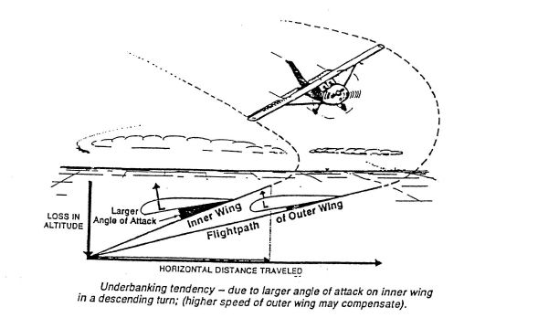

---

## Aileron drag & adverse yaw

<!--
Use model to show one aileron down the other up.
What happens to the chord line on the outside wing?
Therefore AoA?
Therefore drag?
And on the inside wing?
-->
*   Aileron down on outside wing = increased AoA and drag
    <!--
    What happens in a kayak when you stick one paddle in the water and hold it there?
    That same thing is happening in a plane when you increase drag on one wing
    -->
*   Increased drag on one side = yaw 
*   Adverse yaw is the effect where the plane wants to yaw in the **opposite direction** to the direction it is being rolled with ailerons

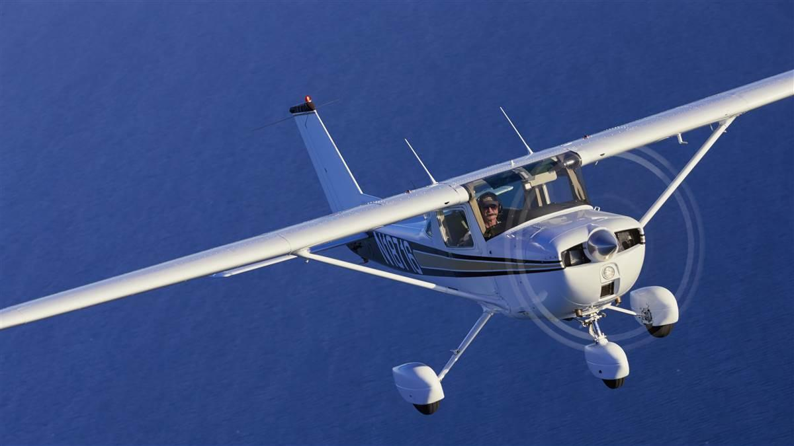

---

<!--
_class:
_backgroundColor: #fff
-->

## Aileron drag & adverse yaw

Differential ailerons

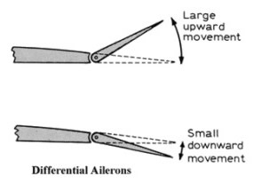

---

<!--
_class:
_backgroundColor: #fff
-->

## Aileron drag & adverse yaw

Frise ailerons

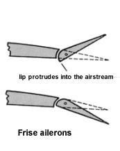

<!-- C150 has both differential ailerons and Frise ailerons -->

---

## Controlling a turn

<!-- Although the engineer has done a lot to reduce adverse yaw, it is still present and the pilot still needs to ensure the plane is balanced during a turn.

That is why we need to turn with coordinated use of ailerons and rudder -->

*   Coordinated control of ailerons and rudder
    *   Simultaneously turn the yoke and apply rudder pressure in the direction of the turn to begin the roll
    *   As the desired bank angle is reached centralise the yoke and reduce rudder pressure to stop the roll and maintain balanced flight
*   Gently increase back pressure as bank angle steepens, using the horizon as your reference
    <!-- In a 30° turn the reduction in the vertical component of lift is small, so only a slight increase in backpressure is required -->

---

<!--
_class: lead invert
_backgroundColor: #333
-->

## Artificial horizon

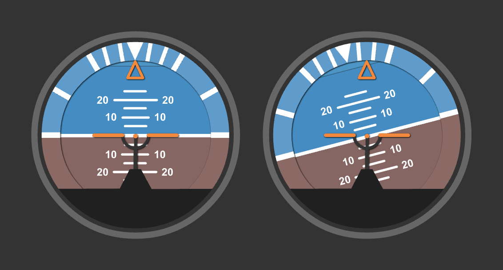

<!--
The attitude indicator shows AoB (roll pointer + reference marks at 10, 20, 30, and 60 degrees)

When we turn we roll visually to an angle of bank that we guess is about right, and we confirm with the attitude indicator
-->

---

<!--
_class: lead
-->

## Balance ball

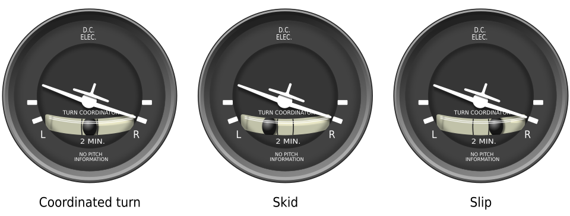

<!--
Draw turning flight path and use magnetic plane to show balanced, skidding, and slipping flight

Skid into the turn (nose into turn, tail out of the turn), slip out of the turn (nose out of turn, tail into turn). The ball indicates where the tail is relative to our flight path.

As part of our maintenance checks we check that the turn coordinator is "ball centred", and make adjustments by "stepping on the ball"

https://commons.wikimedia.org/wiki/File:Turn_coordinators-en.svg
-->

---

## Application

---

## Threat and error management

*   Traffic
    *   Lookout—outside, straight ahead, inside
    *   Listen out, make radio calls
*   Coordinated use of controls
    *   "Step on the ball" to maintain balance
*   Climbing & descending considerations
    *   Temperature and pressures
    *   Carb ice

---

## Review questions

*   How does the orientation of the lift force change as we bank into a turn?
    <!-- Lift vector is tilted, this provides our centripetal force towards the centre of the turn -->
*   Why do we increase back pressure on the yoke during a turn?
    <!-- To increase the vertical component of lift to equal weight so that we don't descend -->
*   How could we increase rate of turn?
*   How could we decrease radius of turn?

---

## Review questions

*   Why does rolling using ailerons cause the adverse yaw effect?
    <!-- Outer wing has increased angle of attack, therefore drag -->
*   How do you counter the adverse yaw effect?
    <!-- Coordinated use of ailerons and rudder. Ailerons for right bank + right rudder. -->
*   Why is there an overbanking tendency in a level turn?
    <!-- Outside wing travels faster, therefore generates more lift -->
*   Why is it important to "step on the ball" if the balance ball is not centred?
    <!-- Fly in balance, reduce drag -->

---

## Objectives

You should now be able to:

*   Describe the forces acting on an aeroplane during a turn
*   List the factors that affect rate and radius of turn
*   Explain the causes of the overbank and underbank tendencies
*   Explain the cause of adverse yaw and how to counter it
*   Identify and recover from skid and slip